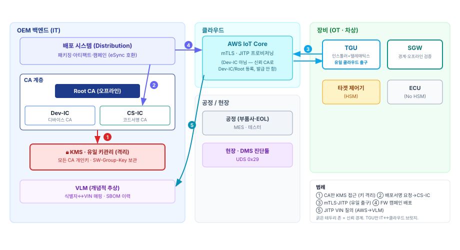
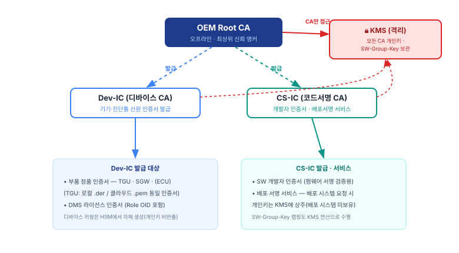

# 차세대 건설기계 시스템·장비 보안 아키텍처 명세서

| 항목 | 내용 |
|------|------|
| **문서 ID** | DOC-10 (A1 · 시스템·장비 보안 아키텍처) |
| **문서 버전** | v1.1 |
| **문서 분류** | 보안 아키텍처 / 기술 명세서 |
| **적용 대상** | KMS·CA 계층, 배포 시스템, VLM, AWS IoT Core, 제어기(TGU/SGW/ECU/타겟), 진단툴(DMS) |
| **용어 기준** | [DOC-00 용어집](../00-공통/용어집.md) |

본 문서는 건설기계 보안 체계의 **정적 토대(아키텍처)**를 정의한다 — 시스템 구성·신뢰 경계, PKI·키 관리
아키텍처(Root CA·Dev-IC·CS-IC·KMS), 암호 규격, 파일 포맷, 인증서 프로파일, EOL 주입 데이터. 이 토대 위에서
동작하는 *절차*(업데이트·진단·생애주기)는 [DOC-20](../20-업데이트사양/업데이트-보안명세서.md)·[DOC-30](../30-진단-인증사양/진단-인증-보안명세서.md)·[DOC-40](../40-생애주기-절차/생애주기-절차명세서.md)에서 규정한다.

---

## 1. 시스템 개요 및 신뢰 경계

### 1.1 구성요소와 구역(Zone)

시스템은 네 구역으로 나뉜다. 각 구역은 서로 다른 신뢰 수준을 가지며, 구역 간 상호작용은 제한된 경로로만 허용된다.

| 구역 | 구성요소 |
|------|----------|
| **OEM 백엔드 (IT)** | KMS(격리), CA 계층(Root CA·Dev-IC·CS-IC), 배포 시스템, VLM |
| **클라우드** | AWS IoT Core (mTLS·JITP) |
| **장비 (OT · 차상)** | TGU(인스톨러+텔레매틱스), SGW(경계), 타겟 제어기(HSM), ECU |
| **공정 / 현장** | MES·테스터(부품사·EOL), DMS(정비 진단툴) |

*[그림 1] 시스템 구성 및 신뢰 경계*

### 1.2 신뢰 경계 (Trust Boundaries)

- **① KMS 격리 경계:** 모든 CA 개인키·대칭키가 담긴 KMS는 **CA 계층만** 접근할 수 있는 최내곽 격리 공간이다. 배포 시스템 등 다른 백엔드는 KMS에 직접 접근하지 못한다. (§2.2)
- **② IT↔OT 경계 (단일 출구):** 장비(OT)에서 외부 클라우드로 나가는 경로는 **TGU 하나뿐**이다. SGW·ECU·타겟 제어기는 외부 인터넷과 격리되며, 클라우드 연동은 전적으로 TGU가 대리한다.
- **③ OT 내부 경계:** SGW가 진단 접근의 경계(UDS 0x29 게이트)로서, 외부(DMS)의 내부망 진입을 오프라인 검증 후에만 허용한다.

---

## 2. PKI · 신뢰 아키텍처

전 문서(업데이트·진단·생애주기)가 딛는 **정적 신뢰 인프라**를 여기서 정의한다. 다른 문서는 이 절을 *참조*한다.

### 2.1 CA 계층 구조

OEM Root CA를 최상위 앵커로, 목적별 중간 CA 둘을 병렬로 둔다. (→ [DOC-00 §0.1](../00-공통/용어집.md))

- **OEM Root CA:** 최상위 신뢰 앵커. **오프라인** 보관하며 하위 중간 CA 발급 시에만 사용한다.
- **Dev-IC (디바이스 CA):** 기기·진단툴의 **신원 인증서**(부품 정품 인증서, DMS 라이선스 인증서)를 발급한다.
- **CS-IC (코드서명 CA):** **SW 개발자 인증서**를 발급하고, 배포 시스템의 요청에 따라 **배포 서명**을 생성한다.

*[그림 2] PKI 계층 구조 및 KMS 격리*

> "단일 CA"는 **기기·사용자 신원 발급 CA를 하나(Dev-IC)로 둔다**는 의미이지, PKI 전체가 단일 CA라는 뜻이
> 아니다. Root·CS-IC를 포함한 계층 위에서 Dev-IC가 신원 발급을 전담한다.

### 2.2 KMS 및 키 격리

- **유일·격리:** KMS는 시스템 전체의 **유일한 키 관리 시스템**이며, 모든 CA(Root/Dev-IC/CS-IC) 개인키와 대칭키(SW-Group-Key)를 보관한다. **오직 CA 계층만** KMS에 접근한다.
- **간접 접근 원칙:** 배포 시스템 등 백엔드 구성요소는 KMS에 직접 접근할 수 없다. 서명·키 랩핑이 필요하면 해당 CA(예: CS-IC)에 **요청**하고, 실제 개인키 연산은 CA가 KMS를 통해 수행한다.
  - **근거(침해 격리):** CA 개인키를 애플리케이션 서버에 상주시키지 않으므로, 배포 시스템·배포 서버가 침해되어도 곧바로 키 유출로 이어지지 않는다.
- **디바이스 키 예외:** 제어기의 디바이스 키쌍(Dev-Pub/Priv)은 **제어기 HSM에서 자체 생성**되며 개인키는 절대 반출되지 않는다(중앙 KMS에도 존재하지 않음). KMS는 OEM측 키만 관리한다.

### 2.3 OEM 백엔드 구성요소

- **배포 시스템 (Distribution System):** FW 업데이트 패키지를 **패키징**(매니페스트·암호화·이중서명 부착)하고, **아티팩트 리포지토리**로 관리하며, **배포 캠페인**(타겟팅·릴리스)을 운영한다. 개인키를 직접 보유하지 않으며 배포 서명은 CS-IC에, TSK 랩핑은 KMS 연산(CA 경유)에 의존한다. **eSync 호환**을 지향한다(→ DOC-20). '배포 서버'는 배포 시스템이 인스톨러(TGU)로 패키지를 전달하는 엔드포인트를 가리킨다.
- **AWS IoT Core:** 클라우드 IoT 엔드포인트(mTLS 서버)이자 JITP 프로비저닝 지점. **Dev-IC와 별개 객체**로, Dev-IC/Root CA를 *신뢰 CA로 등록*하여 TGU의 mTLS 접속을 인증하고 사물(Thing)을 등록할 뿐 **인증서를 발급하지 않는다**. 접속은 TGU만 가능하다. (절차 → [DOC-40 §1.3](../40-생애주기-절차/생애주기-절차명세서.md))
- **VLM:** 식별자↔VIN 매핑·SBOM 이력을 담당하는 **개념적 추상 존재**(미도입, 배치 미정 → [DOC-00 §2](../00-공통/용어집.md)).

### 2.4 키·크리덴셜 인벤토리

| 키/크리덴셜 | 유형 | 보관 위치 | 생성 주체 | 수명·회전 |
|-------------|------|-----------|-----------|-----------|
| Root CA 키쌍 | 비대칭 P-256 | KMS (오프라인) | OEM | 최장수명 앵커 |
| Dev-IC 키쌍 | 비대칭 P-256 | KMS | OEM | 중간 CA 정책 |
| CS-IC 키쌍 | 비대칭 P-256 | KMS | OEM | 회전 가능(인증서를 패키지로 전달 → DOC-20 §1.3) |
| SW-Group-Key | 대칭 AES | KMS · 제어기 HSM | OEM(KMS) | 그룹 단위 (**TBD**) |
| 디바이스 키쌍(Dev-Pub/Priv) | 비대칭 P-256 | 제어기 HSM (개인키 비반출) | 제어기 자체 | 장비 수명(20년) |
| DMS 키쌍 | 비대칭 P-256 | DMS PC | DMS | 라이선스 수명(3~12개월) |
| AES-TSK | 대칭 AES | 배포 시스템(1회용) | 배포 시 | 배포 1회 |

> **TBD:** `SW-Group-Key`의 **그룹 단위**(제어기 기종별 / 벤더별 / 전 차종 단일 등)와 회전 정책은 미확정. → [DOC-00 §5](../00-공통/용어집.md)

### 2.5 신뢰 앵커 분배

"어느 노드가 무엇을 신뢰 잣대로 보유하는가"는 오프라인 검증 아키텍처의 핵심이다.

| 노드 | 내장 신뢰 앵커 | 용도 |
|------|----------------|------|
| 타겟 제어기 (HSM) | Root CA 공개키 (+선택 CS-IC 공개키), SW-Group-Key | 펌웨어 서명 체인 검증(→ DOC-20 §1.3), 복호화 |
| SGW | 발급 CA(Dev-IC) 공개키, 문자열 VIN | DMS 인증서·UDS 서명 검증(→ DOC-30 §1) |
| TGU | Root CA 공개키, 자체 부품 정품 인증서 | 배포 서명 체인 검증, AWS mTLS |
| AWS IoT Core | Dev-IC/Root CA 인증서(신뢰 CA 등록) | mTLS·JITP 인증 |

---

## 3. 설계 원칙 및 범위·제외

### 3.1 설계 원칙

1. **단일 디바이스 신원 CA:** 장비/사용자 CA를 나누지 않고 **Dev-IC**가 기기·진단툴 신원 인증서를 일괄 발급한다(§2.1). 신원 발급 창구를 하나로 두어 신뢰 체계를 단순화한다.
2. **논리적 바인딩:** 하드웨어 인증서에 장비 번호(VIN)를 포함하지 않으며, 클라우드(VLM) DB 매핑과 SGW의 로컬 텍스트(VIN) 주입으로 대체한다.
3. **오프라인 검증 가능성:** 검증에 필요한 신뢰 앵커를 각 노드가 로컬 보유하여(§2.5), 인터넷 없이도 수학적으로 상대를 검증한다(SGW·타겟 제어기 공통 속성).
4. **전 구간 단일 알고리즘:** 연산 부하와 이기종 처리 복잡도를 줄이기 위해 전 구간 P-256을 적용한다(→ §4).

### 3.2 범위 · 제외 (Scope & Exclusions)

- **내부망 암호화(SecOC) 제외:** 기존 J1939(Classic CAN) 대역폭 한계를 고려하여 하위 ECU 노드 간 SecOC(대칭키 통신 암호화)는 본 스펙에서 제외한다.
  - > ⚠️ **잔여 위협:** 내부 CAN 버스 스푸핑·재생 공격 가능성이 남는다. **보상 통제**로 SGW 경계 검증(§1.2 ③), 물리 접근 통제 가정, 부품 정품성(§2.1)에 의존한다. CRA 관점의 잔여 리스크로 명시하며 향후(대역폭 여건 개선 시) 재검토한다. → [REF-03](../05-참조-CRA배경/REF-03-추적성-적합성-개요.md)

---

## 4. 암호 알고리즘 규격 (Cryptographic Suites)

차량용 제어기(MCU)의 연산 한계와 UDS 통신의 속도 요구사항(밀리초 단위)을 충족하며 시스템 전체의
암호 연산 구조를 단순화하기 위해, **전 구간 단일 알고리즘(P-256)**을 적용한다.

### 4.1 PKI 계층별 알고리즘

- **OEM Root CA / 디바이스 CA:** `ECC secp256r1 (NIST P-256)` + `SHA-256`
  - *사유:* 디바이스와 동일한 알고리즘을 사용하여 하드웨어(SGW)의 서명 검증 시 이기종 알고리즘 처리 부하를 제거하고 호환성을 극대화.
- **디바이스 기기 (SGW, TGU, DMS):** `ECC secp256r1 (NIST P-256)` + `SHA-256`
  - *사유:* 글로벌 자동차 보안 표준 규격. 32 Bytes의 작은 키 크기로 UDS 전송에 최적화.

### 4.2 UDS 0x29 데이터 규격

- **Challenge (난수):** `16 Bytes` (TRNG 기반 생성)
- **Signature (서명값):** `64 Bytes` (ECDSA P-256 서명값: R 32 Bytes + S 32 Bytes, Raw 포맷 기준)

---

## 5. 인증서 및 키 파일 포맷 명세 (File Formats)

네트워크 특성(IT 클라우드망 vs OT 내부망)에 따라 인증서 포맷을 이원화하여 관리한다.
UDS 0x29 통신에는 트래픽 최적화를 위해 바이너리(`der`)를, AWS IoT 접속에는 호환성을 위해 텍스트(`pem`)를 사용한다.

| 데이터 유형 | 권장 확장자 | 포맷 설명 | 주체 및 용도 |
|-------------|-------------|-----------|--------------|
| **로컬 디바이스 인증서** | `.der` | X.509 v3 바이너리 구조: 서명·유효기간·식별자 등이 포함된 온전한 인증서의 DER 인코딩 | SGW, DMS 내부 보관 및 제한된 CAN 통신망(UDS 0x29) 전송용 |
| **클라우드 디바이스 인증서** | `.pem` / `.crt` | Base64 인코딩된 텍스트 X.509 | TGU의 AWS IoT Core mTLS 연결 및 디바이스 SDK 활용용 |
| **발급 CA 공개키** | `.der` 또는 `.key` | SPKI 바이너리 구조: X.509 포맷이 아닌, 발급 CA(디바이스 CA)의 순수 공개키 값만 추출한 DER 인코딩 | EOL 공정에서 SGW에 주입 (DMS 인증서·UDS 서명 검증용 잣대) |
| **서버용 인증서** | `.pem` / `.crt` | Base64 인코딩된 텍스트 X.509 | AWS IoT Core 및 VLM 서버 등록·관리용 |

> ✅ **[확정]** TGU의 로컬 인증서(.der)와 클라우드 인증서(.pem)는 **동일한 '부품 정품 인증서'를 용도에 따라
> 다르게 인코딩한 것**이다(별개 인증서 2장이 아님). 하나의 인증서를 UDS 0x29 등 로컬 통신에는 DER로,
> AWS IoT mTLS에는 PEM으로 사용한다. → [DOC-00 §3](../00-공통/용어집.md)

---

## 6. X.509 인증서 프로파일 (Certificate Profiles)

디바이스 CA(Dev-IC)에서 발급되는 인증서는 '확장 필드(Extensions)'를 통해 하드웨어와 라이선스를 구분한다.

### 6.1 부품 정품 인증서 (SGW, TGU)

- **용도:** 부품 위변조 방지 및 TGU의 AWS 클라우드 mTLS 인증
- **인코딩:** TGU는 **동일한 부품 정품 인증서**를 로컬 통신(UDS 0x29)에는 `.der`, AWS IoT mTLS에는 `.pem`으로 사용한다(§5). 별개 인증서가 아님.
- **유효기간(Validity):** `20년` (장비 생애주기와 동일)
- **Subject DN:** `CN={부품 Serial}, O={OEM Name}, OU=Hardware`
- **Key Usage(KU):** `Digital Signature` (필수)
- **Extended Key Usage(EKU):** `Client Authentication (1.3.6.1.5.5.7.3.2)`
  - *참고:* EKU는 인증서 내 속성값이며, AWS IoT 접속을 위해 필수적으로 포함되어야 함.

### 6.2 진단툴(DMS) 라이선스 인증서

- **용도:** DMS PC의 정당성 증명 및 UDS 권한 제어(오프라인)
- **유효기간(Validity):** `3개월 ~ 1년` (만료 시 갱신 유도를 통한 지속적 권한 통제)
- **Subject DN:** `CN={DMS-UUID}, O={OEM Name}, OU=Service`
- **Key Usage(KU):** `Digital Signature`
- **Custom OID (Role 정의):** `1.3.6.1.4.1.{OEM_ID}.1.1`
  - SGW는 인증서 파싱 시 이 OID 값을 확인하여 통신을 개방한다. (검증 절차 → [DOC-30 §1](../30-진단-인증사양/진단-인증-보안명세서.md))
  - 값 정의: `0x01 (Internal/Factory)`, `0x02 (Dealer)`, `0x03 (Read-Only)`
  - > TODO: `{OEM_ID}` 실제 PEN(Private Enterprise Number) 확정.

> **TODO:** CA 인증서(Root/Dev-IC/CS-IC) 및 `SW 개발자 인증서`(DOC-20이 검증 대상으로 사용) 프로파일도 본 절에 추가한다.

---

## 7. EOL 데이터 주입 명세 (EOL Provisioning)

장비 조립의 마지막 EOL 공정에서 테스터 장비가 **SGW에 주입해야 하는 필수 데이터**는 다음과 같다.
(EOL 공정의 전체 절차 흐름은 [DOC-40 §1.2](../40-생애주기-절차/생애주기-절차명세서.md)에서 규정한다.)

1. **발급 CA(디바이스 CA) 공개키 (.der):** 타 디바이스(DMS)의 인증서 유효성을 수학적으로 검증하기 위한 잣대. DMS 라이선스 인증서를 발급한 CA가 디바이스 CA(Dev-IC)이므로, 그 공개키를 신뢰 앵커로 주입한다. (순수 공개키 데이터, SPKI)
2. **장비 식별자 (String):** 자기 자신이 어떤 장비인지 자각하기 위한 `텍스트 포맷의 VIN` (예: `"VIN-KOREA-0001"`)

> SGW는 자신을 외부로 증명할 필요가 없으므로 개인키·인증서를 주입하지 않으며, **타인을 검증하는 잣대(발급 CA 공개키)와
> 자기 식별용 VIN 문자열만** 보유한다. (신뢰 앵커 분배 → §2.5)

---

## 개정 이력

| 버전 | 일자 | 내용 |
|------|------|------|
| v1.0 | 2026-07-11 | 문서 스파인 재편에 따라 구 DOC-20(PKI·UDS) §1~5(설계원칙·암호규격·파일포맷·인증서 프로파일·EOL 주입)를 A1 아키텍처로 분리. |
| v1.1 | 2026-07-11 | **아키텍처 보강:** §1 시스템 개요·신뢰 경계, §2 PKI·신뢰 아키텍처(Root CA·CS-IC·**KMS 격리**·배포 시스템·**AWS IoT Core**·키 인벤토리·신뢰 앵커 분배) 신설. 그림 2종 추가. §3 원칙 재정리 + SecOC 제외를 잔여위협·보상통제와 함께 명시. 기존 내용 §4~7로 이동. |

## 관련 문서

- [DOC-00 용어집](../00-공통/용어집.md)
- [DOC-20 업데이트 보안 명세서](../20-업데이트사양/업데이트-보안명세서.md)
- [DOC-30 진단·인증 보안 명세서](../30-진단-인증사양/진단-인증-보안명세서.md)
- [DOC-40 보안 생애주기·절차 명세서](../40-생애주기-절차/생애주기-절차명세서.md)
- [REF-03 추적성·적합성 개요](../05-참조-CRA배경/REF-03-추적성-적합성-개요.md)
