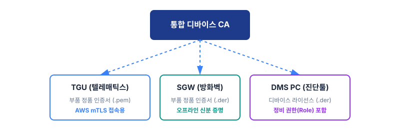
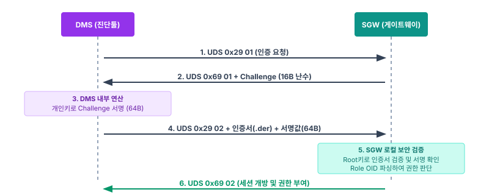

# 차세대 건설기계 통합 PKI 및 UDS 0x29 진단 보안 명세서

| 항목 | 내용 |
|------|------|
| **문서 ID** | DOC-20 |
| **문서 버전** | v1.0 (legacy pki v1.2 정제) |
| **문서 분류** | 보안 아키텍처 / 기술 명세서 |
| **적용 대상** | 디바이스 CA(Dev-IC), 제어기(TGU/SGW/ECU), 진단툴(DMS), 클라우드(VLM/AWS IoT) |
| **용어 기준** | [DOC-00 용어집](../00-공통/용어집.md) |

본 문서는 건설기계 장비의 **오프라인 진단 보안(UDS 0x29)** 및 **클라우드 연동(mTLS)**을 위한
**'단일 디바이스 CA 중심의 통합 PKI 아키텍처'**를 정의한다.

---

## 1. 아키텍처 기본 원칙 (Design Principles)

1. **단일 CA 체계:** 복잡한 장비/사용자 CA 구분을 없애고, OEM 산하의 단일 **디바이스 CA(Dev-IC)**가 하드웨어 제어기(TGU, SGW)와 진단툴(DMS PC)의 인증서를 일괄 발급한다. (원본 명칭 '통합 디바이스 CA'와 동일 주체 — '통합'은 여러 디바이스를 총괄한다는 의미. → [DOC-00 §0.1](../00-공통/용어집.md))
2. **논리적 바인딩:** 하드웨어 인증서에 장비 번호(VIN)를 포함하지 않으며, 클라우드(VLM) 레벨의 데이터베이스 매핑과 SGW의 로컬 텍스트(VIN) 주입으로 대체한다.
3. **오프라인 중심 보안:** SGW는 인터넷(VLM) 통신 없이 내장된 **발급 CA(디바이스 CA) 공개키**를 활용하여 오프라인 상태에서 DMS의 접근 권한을 수학적으로 검증한다. (검증 잣대 원칙 → [DOC-00 §0.2](../00-공통/용어집.md))
4. **내부망 암호화 유예:** 기존 J1939(Classic CAN) 통신 환경의 대역폭 한계를 고려하여, 하위 ECU 노드 간의 SecOC(대칭키 암호화)는 본 스펙에서 제외한다.

*[그림 1] 디바이스 CA(Dev-IC) 기반 PKI 발급 아키텍처*

---

## 2. 암호 알고리즘 규격 (Cryptographic Suites)

차량용 제어기(MCU)의 연산 한계와 UDS 통신의 속도 요구사항(밀리초 단위)을 충족하며 시스템 전체의
암호 연산 구조를 단순화하기 위해, **전 구간 단일 알고리즘(P-256)**을 적용한다.

### 2.1 PKI 계층별 알고리즘

- **OEM Root CA / 디바이스 CA:** `ECC secp256r1 (NIST P-256)` + `SHA-256`
  - *사유:* 디바이스와 동일한 알고리즘을 사용하여 하드웨어(SGW)의 서명 검증 시 이기종 알고리즘 처리 부하를 제거하고 호환성을 극대화.
- **디바이스 기기 (SGW, TGU, DMS):** `ECC secp256r1 (NIST P-256)` + `SHA-256`
  - *사유:* 글로벌 자동차 보안 표준 규격. 32 Bytes의 작은 키 크기로 UDS 전송에 최적화.

### 2.2 UDS 0x29 데이터 규격

- **Challenge (난수):** `16 Bytes` (TRNG 기반 생성)
- **Signature (서명값):** `64 Bytes` (ECDSA P-256 서명값: R 32 Bytes + S 32 Bytes, Raw 포맷 기준)

---

## 3. 인증서 및 키 파일 포맷 명세 (File Formats)

네트워크 특성(IT 클라우드망 vs OT 내부망)에 따라 인증서 포맷을 이원화하여 관리한다.
UDS 0x29 통신에는 트래픽 최적화를 위해 바이너리(`der`)를, AWS IoT 접속에는 호환성을 위해 텍스트(`pem`)를 사용한다.

| 데이터 유형 | 권장 확장자 | 포맷 설명 | 주체 및 용도 |
|-------------|-------------|-----------|--------------|
| **로컬 디바이스 인증서** | `.der` | X.509 v3 바이너리 구조: 서명·유효기간·식별자 등이 포함된 온전한 인증서의 DER 인코딩 | SGW, DMS 내부 보관 및 제한된 CAN 통신망(UDS 0x29) 전송용 |
| **클라우드 디바이스 인증서** | `.pem` / `.crt` | Base64 인코딩된 텍스트 X.509 | TGU의 AWS IoT Core mTLS 연결 및 디바이스 SDK 활용용 |
| **발급 CA 공개키** | `.der` 또는 `.key` | SPKI 바이너리 구조: X.509 포맷이 아닌, 발급 CA(디바이스 CA)의 순수 공개키 값만 추출한 DER 인코딩 | EOL 공정에서 SGW에 주입 (DMS 인증서·UDS 서명 검증용 잣대) |
| **서버용 인증서** | `.pem` / `.crt` | Base64 인코딩된 텍스트 X.509 | AWS IoT Core 및 VLM 서버 등록·관리용 |

> ⚠️ **[미결 · 대화로 확정]** TGU가 보유하는 로컬 인증서(.der)와 클라우드 인증서(.pem)가 **동일 인증서의
> 인코딩 차이**인지, **물리적으로 다른 별개 인증서 2장**인지 미확정이다. 전자면 명칭을 '부품 정품 인증서'로
> 단일화하고, 후자면 발급 주체·용도를 분리 기술한다. → [DOC-00 §5](../00-공통/용어집.md)

---

## 4. X.509 인증서 프로파일 (Certificate Profiles)

디바이스 CA(Dev-IC)에서 발급되는 인증서는 '확장 필드(Extensions)'를 통해 하드웨어와 라이선스를 구분한다.

### 4.1 부품 정품 인증서 (SGW, TGU)

- **용도:** 부품 위변조 방지 및 TGU의 AWS 클라우드 mTLS 인증
- **유효기간(Validity):** `20년` (장비 생애주기와 동일)
- **Subject DN:** `CN={부품 Serial}, O={OEM Name}, OU=Hardware`
- **Key Usage(KU):** `Digital Signature` (필수)
- **Extended Key Usage(EKU):** `Client Authentication (1.3.6.1.5.5.7.3.2)`
  - *참고:* EKU는 인증서 내 속성값이며, AWS IoT 접속을 위해 필수적으로 포함되어야 함.

### 4.2 진단툴(DMS) 라이선스 인증서

- **용도:** DMS PC의 정당성 증명 및 UDS 권한 제어(오프라인)
- **유효기간(Validity):** `3개월 ~ 1년` (만료 시 갱신 유도를 통한 지속적 권한 통제)
- **Subject DN:** `CN={DMS-UUID}, O={OEM Name}, OU=Service`
- **Key Usage(KU):** `Digital Signature`
- **Custom OID (Role 정의):** `1.3.6.1.4.1.{OEM_ID}.1.1`
  - SGW는 인증서 파싱 시 이 OID 값을 확인하여 통신을 개방한다.
  - 값 정의: `0x01 (Internal/Factory)`, `0x02 (Dealer)`, `0x03 (Read-Only)`
  - > TODO: `{OEM_ID}` 실제 PEN(Private Enterprise Number) 확정.

---

## 5. EOL 데이터 주입 명세 (EOL Provisioning)

장비 조립의 마지막 EOL 공정에서 테스터 장비가 **SGW에 주입해야 하는 필수 데이터**는 다음과 같다.

1. **발급 CA(디바이스 CA) 공개키 (.der):** 타 디바이스(DMS)의 인증서 유효성을 수학적으로 검증하기 위한 잣대. DMS 라이선스 인증서를 발급한 CA가 디바이스 CA(Dev-IC)이므로, 그 공개키를 신뢰 앵커로 주입한다. (순수 공개키 데이터, SPKI)
2. **장비 식별자 (String):** 자기 자신이 어떤 장비인지 자각하기 위한 `텍스트 포맷의 VIN` (예: `"VIN-KOREA-0001"`)

> SGW는 자신을 외부로 증명할 필요가 없으므로 개인키·인증서를 주입하지 않으며, **타인을 검증하는 잣대(발급 CA 공개키)와
> 자기 식별용 VIN 문자열만** 보유한다. → §8.2 참조

---

## 6. 오프라인 UDS 0x29 인증 흐름 (Authentication Flow)

인터넷이 차단된 현장에서 진단툴(DMS)이 보안 게이트웨이(SGW)에 접근하여 권한을 획득하는 통신 절차이다.

*[그림 2] UDS 0x29 (Authentication) 상호 인증 시퀀스*

| 단계 | 주체 | UDS Payload (참고) | 설명 |
|:----:|------|--------------------|------|
| 1 | DMS → SGW | `0x29 01` | **[인증 요청]** DMS가 SGW에 Challenge 생성을 요청함. |
| 2 | SGW → DMS | `0x69 01 [16B Challenge]` | **[난수 제공]** SGW가 16 Bytes 난수를 생성하여 응답함. |
| 3 | DMS (내부) | - | **[서명 생성]** 수신한 난수를 DMS 개인키(P-256)로 서명하여 64 Bytes 서명값 생성. |
| 4 | DMS → SGW | `0x29 02 [인증서.der] [64B 서명]` | **[증명 제출]** 자신의 딜러 인증서(DER)와 서명값을 SGW로 전송함. (필요 시 분할 전송) |
| 5 | SGW (내부) | - | **[로컬 검증]** ① 내장 **발급 CA(디바이스 CA) 공개키**로 DMS 인증서 위변조·만료일 확인 ② DMS 공개키 추출 후 난수 서명값 일치 확인 ③ 인증서 내 Custom OID(Role) 확인. |
| 6 | SGW → DMS | `0x69 02` | **[권한 부여]** 검증 성공 시 해당 Role에 맞는 UDS 세션(예: Programming Session) 개방. |

---

## 7. 3rd Party(외자품) 제어기 연동 예외 처리

자체적인 강력한 보안 정책을 고수하여 OEM PKI(디바이스 인증서) 수용이 불가한 글로벌 3rd Party ECU
(예: Bosch, Cummins 등 엔진 제어기)에 대한 시스템 연동 및 예외 처리 정책을 정의한다.

### 7.1 식별 및 바인딩 (EOL 단계)

- **OEM 인증서 주입 불가:** 해당 ECU에는 OEM 디바이스 CA가 서명한 인증서를 발급·주입하지 않는다.
- **식별자 DB 매핑:** 완성차 EOL 공정에서 테스터로 해당 ECU에 하드코딩된 '공급사 자체 인증서 정보' 또는 '하드웨어 고유 식별자(Serial)'를 읽어, MES를 통해 VLM 서버에 해당 식별자와 대상 장비(VIN)를 논리적으로 매핑(DB 바인딩)하여 보안 생애주기 관리에 편입시킨다.

### 7.2 진단 및 텔레매틱스 보안 연동

OEM 디바이스 CA(Dev-IC) 체계에 속하지 않는 외자품 ECU와 상호작용하기 위해 주체별로 역할을 분리한다.

- **DMS(정비사 진단툴) 연동:**
  - DMS는 외자품 ECU를 직접 진단하거나 OEM 스펙의 보안 해제를 시도하지 않는다.
  - 공급사(Bosch 등)가 제공하는 **벤더 전용 진단 프로세스(라이브러리·DLL·자체 툴킷 등)**를 DMS 애플리케이션 내부에서 호출(위임)하여 엔진 진단 및 보안 세션 진입을 처리한다.
- **TGU(텔레매틱스 단말기) 원격 데이터 수집 연동 (TBD):**
  - TGU가 클라우드(AWS)로 엔진 데이터를 전송하기 위해 외자품 ECU로부터 주기적 진단 데이터(UDS PID 등)를 읽어야 하는 요구사항이 존재한다.
  - 그러나 TGU가 외자품 ECU의 독자적 진단 보안 세션(자체 UDS 0x27/0x29)을 자동으로 개방·유지하는 데에는 인증서 호환성 및 키 교환의 기술적 제약이 따른다.
  - **[결론]** TGU와 3rd Party ECU 간의 상시 텔레매틱스 진단 세션 연동 구조 및 보안 해제 방안은 추후 공급사와의 상세 협의를 통해 구체화한다. **(TBD)**

---

## 8. 통합 보안 생애주기 프로세스 (Security Lifecycle Process)

> 본 장은 장비의 제조부터 유지보수에 이르는 전 과정에서 앞서 정의된 보안 정책과 PKI 체계가 어떻게 적용·작동하는지를
> 5단계로 규정한다. 각 단계는 `legacy/pki_v1.2.html`의 인터랙티브 시뮬레이터 5스텝과 1:1 대응하며, 정합성을 검증하였다.

### 8.1 단계 1 — 단일 CA PKI 발급 (부품 제조 및 SW 배포)

장비·서비스 운영에 개입하는 모든 행위자를 장비/사용자 구분 없이 **단일 '디바이스 CA'** 관할 하에 통합 인증한다.

- **부품사 생산 공정:** HSM을 탑재한 Tier 1(TGU), Tier 2(SGW) 제어기는 제조 시점에 자체적으로 키쌍을 생성하고, OEM 디바이스 CA로부터 VIN 정보가 배제된 순수 **'부품 정품 인증서'**를 발급받아 내장한다.
- **진단툴(DMS) 배포:** 딜러/정비사가 Windows PC에 DMS를 설치할 때, 디바이스 CA로부터 정비 권한(Role)과 유효기간이 명시된 **'라이선스 인증서'**를 발급받는다.
- **결과:** 장비 내부 OT 환경과 정비용 IT 환경이 동일한 Root CA를 바라보는 단일 신뢰 체계(Trust Chain)로 통합된다. (이 시점에 VIN 정보는 아직 없음)

### 8.2 단계 2 — EOL 보안 주입 및 식별자 매핑 (완성차 조립 라인)

물리적 부품들이 하나의 장비(VIN)로 결합되는 EOL(End-Of-Line) 공정에서는 **식별자 매핑과 최소한의 검증
잣대(공개키)만 주입**한다.

- **차량 레지스트리(VLM) 매핑:** MES가 라인에 투입된 모든 제어기(TGU, SGW, 일반 ECU)의 시리얼을 스캔하여 VLM 서버 상에서 단일 VIN과 식별자 매핑(DB 바인딩)한다. 3rd Party 외자품 ECU(Bosch 등)도 식별자만 스캔하여 VLM에 등록한다. (§7.1)
- **SGW 로컬 검증 앵커화:** EOL 테스터는 SGW에 향후 UDS 통신 검증을 위한 **'발급 CA(디바이스 CA) 공개키(.der)'**와 자신이 속한 장비 인식을 위한 **'문자열 VIN 텍스트'**만 주입한다. (§5)
- **결과:** SGW는 외부로 자신을 증명할 필요 없이 순수하게 타인을 검증(Verify)하는 완벽한 내부 방화벽으로 설정된다.

### 8.3 단계 3 — JITP 온라인 프로비저닝 (클라우드 연동)

가동을 시작한 장비는 오직 **TGU(Tier 1)**를 통해서만 외부 클라우드(AWS IoT Core)와 연결된다.

- **mTLS 및 JITP 연결:** TGU는 자신의 클라우드 디바이스 인증서(.pem)로 AWS IoT Core에 접속한다.
- **VIN 기반 사물(Thing) 인가:** AWS 내부의 JITP Lambda가 VLM에 실시간 질의하여 접속한 TGU 시리얼에 대응하는 'VIN 번호'를 확인한다. 성공 시 해당 VIN 이름으로 사물(Thing)이 생성·연결된다.
- **결과:** SGW 및 하위 일반 ECU는 외부 인터넷과 완전히 격리되며, 클라우드 연동은 전적으로 TGU가 대리(Proxy) 수행한다.

### 8.4 단계 4 — 오프라인 UDS 0x29 진단 (현장 유지보수)

인터넷 통신이 철저히 차단된 산악·광산 현장에서, 클라우드 개입 없이 로컬 통신만으로 완벽한 인증·인가를 수행한다.

- **DMS 로컬 자가 통제:** DMS 소프트웨어는 통신 전 자체적으로 인증서 유효기간과 Role OID를 검사하여 UI 차단 및 권한 밖 메뉴를 숨긴다.
- **Challenge-Response 상호 인증:** DMS가 SGW에 접근하면 SGW는 난수(Challenge)를 송신하고, DMS는 개인키로 난수를 서명하여 인증서와 함께 제출한다. (§6)
- **SGW 로컬 방화벽 통과:** SGW는 내장 발급 CA(디바이스 CA) 공개키로 DMS 인증서·서명과 Role을 오프라인 상태에서 즉각 수학적으로 검증한 후, 조건 부합 시 UDS 0x29 진단 세션을 개방한다. 외자품 ECU에 대해서는 DMS 내부의 벤더 제공 라이브러리를 호출하여 추가 인증(0x27 등)을 수행한다. (§7.2)

### 8.5 단계 5 — 현장 부품 자가 교체 (수리할 권리 및 P&P)

고장 난 하위 제어기(ECU)를 현장에서 교체할 때, 시스템의 가용성과 추적성을 동시에 보장하는
'비동기식 보안 연동'을 수행한다.

- **즉각적인 통신 허용(Plug & Play):** 정비사가 새 정품 ECU를 장착하면, SGW는 하드코딩된 특정 VIN 종속성 검사 없이 해당 부품이 정상 보안 규격(대칭키 등)을 갖추었는지만 판단하여 즉각 내부망 통신을 허용한다. 이를 통해 현장의 '수리할 권리'를 방해하지 않는다.
- **장비 이력(SBOM) 최신화:** 부품이 교체된 장비가 이후 텔레매틱스(TGU)를 통해 AWS 클라우드에 접속하면, 교체 이벤트 로그를 VLM으로 비동기 전송한다. VLM은 이를 바탕으로 장비의 부품 이력 데이터를 최신화한다.
- **결과:** 엄격한 하드웨어 강결합(Strict Binding)에서 탈피하여 정비 편의성을 극대화하면서도, EU CRA(사이버 복원력 법안)가 요구하는 생애주기 추적성을 만족한다. → [DOC-30](../30-CRA대응/README.md)

---

## 개정 이력

| 버전 | 일자 | 내용 |
|------|------|------|
| v1.0 | 2026-07-10 | legacy `pki_v1.2.html` 텍스트 명세(§1~8) Markdown 이관. SVG 2종 자산화, §8 5단계와 인터랙티브 시뮬레이터 정합성 검증, 용어 [DOC-00] 기준 통일, 메타·개정이력·상호참조 추가. |
| v1.1 | 2026-07-10 | **용어 검수 반영:** '통합 디바이스 CA' → '디바이스 CA(Dev-IC)'로 통일(DOC-10과 동일 주체). DMS 인증서 검증 잣대를 'Root CA 공개키' → '발급 CA(디바이스 CA) 공개키'로 정밀화(§1·§5·§6·§8). 그림1 SVG 라벨 갱신. TGU 로컬/클라우드 인증서 동일성 미결(§3) 명시. |

## 관련 문서

- [DOC-00 용어집](../00-공통/용어집.md)
- [DOC-10 FOTA 보안 아키텍처 명세서](../10-FOTA보안아키텍처/FOTA보안아키텍처명세서.md)
- [DOC-30 CRA 요구사항 대응 매핑](../30-CRA대응/README.md)
- 인터랙티브 시뮬레이터: `legacy/pki_v1.2.html` (뷰어 보존)
