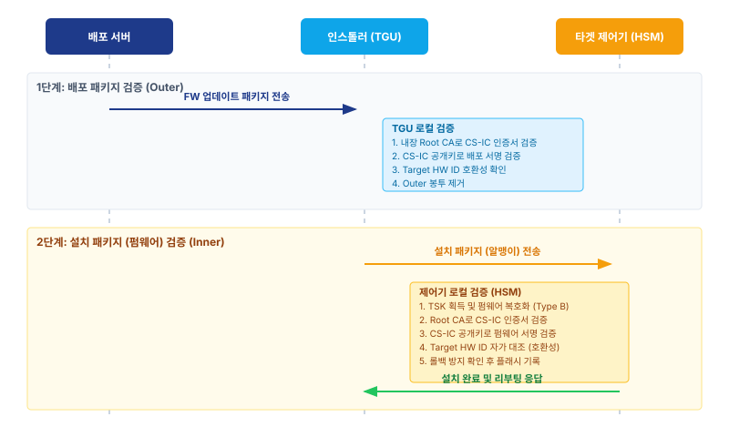
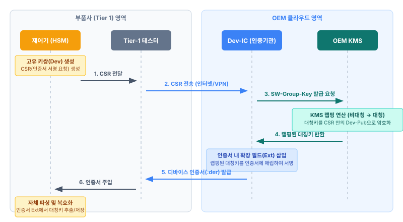

# 차세대 제어기 소프트웨어 업데이트(FOTA) 보안 아키텍처 명세서

| 항목 | 내용 |
|------|------|
| **문서 ID** | DOC-20 (A2 · 업데이트 사양) |
| **문서 버전** | v1.8 |
| **문서 분류** | 보안 아키텍처 / 기술 명세서 |
| **적용 대상** | 배포 서버(eSync 등 연동), 인스톨러(TGU 중심), 타겟 제어기(EPOS 등) |
| **용어 기준** | [DOC-00 용어집](../00-공통/용어집.md) |

본 명세서는 펌웨어(FW) 무선 업데이트(FOTA)의 **출처 보증(Authenticity)**, **무결성(Integrity)**,
**기밀성(Confidentiality)**을 확보하기 위한 PKI·전자서명·암호화·Secure Boot 아키텍처를 정의한다.

---

## 1. FW 업데이트 패키지 전자서명 PKI

본 장은 펌웨어 패키지의 출처 보증과 무결성을 확보하기 위한 공개키 기반 구조(PKI) 및 전자서명 정책을 정의한다.

### 1.1 PKI 계층 구조 및 인증기관(CA) 분리

단일 Root CA 산하에 목적별로 중간 인증기관(Intermediate CA)을 분리하여, 권한 탈취 시 피해 범위를 격리한다.

- **OEM Root CA:** 최상위 인증기관. 오프라인에 보관되며, 하위 Intermediate CA 발급 시에만 사용된다.
- **Dev-IC (Device CA):** 기기 인증망. 제어기(SGW, TGU, EPOS)의 신분 증명용 고유 인증서를 발급한다.
- **CS-IC (Code Signing CA):** 코드 서명망. 펌웨어·배포 패키지의 **모든 서명을 담당하는 단일 서명 주체**다. 개인키는 KMS 안에만 있으며 개발자·벤더·배포 서버 누구에게도 배포되지 않는다(§1.2).

### 1.2 중앙집중 서명 — KMS 서명 서비스

**모든 서명 개인키는 KMS 안에서만 존재하며 밖으로 나가지 않는다.** 개발자·벤더는 서명 키를 갖지 않는다.
대신 **플랫폼에 인증한 뒤 "이 펌웨어에 서명해 달라"고 요청**하고, 실제 서명은 KMS 안의 CS-IC가 수행한다(서명 서비스).

- **왜 이렇게 하나:** 개발자·벤더에게 키를 나눠주면 그 키가 유출될 때 가짜 펌웨어를 서명할 수 있다. 키를 아예
  내주지 않으면 그 위협이 사라진다. "누가 만든 펌웨어인가"라는 책임은 **키가 아니라 권한·기록으로** 담보한다 —
  누가 서명을 요청했고 누가 승인했는지를 **설치 매니페스트에 함께 담아 CS-IC가 서명**하고 감사 로그로 남긴다.
- **효과:** 타겟이 검증하는 서명은 **오직 CS-IC(플랫폼) 서명 하나**다. 개발자가 따로 서명한 값은 없다(검증 단순화 → §1.3).

서명은 **검증하는 주체가 둘(인스톨러·타겟)**이므로, 대상과 검증자가 다른 **2계층**으로 나뉜다. 단, 두 서명 모두
**주체는 CS-IC(KMS) 하나**다(개발자+배포로 나뉘던 과거의 이중서명과 다르다).

| 계층 | 서명 대상 | 서명 주체 | 검증자 | 무엇을 보증하나 |
|------|-----------|-----------|--------|-----------------|
| **배포 서명** | 배포 매니페스트(타겟팅·라우팅) | CS-IC (KMS) | 인스톨러(TGU) | 공인된 배포 승인, 설치 패키지 무결성, 오설치 방지 |
| **펌웨어 서명** | 펌웨어 + 설치 매니페스트 | CS-IC (KMS) | 타겟 제어기 | 펌웨어가 플랫폼이 승인한 정품·무결 상태임, Secure Boot 인가 |

> **같은 주체가 왜 두 번 서명하나:** 인스톨러는 배포 매니페스트로 라우팅을 판단한 뒤 `배포 패키지[1]`를 폐기하고
> `설치 패키지[2]`만 타겟에 넘긴다(§3). [1]이 사라진 뒤에도 타겟이 **스스로** 검증하려면 [2]가 자기 서명을 지녀야 한다.

### 1.3 신뢰의 연쇄(Chain of Trust) 검증 메커니즘

> 타겟이 **CS-IC의 펌웨어 서명**을 검증하는 원리를 정의한다. **발급 CA 공개키로 인증서를 검증하고,
> 검증된 인증서의 공개키로 다음 단계를 검증**하는 신뢰 연쇄를 따른다. (→ [DOC-00 §0.2](../00-공통/용어집.md))

`펌웨어 서명`은 **CS-IC**가 수행하므로(§1.2), 이를 검증하는 기준은 **CS-IC 공개키**이다. 타겟은 ROM의
`Root CA 공개키`를 앵커로 삼아 동봉된 `CS-IC 인증서`를 검증하여 `CS-IC 공개키`를 확보한다.

1. **Step 1:** `Root CA 공개키`로 `CS-IC 인증서`를 검증하여 `CS-IC 공개키`를 신뢰 확보한다. (CS-IC 공개키를 ROM에 사전 주입한 제약 타겟은 생략)
2. **Step 2:** `CS-IC 공개키`로 `펌웨어 서명`을 최종 검증한다.

개발자 서명 단계가 사라져 검증이 **2단계로 단순**해진다. 중앙집중 서명(§1.2)의 직접적 이점이다.

> **✅ 설계 결정 — 신뢰 앵커·체인 전달:** 타겟 제어기 ROM에는 **장수명 앵커로 `Root CA 공개키`만**
> 공정 주입(§5.1)하고, 발급 CA인 `CS-IC 인증서`는 **설치 패키지[2]에 동봉**하여 함께 전달한다(§2). 타겟은
> Root 앵커로 `CS-IC 인증서`를 검증해 `CS-IC 공개키`를 확보한 뒤 펌웨어 서명을 검증한다.
>
> **근거(생애주기·CRA):** 제어기 수명이 20년(DOC-10 §6.1)에 달해 그 사이 CS-IC는 만료·교체된다. Root만 고정
> 앵커로 두고 CS-IC를 패키지로 전달하면 **필드 기기 재프로비저닝 없이 CS-IC를 회전**할 수 있다. 수명·폐기의
> 상세는 §1.4에서 다룬다.

### 1.4 인증서 수명과 폐기 (수명 분리 · 오프라인 대응)

"수명"은 서로 다른 두 가지를 뒤섞기 쉽다. 이 둘을 분리해서 다룬다.

| 무엇의 수명 | 길이 | 이유 |
|-------------|------|------|
| **컴포넌트(펌웨어) 수명** | 수년 ~ 장비 수명(최대 20년) | 실제 운용 기간 |
| **서명 인증서(CS-IC) 수명** | 짧게 유지 · 주기 회전 | 키 유출 시 가짜를 새로 서명할 수 있는 창을 좁힘 |

오래 유지되어야 하는 것은 **펌웨어와, 타겟이 그것을 검증하는 능력**이지 CS-IC의 달력상 유효기간이 아니다.

- 타겟의 검증은 **ROM에 심긴 장수명 앵커(`Root CA 공개키`)**에 걸린다. 펌웨어 서명은 이 앵커가 신뢰되는 한(=장비 수명) 유효하다.
- 그러므로 **CS-IC는 단수명으로 두고 Root 아래에서 회전**해도, 새 `CS-IC 인증서`를 패키지에 동봉하면 그대로 검증된다.
- 결과적으로 **단수명 서명 인증서와 20년 검증 가능한 펌웨어가 동시에 성립**한다(필드 재프로비저닝 불필요).

**폐기(Revocation)는 경계별로 다르게 처리한다.** OCSP 같은 실시간 폐기 조회는 온라인을 전제로 하므로 오프라인 타겟에는 그대로 적용할 수 없다.

| 경계 | 성격 | 폐기 방식 |
|------|------|-----------|
| TGU ↔ 클라우드 · 배포 서버 | 연결 | **OCSP(스테이플링)** — 실시간 폐기 확인 |
| TGU → 타겟 제어기 (CAN) | 오프라인 | **만료 기반** + 필요 시 스테이플드 OCSP를 패키지에 동봉하거나 폐기목록(CRL)을 캠페인으로 배포 |

> **중앙집중 서명(§1.2)의 효과:** 개발자에게 키를 주지 않으므로 **개발자 키 유출로 인한 폐기 필요 자체가 사라진다.**
> 남는 폐기 대상은 연결 경계의 TLS 인증서와, 장비 수명에 묶인 **장치 신원 인증서**([DOC-10 §6.1](../10-시스템장비-보안아키텍처/시스템장비-보안아키텍처명세서.md))이며,
> 후자의 오프라인 폐기는 DOC-10 관할 과제다. (→ 트래커 B6, [REF-03](../05-참조-CRA배경/REF-03-추적성-적합성-개요.md))

---

## 2. FW 업데이트 패키지 구성트리

> **배포 서버와 OTA 서버의 관계:** 배포 서버는 배포 캠페인(타겟팅·릴리즈)을 총괄 관리하며, 펌웨어 패키징 시
> 배포 서명을 부착하여 인스톨러(TGU 등)로 전달한다.
>
> **eSync 호환 지향(설계 제약):** eSync(OTA Alliance 표준)는 아직 당사에 도입되지 않았으나 OTA·CRA 대응의
> 유력 솔루션으로 검토 중이다. 따라서 본 명세의 **배포 서버·패키지 구조는 eSync 배포 캠페인 모델과 정합**하도록
> 유지하여, 추후 eSync 도입 시 변경을 최소화한다. (→ [DOC-00 §2](../00-공통/용어집.md))

### 2.1 [Type A] 일반 평문 배포 트리 (암호화 미적용)

레거시 제어기나 암호화가 불필요한 제어기를 위한 표준 패키지 트리이다.

```
📦 FW 업데이트 패키지 (배포 서버 배포본)
│
├── 📂 [1] 배포 패키지 (Distribution Package)
│   │   * 목적: 인스톨러(TGU)의 타겟 라우팅 및 설치 패키지 신뢰성 검증
│   │
│   ├── 📜 CS-IC 인증서 (.der)
│   │
│   ├── 📄 배포 매니페스트 (Distribution Manifest)
│   │   ├── 🎯 타겟팅 메타데이터 (Target HW ID, 연식 조건, 강제 설치 플래그)
│   │   ├── ⚙️ 암호화 명세 (Encryption Mode: 'NONE')
│   │   └── 🔗 설치 패키지 해시 ([2]번 '설치 패키지' 전체에 대한 SHA-256)
│   │
│   └── 🔐 배포 서명 (Distribution Signature)
│
└── 📂 [2] 설치 패키지 (Installation Package)
    │   * 목적: 타겟 제어기의 최종 무결성·호환성 검증 및 설치
    │
    ├── 📜 CS-IC 인증서 (.der)
    │    * 목적: 펌웨어 서명을 검증할 CS-IC 공개키 제공 (Root CA 공개키로 체인 검증)
    │    * 예외: 타겟 ROM에 CS-IC 공개키가 사전 주입된 경우 생략 가능
    │
    ├── 📄 설치 매니페스트 (Installation Manifest)
    │   ├── 🎯 Target HW ID (품번·HW 버전 — 타겟 자가 호환성 검증용, §3.4)
    │   ├── 🔢 버전 메타데이터 (SW Version, ARVN 롤백 방지 버전 번호)
    │   ├── 🧾 서명 요청 신원 (요청 개발자/벤더·승인자 — 감사 속성, §1.2)
    │   └── 🔗 원본 펌웨어 해시 (아래 '순수 펌웨어'에 대한 SHA-256)
    │
    ├── 🔐 펌웨어 서명 (Firmware Signature — CS-IC/KMS 서명)
    │
    └── 📦 펌웨어 바이너리 페이로드
        └── 📄 순수 펌웨어 원본 파일 (.bin) (평문 상태)
```

### 2.2 [Type B] Secure Flash 암호화 배포 트리

고도화된 하드웨어(HSM)를 보유하여 지적재산권(기밀성) 보호가 필요한 제어기용 트리이다.

```
📦 FW 업데이트 패키지 (Secure Flash 적용 배포본)
│
├── 📂 [1] 배포 패키지 (Distribution Package)
│   ├── 📜 CS-IC 인증서 (.der)
│   ├── 📄 배포 매니페스트 (Distribution Manifest)
│   │   ├── 🎯 타겟팅 메타데이터 (Target HW ID 등)
│   │   ├── ⚙️ 암호화 명세 (Encryption Mode: 'AES-256-GCM')
│   │   ├── 🔒 암호화된 임시 세션 키 (Encrypted TSK)
│   │   │    * FW를 암호화한 대칭키(AES-TSK)를 대칭키 'FW-Group-Key'로 랩핑함
│   │   └── 🔗 설치 패키지 해시
│   └── 🔐 배포 서명 (Distribution Signature)
│
└── 📂 [2] 설치 패키지 (Installation Package)
    ├── 📜 CS-IC 인증서 (.der) (ROM 사전 주입 시 생략 가능)
    ├── 📄 설치 매니페스트 (Target HW ID · 버전(ARVN) · 서명 요청 신원 · 평문 원본 해시)
    ├── 🔐 펌웨어 서명 (Firmware Signature — CS-IC/KMS 서명)
    │
    └── 📦 암호화된 펌웨어 바이너리 페이로드
        └── 📄 순수 펌웨어 원본 파일 (.bin)
             * 보안: 임시 세션 키(AES-TSK)로 고속 암호화 처리됨
```

---

## 3. 패키지 검증 주체 및 검증 절차

본 장은 인스톨러(TGU 중심)가 패키지를 수신하여 타겟 제어기에 플래싱하기까지의 2단계 검증 시퀀스를 정의한다.



*[그림 1] 배포 패키지 및 펌웨어 검증 시퀀스 다이어그램*

### 3.1 1단계: 배포 패키지 검증 (인스톨러 역할)

- **검증 주체:** 인스톨러 (TGU)
- **검증 수단:** TGU 내부에 사전 주입된 `OEM Root CA 공개키`
- **검증 절차:**
  1. 패키지에 동봉된 `CS-IC 인증서`를 Root CA 공개키로 검증하여 배포 서버의 신원을 확인한다.
  2. 확인된 CS-IC 공개키로 `배포 서명`을 검증하고, 매니페스트의 무결성을 확인한다.
  3. `배포 매니페스트` 내의 설치 패키지 해시값을 직접 계산하여 설치 패키지 본문이 변조되지 않았음을 확인한다.
  4. `배포 매니페스트`의 `Target HW ID`를 대상 제어기의 실측값(UDS 0x22)과 대조한다(§3.4 ①).
  5. 검증 완료 후 `[1] 배포 패키지`를 폐기하고, `[2] 설치 패키지`를 타겟 제어기로 전송한다.

### 3.2 2단계: 설치 패키지(펌웨어) 검증

- **검증 주체:** 타겟 제어기 (HSM)
- **검증 수단:** 타겟 제어기 ROM에 공정 주입된 **`Root CA 공개키`(장수명 앵커)**. 설치 패키지에 동봉된 `CS-IC 인증서`를 이 앵커로 검증해 `CS-IC 공개키`를 확보한다. (제약 타겟은 `CS-IC 공개키` ROM 사전주입으로 대체 → §1.3)
- **검증 절차:**
  1. 인스톨러로부터 `설치 패키지`를 수신하고, 암호화된 경우 내장 대칭키(FW-Group-Key)로 TSK를 풀어 펌웨어를 복호화한다.
  2. 동봉된 `CS-IC 인증서`를 ROM의 `Root CA 공개키`로 검증하여 `CS-IC 공개키`를 확보한다. (CS-IC 공개키 사전주입 시 생략)
  3. 확보한 `CS-IC 공개키`로 `펌웨어 서명`을 검증한다(§1.3). 개발자 서명 단계가 없어 검증이 한 단계 짧다.
  4. `설치 매니페스트`의 `Target HW ID`를 자신의 실측 HW ID와 대조해 호환성을 자가검증한다(§3.4 ②).
  5. 매니페스트의 버전(ARVN)을 확인해 롤백 시도를 차단하고(§5.2), 펌웨어를 플래시 메모리(비활성 뱅크)에 기록한다.

### 3.3 펌웨어·서명 통합 무결성 보증

펌웨어와 서명은 별개로 보호되는 것이 아니라, **검증의 대상(Input)**으로서 하나로 결합되어야 한다.
`[펌웨어 + 서명]`은 하나의 **불변(Immutable) 패키지**로 간주하여 처리한다.

- **펌웨어 수정 시:** 해시값 자체가 변하므로 서명값이 일치할 수 없음.
- **서명 수정 시:** 공개키로 복호화한 값이 원본 해시와 일치하지 않음.

즉, 펌웨어 혹은 서명 중 하나라도 변경되면 서명 검증 알고리즘은 **'일치하지 않음(Mismatch)'**을 반환한다.

### 3.4 호환성 관문 (Compatibility Gate)

전자서명(§3.1~3.3)은 펌웨어의 **진위·무결성**만 보증한다. **어떤 HW 형상(품번·HW 버전)에 적용 가능한가(호환성)**는
서명으로 표현하지 않으며(→ [DOC-10 §3.1](../10-시스템장비-보안아키텍처/시스템장비-보안아키텍처명세서.md) 원칙 5),
품번별 서명키로 인코딩하지도 않는다. 호환성은 **서명된 타겟팅 메타데이터(`Target HW ID`)**를 대조하는 별도 관문에서
검증한다. 이로써 서명이 통과해도 "정품이나 비호환"인 펌웨어의 오설치(브릭)를 차단한다.

관문은 두 지점에 둔다.

- **① 배포 전 (인스톨러):** 인스톨러(TGU)가 **UDS 0x22(ReadDataByIdentifier)**로 타겟 제어기의 실측 HW ID(품번·HW 버전)를 읽어, `배포 매니페스트`의 서명된 `Target HW ID`와 대조한다. 불일치 시 설치 패키지를 전송하지 않는다. (§3.1-4의 "연결 장비 일치" 확인을 "타겟 제어기 실측 대조"로 강화)
- **② 설치 전 (타겟 제어기):** 타겟 제어기가 **자신의 HW ID를 `설치 매니페스트`의 `Target HW ID`와 대조**해 자가검증한 뒤 플래시한다. 인스톨러를 신뢰하지 않고 타겟이 독립적으로 오설치를 차단하며, 오프라인·유선(DMS) 경로에서도 동일하게 성립한다.

> **✅ 반영 완료(트래커 B2):** `설치 매니페스트`에 `Target HW ID`(품번·HW 버전)를 추가하여(§2.1·§2.2)
> `펌웨어 서명` 범위에 포함했다. 이로써 ②(타겟 자가검증)가 성립한다. 대조에 쓰는 UDS DID(HW 버전·품번) 규약
> 정의는 [DOC-30](../30-진단-인증사양/진단-인증-보안명세서.md)의 후속 과제로 남는다.

---

## 4. 대칭키(FW-Group-Key) 기반 FW 암호화 (Secure Flash)

펌웨어의 기밀성을 보호하면서도 복잡한 비대칭 연산을 줄이고 대규모 배포 스케일링을 만족하기 위해,
**대칭키 기반의 'FW-Group-Key'** 구조를 도입한다. FW-Group-Key는 일회용 `AES-TSK`(DEK)를 랩핑하는 KEK다.
키 인벤토리·격리는 [DOC-10 §1.2·§1.3](../10-시스템장비-보안아키텍처/시스템장비-보안아키텍처명세서.md)에서, 그룹 단위·회전 정책은 §4.3에서 규정한다.



*[그림 2] CSR 기반 대칭키(FW-Group-Key) 인증서 매립 주입 시퀀스*

### 4.1 인증서 확장 필드(Extension) 기반의 대칭키 주입 절차

1. **[부품사 영역] 고유 키쌍 생성 및 CSR 발급:** 제어기(HSM) 최초 전원 인가 시 난수를 발생하여 **`디바이스 고유 키쌍(Dev-Pub/Priv)`**을 스스로 생성한다. 공개키(Dev-Pub)를 포함한 CSR 규격을 만들어 Tier-1 테스터로 전달한다.
2. **[OEM 영역] CSR 전송 및 KMS 연동:** 테스터는 VPN을 통해 CSR을 OEM의 **`Dev-IC`**로 전송한다. Dev-IC는 내부망에 격리된 **KMS**에 대칭키 **`FW-Group-Key`**를 요청하고, 이를 CSR 내의 `Dev-Pub`으로 비대칭 암호화 받는다.
3. **[OEM 영역] X.509 확장 필드 매립:** Dev-IC는 디바이스 인증서를 발급할 때 암호문을 **X.509 v3 Custom Extension** 영역에 매립하여 서명한 뒤 테스터로 반환한다.
4. **[부품사 영역] 로컬 인증서 파싱 및 복호화:** 테스터가 인증서를 제어기에 주입하면, 제어기는 확장 필드 안의 암호문을 자신의 `Dev-Priv`로 풀고 최종 대칭키 `FW-Group-Key`를 HSM에 영구 저장한다.

### 4.2 FOTA 배포 서버의 암호화 프로세스

1. **[펌웨어 암호화]:** 배포 서버는 일회용 임시 세션 키(`AES-TSK`)를 생성하여 펌웨어를 고속 암호화한다.
2. **[TSK 랩핑 요청]:** 배포 서버는 `AES-TSK`의 랩핑을 KMS/CA에 요청하고, `FW-Group-Key`로 랩핑된 `Encrypted TSK`를 수령하여 배포 매니페스트에 동봉한다. **배포 서버는 `FW-Group-Key`를 보유하지 않으며**, 랩핑 연산은 KMS 안에서만 수행된다(→ [DOC-10 §1.2](../10-시스템장비-보안아키텍처/시스템장비-보안아키텍처명세서.md)).
3. **[로컬 복호화]:** 타겟 제어기는 자신의 HSM에 내장된 `FW-Group-Key`로 `AES-TSK`를 복호화하고, 이를 이용해 최종 펌웨어를 복호화한다.

### 4.3 FW-Group-Key 정책

FW-Group-Key는 펌웨어 기밀성 전용 대칭 KEK로, §4.2의 일회용 `AES-TSK`(DEK)를 랩핑한다.

- **보안 속성(기밀성 한정):** 무결성·정품성은 펌웨어 서명(§1)이 담당하므로 이 키는 **기밀성(IP 보호)만** 책임진다. 따라서 유출 시 위험은 가짜 펌웨어 주입이 아니라 펌웨어 IP 열람에 국한된다.
- **그룹 단위 = 정책 파라미터:** 어떤 단위로 키를 공유할지는 명칭에 고정하지 않고 정책으로 정의한다.
  - **현재값:** 제어기 **기종별**(펌웨어 빌드·릴리스 단위와 일치, 유출 피해를 한 기종 IP로 국한).
  - **후보:** **품번별** 등 *(보안감사 후 조정)*. 같은 기종이라도 품번이 갈리는 경우가 있고(예: EPOS = 굴착기용·휠로더용 등 **1 기종 → N 품번**), 전 건설기계 공통 단일 품번인 제어기도 있다(예: TGU = **1 기종 → 1 품번**).
  - 그룹 단위가 바뀌어도 아키텍처·명칭은 그대로이며 **정책값만** 조정한다.
- **회전(rotation):** §4.1대로 공정에서 HSM에 인증서 확장 필드로 주입되어 필드 회전이 어렵다. 기밀성에 국한된 위험이라 긴급도는 낮으며, 회전 방식은 **TBD**(→ [DOC-00 §5](../00-공통/용어집.md)).

---

## 5. Secure Boot 및 공정 초기 주입(Factory Flashing)

부품사 양산 단계에서의 물리적 펌웨어 플래싱(Factory Flashing)와, 플래싱 완료 후 기기가 부팅될 때 동작하는
로컬 무결성 검증(Secure Boot) 프로세스를 정의한다.

> **[참고] 활성 뱅크(Active Bank)와 HSM의 역할 분리**
> OTA를 지원하는 제어기의 플래시 메모리는 A/B 두 개의 뱅크로 나뉜다. **'활성 뱅크'는 수십 MB의 펌웨어
> 본체가 저장되어 현재 실행되는 대용량 저장 영역**이고, **HSM**은 내부 메모리가 수 KB에 불과한
> **소용량 보안 연산 모듈**이다. 부트로더는 활성 뱅크 펌웨어를 통째로 HSM에 넣지 않고, 빠른 해시
> 알고리즘(SHA-256)으로 요약본(Hash)을 만든 뒤 그 작은 요약본과 서명값만 HSM으로 보내 검증을 위임한다.

### 5.1 양산 라인의 초기 펌웨어 주입 (Factory Flashing)

부품사(Tier-1)의 양산 조립 공정에서는 FOTA 배포 패키지 구조(매니페스트·암호화 메타데이터 등)를 사용하지 않으며,
물리적 케이블을 통한 직접 플래싱을 수행한다.

- **양산용 ROM 이미지(Production Image):** OEM은 FOTA 포장 전 단계인 `[순수 펌웨어 + 펌웨어 서명(헤더) + Root CA 공개키]`가 하나로 결합된 단일 바이너리 파일(.hex/.bin)을 부품사에 제공한다.
- **고속 플래싱:** 부품사 라인의 플래셔(Flasher) 장비가 JTAG, SWD 등 하드웨어 인터페이스로 ROM 이미지를 플래시 메모리(활성 뱅크)에 직접 기록한다.
- **초기 검증 앵커 확립:** 이 과정을 통해 제어기는 첫 시동 전부터 내부에 'Root CA 공개키(검증 기준)'와 헤더의 '펌웨어 서명'을 보유하게 되어, 별도의 FOTA 통신 없이도 즉각적인 Secure Boot가 가능하다.

### 5.2 안티 롤백 (Anti-Rollback)

매니페스트 및 펌웨어 헤더에 **기재된** 보안 버전 번호(**ARVN**)를, HSM 내부의 **단조증가 비휘발성
카운터**(HSM 롤백 카운터)와 대조하여, 취약점이 존재하는 구버전으로의 다운그레이드 공격을 하드웨어 레벨에서
원천 차단한다. (ARVN과 HSM 롤백 카운터는 별개 객체 → [DOC-00 §3](../00-공통/용어집.md))

### 5.3 Secure Boot (안전한 부팅)

초기 양산 주입 또는 FOTA 업데이트가 완료된 후, 제어기에 전원이 인가(Ignition On)될 때마다 부트로더가
수행하는 프로세스이다.

1. **제어권 획득:** 제어기 하드웨어 부트로더가 제어권을 갖는다.
2. **Hashing:** 부트로더가 **활성 뱅크(Active Bank)** 전체를 스캔하여 펌웨어의 `SHA-256 해시값`을 계산한다.
3. **서명 확인:** 부트로더가 펌웨어 헤더에 부착된 `펌웨어 서명`을 확인하고, 계산된 해시값과 함께 **HSM**으로 전달한다.
4. **Verification:** HSM은 **`CS-IC 공개키`**(ROM의 `Root CA` 앵커로 검증한 `CS-IC 인증서`에서 확보, §1.3)로, `계산된 해시값`과 `서명값의 복호화 결과`를 수 밀리초(ms) 이내에 초고속 비교·재검증한다.
5. **Action:** 무결성이 확인된 경우에만 어플리케이션 영역으로 점프하여 제어 코드를 실행한다. 검증 실패 시 즉시 **변조 감지 모드(Security Alert)**로 전환하여 정상 뱅크로의 복구(Fallback) 또는 안전 모드(Safe Mode)로 진입한다.

---

## 개정 이력

| 버전 | 일자 | 내용 |
|------|------|------|
| v1.0 | 2026-07-10 | legacy `fota_v5.1.html` + `fota_v5.2.html` 통합·정제. 신뢰의 연쇄(§1.3)·통합 무결성(§3.3)을 흡수, 중복 제거, 오탈자·다이어그램 텍스트 정정, 용어 [DOC-00] 기준 통일. |
| v1.1 | 2026-07-10 | **용어 검수 반영:** 검증 기준을 '발급 CA 공개키' 원칙으로 정밀화(§1.3·§3.2 — 개발자 인증서는 CS-IC 공개키로 검증). 타겟의 CS-IC 공개키 확보 경로 설계 공백 TODO 명시. ARVN(버전 번호)과 HSM 롤백 카운터를 분리 정의(§5.2). |
| v1.2 | 2026-07-11 | eSync 미도입·**호환 지향**을 설계 제약으로 명시(§2). 약어 확정 반영(EPOS=Electric Power Optimization System). |
| v1.3 | 2026-07-11 | **설계 결정:** 타겟 CS-IC 공개키 확보 경로 확정 — Root CA 공개키만 ROM 앵커, `CS-IC 인증서`를 설치 패키지[2]에 동봉해 체인 검증(§1.3·§2·§3.2). 20년 수명 중 CS-IC 회전을 재프로비저닝 없이 지원(CRA). |
| v1.4 | 2026-07-11 | **문서 스파인 재편:** 구 DOC-10(FOTA)을 **DOC-20 · A2 업데이트 사양**으로 재배치(문서 ID 10→20). PKI 정적 아키텍처는 DOC-10, 진단은 DOC-30, 생애주기는 DOC-40으로 분리됨에 따라 상호참조 갱신. 내용 동일. |
| v1.5 | 2026-07-11 | 검수 반영: TSK 랩핑을 KMS·CA 요청으로 정정(§4.2, 배포 서버는 FW-Group-Key 미보유), 서명 주체 CS-IC 명확화, 콜로퀴얼 표현(굽기·통짜·알맹이 등) 정리. |
| v1.6 | 2026-07-11 | FW-Group-Key 정책(개념·그룹 단위·회전)을 §4.3으로 신설(DOC-10에서 이관). |
| v1.7 | 2026-07-14 | §3.4 「호환성 관문」 신설: 서명은 진위·무결성만 보증하고, 호환성은 서명된 `Target HW ID`의 별도 관문(① 인스톨러 UDS 0x22 실측 대조 + ② 타겟 자가검증)으로 검증함을 명문화(→ DOC-10 §3.1 원칙 5). 설치 매니페스트에 `Target HW ID` 추가는 구조 변경 TODO로 표기(트래커 B2). |
| v1.8 | 2026-07-14 | **서명 모델 전환(eSync 재서명 채택):** 이중서명(개발자+배포)을 폐기하고 **중앙집중 서명(KMS 서명 서비스)**으로 전환(§1.2) — 모든 서명을 CS-IC가 KMS 안에서 수행, 개발자·벤더는 키 없이 서명 요청, 타겟은 CS-IC 단일 서명만 검증(§1.3 2단계 단순화). §1.4 「인증서 수명과 폐기」 신설(컴포넌트·인증서 수명 분리, 경계별 폐기: 연결=OCSP·오프라인=만료+스테이플/CRL). §2 트리에서 개발자 인증서·서명 제거, 설치 매니페스트에 `Target HW ID`·서명요청 신원 추가(B2 반영). §3 검증 절차 갱신. (트래커 A2·B2·B6) |

## 관련 문서

- [DOC-00 용어집](../00-공통/용어집.md)
- [DOC-10 시스템·장비 보안 아키텍처 명세서](../10-시스템장비-보안아키텍처/시스템장비-보안아키텍처명세서.md)
- [DOC-30 진단·인증 보안 명세서](../30-진단-인증사양/진단-인증-보안명세서.md)
- [DOC-40 보안 생애주기·절차 명세서](../40-생애주기-절차/생애주기-절차명세서.md)
- [REF-03 추적성·적합성 개요](../05-참조-CRA배경/REF-03-추적성-적합성-개요.md)
