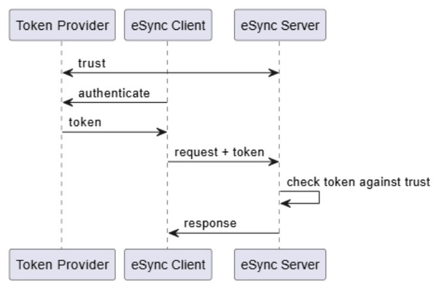
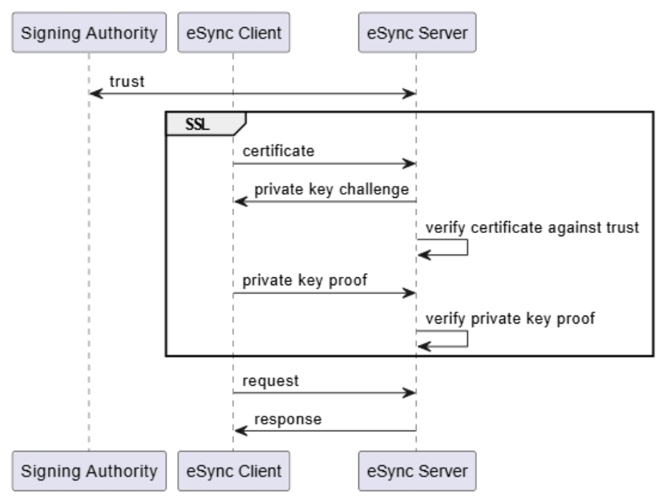
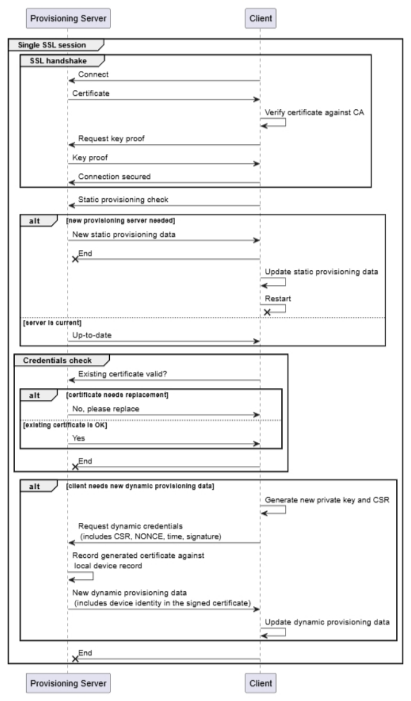
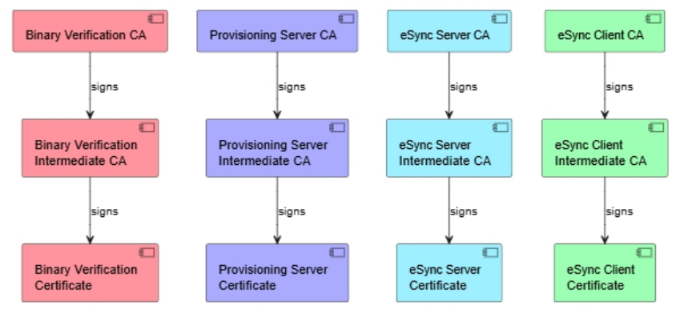
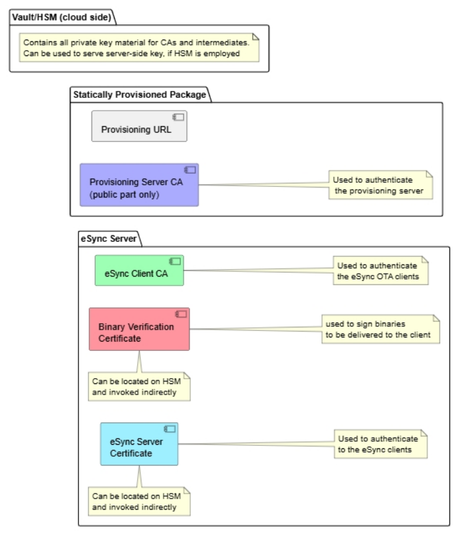
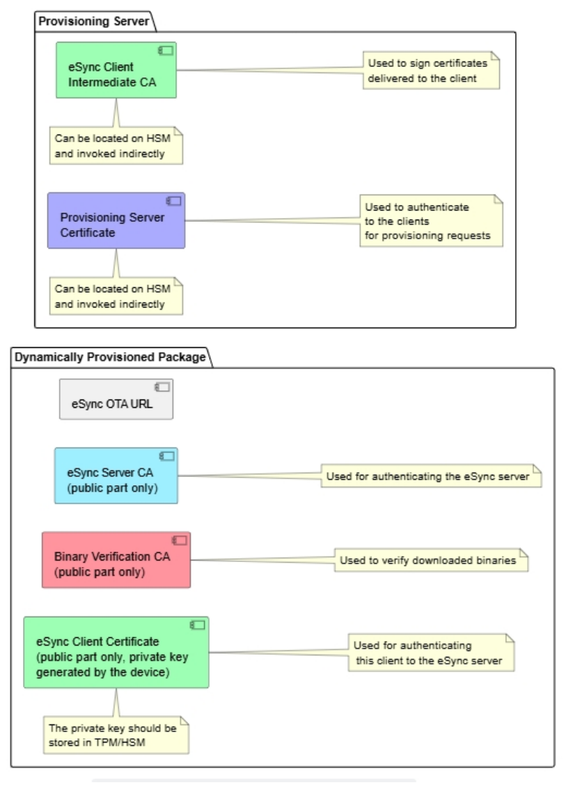

# 클라이언트 인증 통합 (Client Authentication Integration)

> **원문:** Excelfore, *Client Authentication Integration* (24p). **Excelfore Confidential.**
> **성격:** 내부 참조용 **비공식 한글 번역**. 외부 배포 금지. 원문의 절·제목 구조를 유지하되 자연스러운 기술문서체로 옮겼다.
> 원문은 구현 방식을 강제하지 않고 통용되는 관행과 그 eSync 적용을 검토하는 **권고 문서**다.
> **우리 아키텍처와의 대응은 문서 끝 「부록: 우리 프로젝트 대응표」에 별도로 정리한다.**

---

## 대상 독자 (Audience)

이 문서는 eSync Client를 자사 클라이언트 측 환경(차량, IoT 디바이스 등)에 통합하는 OEM과 서드파티 벤더를 대상으로 한다.

다루는 범위는 eSync 생태계가 제공하는 두 가지 인증 메커니즘이다 — eSync Client를 그에 대응하는 eSync Server에 인증시키는 것, 그리고 내려받은 업데이트를 인증하는 것.

인증에는 세 축이 있고, 최종 구현을 고를 때 셋을 모두 함께 고려해야 한다.

1. 인증 절차 그 자체
2. 인증 자료의 저장 위치와 그 보안
3. 인증 자료의 프로비저닝

## 개요 (Overview)

클라이언트를 서버에 인증시키는 메커니즘은 일반적으로 여러 가지가 있다. 무엇을 고를지는 다음 요인에 달려 있다.

1. 인증을 뒷받침하는 서드파티 인프라
2. 기존 인증 크리덴셜의 폐기(revocation) 요구사항
3. 이미 존재하는 구현

이 문서는 인증을 어떻게 구현해야 하는지를 지시하지 않는다. 대신 널리 수용되는 관행과 그것을 eSync 구현에 적용하는 방법을 검토한다.

고려해야 할 인증 적용 대상은 서로 다른 셋이다.

1. 내려받은 업데이트 바이너리는 무결성을 인증받아야 한다.
2. eSync Server는 자신의 진정성을 eSync Client에 증명해야 한다.
3. eSync Client는 자신의 진정성을 eSync Server에 증명하고 자신의 신원을 확립해야 한다.

---

## 내려받은 바이너리의 인증 (Downloaded Binaries Authentication)

내려받은 바이너리의 인증은 그 바이너리가 진정하다는 암호학적 증거를 지니고 있는지 확인하는 절차다. 내려받은 내용으로부터 결정적(deterministic) 방식으로 보안 해시값을 계산하고, 그 해시에 대한 서명을 검증한다. 따라서 바이너리는 서명과 함께, 그 서명을 생성한 주체에 대한 참조를 담고 있어야 한다.

### 인증서 기반 인증 (Certificate Authentication)

이 방식에서는 바이너리·서명과 함께 인증서와 (필요하면) 인증서 체인이 제공된다. 서명은 그 인증서에 담긴 공개키에 대응하는 개인키로 생성된 것이어야 한다. 클라이언트는 다음을 검증한다.

1. 서명이 실제로 대응하는 개인키로 서명되었는지
2. 인증서가 그 소지자에게 콘텐츠 서명 권한을 부여하는 표시를 담고 있는지
3. 인증서 체인을 따라 사용 가능한 신뢰 루트(root of trust)까지 도달해, 인증서가 진정한지

#### 구현 시 고려사항 (Implementation Considerations)

이 메커니즘은 HTTPS에서 인증서로 서버를 인증하는 것과 대체로 같다. eSync Server 인증에 적용되는 고려사항이 여기에도 그대로 적용된다.

대안으로, 서명 인증서를 서명된 바이너리와 함께 실어 보내는 대신 URL로 참조하게 할 수도 있다.

### 임의 키 기반 인증 (Arbitrary Key Authentication)

콘텐츠를 인증서로 감싸지 않은 낱개 키(loose key)로 서명할 수도 있다. 인증서가 없으면 체인 검증을 쓸 수 없으므로, 키의 유효성은 다른 수단으로 확립해야 한다. 서명 키를 검증해 주는 서비스가 클라이언트 측에 있을 때 주로 쓰는 방식이다. 키는 대칭키일 수도, 비대칭키일 수도 있다.

---

## eSync Server 인증 (eSync Server Authentication)

eSync Server는 자신의 진정성을 eSync Client에 증명해야 한다. 요점은 클라이언트가 지금 대화하는 상대가 업데이트 지시를 내릴 권한이 있는 서버인지, 그래서 내부 상태 정보를 그 서버에 안전하게 보내도 되는지다.

### 인증서 기반 인증 (Certificate Authentication)

클라이언트에서 서버로 가는 모든 통신은 HTTPS로 해야 하며, 이 프로토콜은 설계상 서버 측 인증서를 요구한다.

이때 인가(authorization)는 두 요소로 성립한다.

1. 서버 측 인증서가 지정된 인증기관(CA)의 서명을 받았을 것
2. 서버 측 인증서가 그 소지자를 eSync Server로 확정하는 명시적 속성을 담고 있을 것

인증이 제대로 동작하려면 클라이언트가 대응하는 CA를 로컬에 갖고 있어, 서버 인증서를 그 CA로 검증할 수 있어야 한다.

### 네트워크 기반 인증 (Network Based Authentication)

이 방식에서는 인증이 네트워크 계층에서 이뤄지며, eSync의 범위 밖이다. 서버는 네트워크에 진입할 수 있었다는 사실로 인증된 것으로 보고, 잘 알려진 주소로 그 네트워크에 나타난다는 사실로 인가된 것으로 본다.

#### 신뢰 기반 신원 (Trust Based Identity)

서버가 고정된 DNS 이름 또는 고정 IP 주소에 배치된다. IP 기반이 아닌 네트워크에서는 식별 방식이 프로토콜마다 다르다.

#### 네트워크 엔드포인트 신원 (Network Endpoint Identity)

네트워크가 접속한 주체의 신원을 제공한다면, 그 메타데이터로 서버의 신원을 검증할 수 있다. 다만 서버에 접속하는 쪽은 클라이언트이므로, 보통은 연결을 열기 전 디스커버리 과정에서 신원이 먼저 정해진다.

Ziti 같은 제로트러스트 네트워크에서 흔히 이렇게 구현한다.

---

## eSync Client 인증 (eSync Client Authentication)

eSync Client의 인증은 보통 다음 단계로 이뤄진다.

1. 해당 클라이언트가 서버에 접속해도 되는지 판정한다.
2. 클라이언트의 신원을 확립하되, 그 신원을 신뢰할 수 있다는 보증이 함께 있어야 한다. 식별에 쓰는 ID는 특정 eSync 배포(deployment)에 접속할 수 있는 모든 클라이언트에 걸쳐 유일해야 한다.
3. 클라이언트의 등록 레코드가 eSync 데이터베이스에 있는지 확인하고, 등록이 확인된 경우에만 서버와의 데이터 교환을 허용한다.

### 일반적인 인증 고려사항 (General Authentication Concerns)

#### 클라이언트 신원의 중요성 (Significance of Client Identity)

클라이언트의 신원이 가장 중요하다. 서버는 지금 호출한 클라이언트에 어떤 업데이트를 전달해야 하는지 정확히 알아야 하기 때문이다. 대부분의 OTA 시나리오에서 업데이트는 클라이언트에 대해 알려진 부가 정보(능력, 하드웨어 구성, 위치 등)를 근거로 특정 클라이언트를 겨냥한다.

또한 클라이언트는 OTA 절차의 상태와 업데이트 엔드포인트의 현재 상태 정보를 되보고하며, 이 정보는 올바른 클라이언트에 귀속되어야 한다.

eSync 클라이언트는 진단 정보 등도 백엔드로 보고할 수 있고, 그 정보 역시 올바른 클라이언트에 귀속되어야 운영자에게 제대로 제시된다.

신원이 암호학적으로 증명되지 않으면 스푸핑이 극도로 쉬워진다. 클라이언트 하나의 신원만 탈취돼도 다른 클라이언트를 다운그레이드시키거나 OTA 업데이트 수신을 막는 등 심각한 결과로 이어질 수 있다.

다만 신원을 보호하는 것이 물리적으로 불가능하다면(각 인증 메커니즘 설명에 그 개별 수단이 나와 있다), 신원을 인증 정보와 나란히 **인증되지 않은 속성**으로 제공하고, 일반 인증이 성공했다는 사실에 근거해 그 신원을 신뢰하도록 서버를 설정할 수 있다. 적어도 클라이언트가 쓰는 키가 유일하다면, 키 자체가 신원 역할을 할 수 있다.

#### 자동 등록 (Automatic Registration)

위 요건 3번에 대한 선택지로, 등록 레코드가 없을 때 eSync Server가 클라이언트를 자동 프로비저닝하는 방법이 있다. 1번과 2번이 검증되었다면 서버는 다음 중 하나를 할 수 있다.

1. 클라이언트 식별자를 근거로 외부 데이터베이스에 접속해 그 클라이언트 정보를 가져온다.
2. 제시된 크리덴셜에 담긴 정보를 근거로 클라이언트 레코드를 생성한다.

둘 다 불가능하면 클라이언트는 인가되지 않은 것으로 보고, 다른 수단으로 등록이 이뤄질 때까지 접속을 거부한다.

### 인증서 기반 인증 (Certificate Authentication)

클라이언트는 eSync Server에 요청을 보낼 때 인증서와 그에 연결된 개인키로 자신을 인증한다. 이후 모든 요청의 수행은 인증서의 존재와 SSL 세션의 성공적 수립을 전제로 한다.

클라이언트 식별자는 인증서 안에 있어야 한다.

인증서는 그 소지자가 클라이언트 역할임을 나타내는 부가 속성을 담아야 한다.

### 토큰 기반 인증 (Token Based Authentication)

키 기반 인증을 지원하는 임의의 메커니즘으로 인증을 구현할 수 있다. 키는 공유되거나 외부 출처(키 서버)에서 얻는다. 이 경우에도 클라이언트-서버 통신은 여전히 HTTPS로 하고, 서버는 여전히 HTTPS로 인증된다.

이 방식은 보통 "인증 토큰"이라 부른다. 토큰은 암호학적으로 서명된 객체이며, 서명된 문서 안에 클라이언트의 신원과 서명자에 대한 참조가 들어 있다. OAuth 토큰, JWT 토큰이 그 예다. 토큰은 대체로 수명이 짧은 객체로, 만료 시간이 몇 분에서 며칠 사이다.

이 구현에 필요한 요소는 다음과 같다.

1. eSync Client가 외부 서비스로부터 인증 토큰을 얻는 메커니즘
2. 각 HTTP 요청에 인증 토큰을 실어 보내는 메커니즘. 보통 `Authorization` HTTP 헤더로 구현한다.
3. eSync Server가 토큰을 검증하는 메커니즘. 보통 서명 키에 대한 포인터 또는 서명 키 자체를 eSync Server에 설정하는 것을 포함한다.

### 네트워크 기반 인증 (Network Based Authentication)

이 방식에서는 인증이 네트워크 계층에서 이뤄지며, eSync의 범위 밖이다. 클라이언트는 네트워크에 진입할 수 있었다는 사실로 인증된 것으로 본다. 클라이언트의 신원을 확립하는 방식에는 여러 가지가 있다.

#### 신뢰 기반 신원 (Trust Based Identity)

클라이언트가 추가 인증 없이 자신의 신원을 제시한다. 네트워크 인증을 통과했으므로 신뢰하는 것으로 본다.

#### 네트워크 엔드포인트 신원 (Network Endpoint Identity)

서버가 수신한 네트워크 패킷에서 추출한 네트워크 주소 또는 프로토콜상의 메타데이터로 클라이언트를 식별한다. 예를 들어 IP 주소를 유일한 신원으로 볼 수 있다.

#### 네트워크 인증 신원 (Network Authentication Identity)

네트워크가 접속한 주체의 신원을 제공한다면, 그 메타데이터로 클라이언트의 신원을 검증할 수 있다. 보통 커스텀 프로토콜(비TCP 기반이거나 TCP 위에 계층을 하나 더 얹은 것)에서만 가능하다.

Ziti 같은 제로트러스트 네트워크에서 흔히 이렇게 구현한다.

---

## 크리덴셜과 신뢰 저장 (Credentials and Trust Storage)

이 절의 내용 중 일부는 클라이언트와 서버에 똑같이 적용되지만, 서버 측에서는 훨씬 덜 문제가 된다. 서버는 항상 접근 가능하고, 큰 대가 없이 수정할 수 있기 때문이다.

### 저장된 인증서와 CA (클라이언트) — Stored Certificates and CAs (Client)

관련된 인증서(신뢰 루트 또는 CA 포함)의 수명은 디바이스의 예상 수명보다 상당히 길어야 한다. 디바이스가 실제 사용에 들어가기 전 창고에 머무는 기간도 함께 계산해야 한다. 일반적으로 인증서 교체에는 수동 갱신이 필요하다. 만료 전에 OTA 절차가 수행되리라는 보장이 없어, OTA로 인증서가 갱신된다고 단정할 수 없기 때문이다.

키 크기와 알고리즘은 만료 시점에도 여전히 충분히 강하도록 골라야 한다. 만료일이 먼 미래라면 이 점을 크게 고려해야 한다. 그런 이유로 RSA 키보다 **EC/ED 키**를 권장한다.

키 노출에 대비해 **복수의 CA**를 두고 **OCSP를 함께 지원**해야 한다. CA 키가 침해되면 전환할 다른 CA가 있어야 하고, OCSP로 침해된 CA로 검증되는 모든 요청을 무효화할 수 있다.

OCSP를 배치하지 않으면, 침해된 CA를 제거할 유일한 방법은 OTA 업데이트뿐이다.

CA 키 침해 위험을 최소화하려면, 실제 서버 측 키 발급에는 **중간 CA**를 써야 한다.

CA는 변조가 불가능하다고 볼 수 있는 위치에 저장해야 한다. 예를 들어 TPM이나 그 밖의 보안 읽기 전용 메모리다.

인증서 키(또는 인증서/키 조합)는 **TPM/HSM** 유닛에 저장해야 하며, 키가 그 유닛 밖으로 나가지 않고 키를 쓰는 모든 연산을 유닛이 수행해야 한다. 유의할 점은, eSync Client의 HTTPS 구현이 보통 OpenSSL을 쓴다는 것이다. 따라서 해당 TPM/HSM을 지원하는 **OpenSSL 엔진**을 Excelfore 엔지니어링 팀에 제공해 eSync Client와 통합할 수 있게 해야 한다. OpenSSL 엔진 구현을 제공할 수 없다면 대체 SSL 구현을 제공해야 하고, Excelfore가 그 다른 SSL 구현과 통합하게 되는데 이 경우 훨씬 많은 공수와 시간이 든다.

### 동적으로 제공되는 인증서와 CA (클라이언트) — Dynamically Available Certificates and CAs (Client)

원격 서버 인증에 쓸 CA를 제공하는 서비스가 클라이언트 플랫폼에 이미 있을 수 있다. 이 경우 eSync는 그 서비스를 활용하거나, 외부 절차가 정기적으로 갱신하는 CA를 가리키게만 하면 된다. eSync 솔루션이 이를 돕기 위해 제공할 수 있는 서비스는 프로비저닝 절을 참고한다.

### 개인키·비밀키 자료의 저장 (서버) — Private/Secret Key Material Storage (Server)

eSync 배포는 개인키 자료를 비밀 데이터로 저장하지만, 그 보안 수준은 키 데이터를 보관하는 저장소 말단의 보안 수준을 넘지 못한다.

키를 비밀로 지키려면 다음과 같이 한다.

1. 키를 클라우드 인프라가 사용한다면, 키는 키 볼트(AWS ACM에 해당)에 저장한다. 키 볼트에서 개인 자료를 빼낼 수 없다.
2. 키를 eSync 백엔드가 직접 사용한다면, 키는 HSM에 저장하고 개인키·비밀키 성분이 필요한 연산은 HSM 안에서 수행한다(AWS CloudHSM에 해당). HSM에서 개인키 자료를 빼낼 수 없다.

---

## 모범 사례 (Best Practices)

이 절은 디바이스를 보호하고 그 디바이스에 크리덴셜을 프로비저닝하는 전반적 방식을 검토한다.

### 인증 (Authentication)

#### 네트워크 기반 인증 (Network Based Authentication)

네트워크 기반 인증은 통상 통신을 보호하고 접근 제어를 제공하는 적절한 수단을 갖춘 하부 네트워크 메커니즘을 요구한다. 그러한 네트워크는 서드파티 벤더가 제공하는 것으로 전제한다. 그런 네트워크의 사용은 eSync 솔루션과 호환된다. 예:

- Ziti
- VPN
- 사설망(Private Networks)

네트워크 접속용 크리덴셜 자체는 여전히 프로비저닝이 필요할 수 있으므로, 네트워크 벤더가 구현을 제공하지 않는 한 프로비저닝 절의 모든 내용이 그대로 적용된다.

#### 토큰 기반 인증 (Token Based Authentication)

토큰 인증은 일반적으로 다음과 같이 볼 수 있다.

고려할 점은 다음과 같다.

1. 신뢰(trust)를 어떻게 발견하는가 (예: 서버로 푸시, 토큰 제공자에 요청, 중립적 위치에 게시)
2. 토큰 제공자가 어디에 있는가 (클라이언트 네트워크 내부인가 외부인가)
3. 클라이언트와 토큰 제공자 사이의 인증 프로토콜은 무엇인가

클라이언트 환경이 이미 쓸 수 있는 구현이 있다면, eSync 관련 인증도 그 솔루션과 통합해야 한다.

그렇지 않다면 클라이언트를 인증할 메커니즘을 따로 정해야 한다. 이 경우 문제는 통제된 환경 밖에서 프로비저닝을 위해 클라이언트를 식별하는 것과 동일한 문제가 된다.

토큰 인증은 **서버 인증과 다운로드 바이너리 인증을 해결하지 못한다**는 점에 유의한다.

#### 인증서 기반 인증 (Certificate Based Authentication)

인증서 기반 인증은 다음 도식으로 나타낼 수 있다. 교환이 성립하려면 디바이스가 이미 프로비저닝되어 있어야 한다.

토큰 인증과 인증서 인증의 주요 차이를 드러내기 위해 SSL 교환을 개략적으로 함께 표시했다. 토큰도 인증서로 보호할 수 있지만, SSL은 **요청마다 개인키의 존재를 검증하는** 고유한 능력을 제공하며 이는 토큰 인증에서는 일반적으로 지원되지 않는다.

#### 비교 (Comparison)

한 방식을 다른 방식보다 택할 때의 과제를 이해하기 위해 간단히 비교한다.

| 메커니즘 | 주요 장애 요인 | 프로비저닝 필요 |
|---|---|---|
| 사설망 | 적용 범위가 제한적 | 아니오 |
| VPN/Ziti | 네트워크 접속에 서드파티 벤더가 필요 | 예 |
| 토큰 | 토큰이 탈취되면 재전송(replay)될 수 있음 | 아니오 (단, 토큰 요청 하나하나가 사실상 프로비저닝 요청이 된다) |
| 인증서 기반 | 만료와 CRL 관리 | 예 |

네트워크 기반 인증을 논외로 하면, 토큰 인증과 인증서 인증의 비교는 좀 더 설명이 필요하다.

아주 높은 수준에서 보면 두 메커니즘은 거의 같고, 인증 절차를 처음부터 끝까지 보면 다음 단계로 나뉜다.

1. 어떤 주체가 클라이언트를 인증(certify)한다. 인증서 방식에서는 그 사실을 진술하는 인증서를 클라이언트에 주고, 토큰 방식에서는 토큰을 준다. 둘 다 클라이언트의 유효성을 보증하는 권한자가 서명한 객체다.
2. 클라이언트는 자신을 대표하도록 인증받았다는 증거를 서버에 제시한다.
3. 서버는 애초에 클라이언트를 인증했어야 할 주체에 대해 알고 있는 정보를 근거로, 제시된 증거가 실제로 유효한지 검증한다.

그러나 구체적으로 들어가면 큰 차이가 있다. 토큰 기반 인증에서는 클라이언트가 어떤 비밀도 보유할 필요가 없는 반면, 인증서 인증에서는 클라이언트가 개인(비밀)키를 보유해야 한다. 비밀을 두지 않는 것은 클라이언트의 공격 표면을 줄이므로 유리하다. 그러나 비밀이 없으면, 서버는 그 토큰이 실제로 해당 클라이언트에게 발급된 것인지 다른 클라이언트용이었는지 검증할 수 없다. 이를 완화하는 유일한 방법은 서버로 보내는 통신마다 클라이언트가 새 토큰을 받아 오게 하는 것인데, 여기에는 두 가지 문제가 있다.

1. 토큰 제공자가 고성능 엔드포인트여야 한다.
2. 서버가 토큰에 담긴 NONCE 값을 추적·관리해야 한다.

또한 클라이언트가 비밀을 갖지 않는다는 이점은, 애초에 토큰을 받아 오기 위한 인증에 어차피 비밀이 필요할 가능성이 크다는 사실로 상쇄된다.

따라서 **인증서 기반 인증이 토큰 기반 인증보다 낫다는 것이 Excelfore의 결론이다.**

### 클라이언트 측 프로비저닝 (Client-side Provisioning)

여기서 프로비저닝이란, 인증 관련 크리덴셜을 클라이언트 디바이스에서 사용할 수 있게 만들어 인증 절차에 바로 쓸 수 있는 상태로 두는 과정을 말한다.

프로비저닝은 크게 두 방식으로 나뉘며, 아래에서 각각 살펴본다.

프로비저닝 절차는 인증 정보를 디바이스로 **전달하는** 과정만을 다루며, 저장 방식에 대해서는 중립적이다. 저장 형태가 무엇이든 프로비저닝 메커니즘이 수신한 인증 정보를 그에 맞게 저장할 수 있다고 전제한다.

인증 메커니즘에 따라서는, 대응 크리덴셜이 다른 서비스의 일부로 제공된다면 프로비저닝이 필요 없을 수도 있다. 프로비저닝이 필요한지 판단할 때는 선택한 인증 메커니즘을 참고해, 요청된 서비스가 어떤 인증 자료를 필요로 하는지 확인한다. 그것이 프로비저닝해야 할 자료다.

#### 정적 푸시 프로비저닝 (Static Push Provisioning)

이 방식에서는 클라이언트가 사용할 인증 정보를 **제조 시점 또는 활성화 시점**에 제공한다.

프로비저닝이 실행되면 필요한 인증서와 키가 모두 디바이스의 해당 저장소에 기록된다. 디바이스 식별자는 이때 읽어 오거나 새로 설정한다. 디바이스 식별자의 유일성을 보장하는 수단이 있어야 한다.

이 절차는 보통 디바이스 모듈 또는 파일 시스템에 대한 내부 지식을 필요로 하며, 일반적으로 OEM/벤더가 구현한다.

이 방식의 가장 큰 난점은 **프로비저닝된 데이터를 나중에 바꿀 수 없다는 것**이다. 따라서 프로비저닝된 모든 정보의 수명이 디바이스의 수명을 넘어야 한다.

#### 동적 풀 프로비저닝 (Dynamic Pull Provisioning)

이 방식에서는 최초 활성화 시점이나 기존 인증 크리덴셜의 만료 시점에 **디바이스 스스로** 프로비저닝을 개시한다.

프로비저닝 절차가 만료 후 현장에서의 재프로비저닝을 지원한다면, 크리덴셜 만료 시점을 둘러싼 여러 고려사항은 더 이상 문제가 되지 않는다.

동적 프로비저닝을 지원하려면 다음이 필요하다.

1. 디바이스가 접속할 수 있는 프로비저닝 서버
2. 디바이스의 신원을 프로비저닝 요청에 실어 보내는 메커니즘
3. 악성(rogue) 프로비저닝 요청을 막는 보안 메커니즘

이 시나리오에서 인증 정보는 프로비저닝 서버가 계산해 클라이언트 측으로 전달하고, 클라이언트는 저장 요건에 맞게 그것을 저장한다.

동적 프로비저닝이 가능하려면 최소한 다음이 미리 프로비저닝되어 있어야 한다.

1. 클라이언트의 신원
2. 인증 비밀 (개인키 또는 공유키)

이 데이터는 읽기 전용 메모리에 저장해야 한다. 또한 신뢰된 애플리케이션만 접근할 수 있어야 한다. Excelfore는 이 정보를 보호하는 데 **TPM 모듈** 사용을 권장한다.

### Excelfore 권장안 (Excelfore Recommendation)

이 절은 디바이스 한 대의 전체 프로비저닝 절차를 다루며 구현 선택지를 함께 제시한다. 개별 요구사항과 능력에 따라 절차에 변형을 둘 수 있다.

#### 정적 프로비저닝 (Static Provisioning)

디바이스가 공장을 떠날 때, 이후의 프로비저닝과 부트스트랩을 가능하게 하는 최소한의 정보가 함께 들어가야 한다.

##### 서버 데이터 (Server Data)

디바이스가 프로비저닝 서버에 도달하려면 다음이 디바이스에 기록되어야 한다.

1. 접속할 URL
2. 프로비저닝 서버의 인증기관(CA)

이 인증기관은 **만료일이 장기**여야 한다. 디바이스가 너무 오래 오프라인으로 있다가 인증기관의 만료를 넘겨 버리는 일을 줄이기 위해서다. 인증기관에 선택하는 키는 만료 시점에도 여전히 타당할 만큼 충분히 커야 하고, 아니면 향후 암호해독에 내성이 있는 키 종류를 골라야 한다. Excelfore는 **ED25519 키**를 권장한다.

Excelfore는 프로비저닝 인증기관의 만료 기간으로 **30년**을 권장한다.

CA는 신뢰된 메모리에 저장하고, 신뢰된 애플리케이션만 그 메모리를 수정할 수 있어야 한다.

##### 클라이언트 데이터 (Client Data)

클라이언트에는 보안 키가 제공된다 — 개인키 또는 공유키다. Excelfore는 공유키보다 **개인키**를 권장한다. 개인키의 경우, 키 크기를 키울 필요가 없도록 **ED25519 키**를 권장한다.

그다음 클라이언트의 공개키를 공장 프로비저닝 서버에 등록해야 한다. 프로비저닝 키를 플래시한 공장 모듈이, 해당 공개키를 디바이스 식별 정보와 함께 자신의 레지스트리에 기록해야 한다.

여기에는 일반적으로 두 가지 접근이 있다.

1. 클라이언트가 기동하면서 정적 키가 없음을 확인하고, 키를 생성한 뒤 그 공개키를 브로드캐스트하면 이를 포착해 기록한다.
2. 공장 공정이 클라이언트 하드웨어에 키를 플래시하면서 공개키를 기록한다.

키는 **TPM/HSM 모듈 안에** 기록해야 하며, 읽기 전용이어야 하고, 애플리케이션이 직접 읽을 수 없어야 한다.

이를 정확히 어떻게 구현할지, 그리고 디바이스의 식별 정보를 어떻게 얻을지는 디바이스 제조사만이 안다.

최종 사용자가 디바이스를 완전 초기화할 수 있어야 한다는 요구사항이 있을 수 있고, 이 경우 디바이스는 새 키를 생성하게 된다. 그러면 최종 사용자는 디바이스 데이터베이스에 새 키로 디바이스를 재등록해야 한다. 이는 디바이스의 신원을 완전히 새로 확립하는 것이며, 이전 신원은 소실된다.

#### 동적 프로비저닝 (Dynamic Provisioning)

동적 프로비저닝 절차는 두 블록의 정보를 갱신할 수 있어야 한다 — 프로비저닝 정보 자체, 그리고 OTA 서버 접속용 식별 정보다.

프로비저닝 서버 자체도 키 침해나 새로운 키 요구사항 때문에 교체해야 할 수 있다. 그러면 클라이언트는 프로비저닝 정보를 다시 받기 전에 프로비저닝 블록을 먼저 갱신해야 한다.

따라서 한 번의 프로비저닝 구간에서 일어날 수 있는 교환은 다음과 같이 그릴 수 있다.

참고:

1. 정적·동적 프로비저닝 확인에는 두 개의 개별 HTTPS 메시지를 쓴다.
2. 프로비저닝 서버는 NONCE의 유일성을 보장하고, 사용된 시각 범위와 서명을 검증해야 한다.

##### 프로비저닝 서버 교체 (Replacing provisioning server)

다음 중 하나에 해당하면 프로비저닝 서버를 교체해야 한다.

- 프로비저닝 서버를 보호하는 개인키 중 하나라도 침해된 경우
- 기존 인증서를 보호하는 키가 너무 약하다고 판단되는 경우
- 기존 프로비저닝 CA가 예상 수명의 절반에 근접한 경우

프로비저닝 서버를 교체하는 경우:

1. 새 프로비저닝 서버는 **다른 호스트명**으로 등록해야 한다.
2. 기존 프로비저닝 서버들은 그 CA가 만료될 때까지 **계속 운영해야 한다.**
3. 기존 프로비저닝 서버는 프로비저닝 데이터에 서명해 주어서는 안 되며, 최신 프로비저닝 서버로의 이관만 지원해야 한다.

2번이 불가능하다고 판단되면, 새 서버로 전환하지 못한 디바이스는 업데이트 능력을 잃는다. 그 시점 이후 업데이트 능력을 복구하려면 물리적 접근이 필요하다.

##### 프로비저닝 확인 주기 (Provisioning Check Frequency)

일반적으로 디바이스는 **24시간에 한 번** 프로비저닝 상태를 확인해야 한다. 디바이스가 상시 켜져 있지 않고 사용 주기를 최종 사용자가 좌우한다면, **전원 주기마다** 프로비저닝 데이터를 확인해도 된다.

eSync 인증서의 만료 기간은 **60일에서 1년 사이**가 적절하다.

##### 시각 유지 (Time Keeping)

SSL 협상에서 가장 중요한 데이터 출처 중 하나가 디바이스의 로컬 시각이다. 서버 시각은 보통 NTP 등으로 최신 상태를 유지한다. 클라이언트의 시각을 최신으로 유지하는 것은 더 까다로울 수 있다.

클라이언트가 이 맥락 바깥에서 시각을 최신으로 유지할 수 있고, 프로비저닝과 OTA 기능 모두가 시계의 상대적 정밀도(에포크 초 단위 시각 생성)에 의존할 수 있다면, 이 절은 고려하지 않아도 된다.

디바이스의 시각을 항상 신뢰할 수 없다면 추가 고려가 필요하다. 디바이스 시각은 다음 중 하나 이상의 이유로 틀릴 수 있다.

1. NTP류 프로토콜이 디바이스에 구현돼 있지 않다.
2. NTP 인증을 검증할 수 없다.
3. 디바이스에 CMOS 시계가 없다.

이 경우 프로비저닝 서버와의 SSL 교환 중에 시계를 보정할 수 있다.

1. 프로비저닝 서버가 SSL "Server Hello" 메시지의 일부로 로컬 시각을 보낸다.
2. 인증서 검증 시 CA가 "아직 유효하지 않음"으로 판정되면, 서버가 제공한 시각을 일시적으로 "현재 시각"으로 간주할 수 있다.
3. SSL 협상이 성공적으로 끝나면 서버가 신뢰된다는 뜻이며, 앞서 수신한 시각값도 신뢰할 수 있다. 로컬 시계를 그 값으로 보정한다.

##### 오프라인 프로비저닝 (Offline provisioning)

디바이스가 오프라인 프로비저닝을 지원해야 한다면 — 즉 디바이스에 연결된 호스트 시스템의 도움을 받거나, USB 메모리 등을 꽂아서 — 디바이스는 정적 페이로드로 스스로를 프로비저닝할 수 있다.

1. 프로비저닝 페이로드를 생성하고, 이전에 존재하던 모든 CA가 발급한 인증서 전부로 서명한다.
2. 디바이스에 서명된 패키지를 제시한다. 사전 정의된 형식에 따라 정적 프로비저닝 부분을 추출하고, 정적 프로비저닝 데이터를 교체한다.
3. 이제 디바이스는 최신 프로비저닝 서버에 접속해 프로비저닝 데이터를 받을 수 있다.

이 방법으로 **동적 데이터를 프로비저닝하는 것은 권장하지 않는다.** 디바이스가 먼저 CSR을 생성해야 하는데, CSR 방식은 디바이스의 개인키가 디바이스 경계를 절대 벗어나지 않게 하는 수단이기 때문이다. 그럼에도 필요하다면 다음과 같이 할 수 있다.

1. 프로비저닝 시스템에서 개인키와 인증서를 생성한다. 인증서는 해당 권한자가 서명한다. 인증서는 디바이스의 신원을 담아야 한다.
2. 개인키를 디바이스의 비밀키/공개키(프로비저닝 시스템이 아는 값)로 암호화한다. 암호화 후 개인키는 파기한다.
3. 프로비저닝 패키지 전체(암호화된 키, 식별 인증서, 필요한 신뢰 자료)를 이전에 존재하던 모든 CA가 발급한 인증서 전부로 서명한다.

이 경우 디바이스는 자신의 개인키를 생성하지 않고, 프로비저닝 패키지에서 개인키를 복호화해 사용한다.

##### 디바이스 접근 차단 (Disabling device access)

디바이스는 디바이스 레지스트리의 대응 레코드가 활성(enabled)으로 표시된 경우에만 프로비저닝된다. 디바이스 접근을 차단하려면 프로비저닝 서버와 OTA 서버 **양쪽에서** 디바이스 등록을 비활성(disabled)으로 표시해야 한다. 그러면 eSync Server에 대한 접근이 즉시 끊기고, 이후 디바이스가 재프로비저닝되지도 않는다.

##### 인증서 체인 지도 (Certificate Chain Map)

다음 도식은 위에서 설명한 솔루션에 쓰이는 인증기관과 인증서를 정리한 것이다.

중간 인증서를 쓰는 한, 인증기관들은 통합할 수 있다.

인증서는 각 구성요소에 다음과 같이 배치된다.

##### 인증서 교체 (Certificate Replacement)

**클라이언트 인증서 (Client Certificates)**

클라이언트 인증서의 교체는 프로비저닝의 기본 기능이다. 인증서는 정기적으로 교체되는 것을 전제로 한다. 클라이언트 코드는 인증서 내용을 분석해 만료 타임스탬프를 기준으로 언제 교체해야 하는지 판단할 수 있다. 특정 클라이언트 인증서의 리키(rekey)를 강제하려면, 프로비저닝 서버에 그 지시를 내릴 수 있다.

중간 인증서를 교체해야 하는 경우, 일반적으로 별다른 변경이 필요 없다. 서명된 객체나 SSL 엔드포인트에는 항상 전체 인증서 체인이 함께 제공되기 때문이다.

CA를 교체해야 하거나 중간 CA를 폐기해야 한다면, 이제 무효가 된 인증서를 보유한 클라이언트를 리키하라는 신호를 프로비저닝 서버에 주어야 한다. 인증서 확인 요청이 클라이언트에게 리키를 지시해야 한다.

**프로비저닝 서버 인증서 (Provisioning Server Certificates)**

「프로비저닝 서버 교체」 절에서 다뤘다.

**eSync Server 인증서 (eSync Server Certificates)**

eSync Server 인증서나 중간 인증서의 통상적 교체는 운영에 영향을 주지 않는다. 새 인증서/중간 인증서가 같은 CA에서 유래하므로 그대로 수용되기 때문이다.

인증서를 폐기해야 하거나 CA를 교체해야 하는 경우, 프로비저닝 서버가 새 서명 인증기관을 가리키도록 해야 한다. 클라이언트 크리덴셜 확인이 리키를 요청하고, 새 CA 번들이 다음 서명 인증서와 함께 전달된다.

**내려받은 바이너리 인증서 (Downloaded Binary Certificates)**

바이너리 서버 인증서나 중간 인증서의 통상적 교체는 운영에 영향을 주지 않는다. 새 인증서/중간 인증서가 같은 CA에서 유래하므로 그대로 수용되기 때문이다.

인증서를 폐기해야 하거나 CA를 교체해야 하는 경우, 프로비저닝 서버가 새 서명 인증기관을 가리키도록 해야 한다. 클라이언트 크리덴셜 확인이 리키를 요청하고, 새 CA 번들이 다음 서명 인증서와 함께 전달된다. eSync Server에도 변경을 통지해야 하며, 기존 바이너리는 새 키/인증서 쌍으로 **재서명해야 한다.**

---

## 통합 단계 (Integration Steps)

### 구현 방식 선택 (Implementation Selection)

개별 eSync 배포마다 OEM/벤더는 다음에 대해 선택한 방식을 Excelfore에 제공해야 한다.

1. 바이너리 인증
2. 서버 인증
3. 클라이언트 인증
4. 클라이언트 측 인증 자료의 저장
5. 서버 측 인증 자료의 저장
6. 프로비저닝 메커니즘과 인프라
7. 해당 배포에 요구되는 추가 암호화·서명 메커니즘

위 항목들은 대체로 다음에 좌우된다.

- 예산 (서버 측 선택지마다 비용이 다르다)
- 클라이언트 측 모듈·서비스의 가용성 (토큰 서비스, TPM·HSM 모듈 등)
- 기존 프로비저닝 인프라 (EOL 프로비저닝, PoS 프로비저닝 등)
- 전달되는 콘텐츠의 암호화·서명에 대한 추가 요구사항. 예를 들어 바이너리를 eSync Server에 제공하기 전, 릴리스 절차의 일부로 암호화·서명하는 경우.

### 통합 API (Integration API)

eSync 클라이언트 인프라에서 인증 크리덴셜에 접근해야 하는 것은 eSync Client 모듈뿐이다. 클라이언트 측 시스템을 여럿 쓰는 경우, 아래 나열한 API는 eSync Client를 구동하는 시스템·환경에만 제공하면 된다.

#### 바이너리 인증 (Binary Authentication)

X.509 CA를 얻거나, 서명 키를 얻거나, 콘텐츠가 서명된 그 서명 키를 검증하는 메커니즘을 제공해야 한다.

#### 인증서 기반 클라이언트 인증 (Certificate Client Authentication)

기본 제공(out of the box)으로는 **X.509 인증서만 지원**한다.

다음 중 **하나**를 제공해야 한다.

1. CA·인증서·키를 읽어 올 수 있는 위치 (디스크 또는 네트워크)
2. TPM 또는 외부 서비스에서 CA·인증서·키를 가져오는 API
3. HSM에 저장된 키를 쓰기 위한 OpenSSL 엔진 구현
4. HSM에 저장된 키를 쓰기 위한 SSL 라이브러리 구현 (API 문서 포함)

추가로, X.509 인증서의 내용에 대해 다음을 알아야 한다. 이는 보통 인증서의 Subject 필드 또는 X.509v3 속성을 근거로 한다. Subject 필드의 내용에 대해서는 참조 데이터가 어느 RDN에 저장되는지 알려 주어야 한다.

1. 식별 정보. 클라이언트의 신원을 인증서에서 어떻게 추출하는가.
2. 인가 정보(있는 경우). 즉 인증서 사용을 인가할 때 고려해야 할 제약. 예를 들어 특정 속성/값의 존재, 특정 Subject RDN이 특정 값을 가질 것 등.

구현 측이 인증서 구조를 정의하지 않으면, eSync 배포는 기본값으로 다음 인증서 제약을 부과한다.

1. Subject의 `OU` RDN은 `x14_device`여야 한다.
2. X.509v3 속성 `1.3.6.1.4.1.45473.1.1`은 IA5 문자열 리터럴 `sota`의 ASN.1 SET 값으로 설정해야 한다.
3. X.509v3 속성 `1.3.6.1.4.1.45473.1.11`은 UTF-8 문자열 리터럴의 ASN.1 SET 값으로 설정하고, 디바이스의 테넌시(tenancy)를 담아야 한다. 한 배포에서 테넌시를 하나만 쓴다면 값은 보통 `default`다.
4. X.509v3 속성 `1.3.6.1.4.1.45473.1.10`은 디바이스 식별자로 설정하고, 값은 UTF-8 문자열로 표현한다.

#### 토큰 기반 인증 (Token Based Authentication)

다음을 **모두** 제공해야 한다.

1. 인증 토큰을 얻는 API/메커니즘. 토큰 캐시가 있다면 토큰을 갱신하는 메커니즘도 필요하다.
2. 토큰의 만료 시각을 판정하는 메커니즘
3. 서버 측에서 토큰을 검증하기 위한 키 디스커버리 메커니즘 API

#### 네트워크 기반 인증 (Network Based Authentication)

네트워크의 토폴로지와 보안을 다루는 문서를 제공해야 한다. 구체적으로 Excelfore가 알아야 하는 것은 다음과 같다.

1. 엔드포인트를 어떻게 식별하는가
2. 클라우드 측에서 네트워크에 참여하는 메커니즘 (해당하는 경우)
3. 클라이언트 측에서 네트워크에 참여하는 메커니즘 (해당하는 경우)
4. 신원 정보를 서버 측에 어떻게 제공하는가. 제공할 수 없다면 클라이언트의 신원을 어떻게 판별할 수 있는가.

---

## 부록: 우리 프로젝트(CRA) 대응표 — 번역자 정리

> 원문에 없는 내용. 원문 개념을 우리 사양 체계와 잇기 위한 참조다. 상세 대응·충돌은 별도 검토 대상이다.

| 원문 개념 | 우리 프로젝트 |
|---|---|
| eSync Client 인증서 기반 인증(권장안) | **디바이스 인증서**(`CN=Serial`)로 AWS IoT Core에 mTLS 접속 |
| Binary Verification CA → 중간 CA → Binary Verification Certificate | **OEM Root CA가 CS Cert를 직접 발급**(중간 CA 없음). **구조 차이 — 검토 필요** |
| Provisioning Server (동적 풀 프로비저닝) | 현재 사양은 **Tier-1/EOL 정적 주입**. 동적 프로비저닝 서버는 미정 |
| Provisioning CA 만료 30년 권장 | 부품 정품 인증서 수명과 함께 재검토 대상 |
| eSync 인증서 만료 60일~1년 권장 | 디바이스 인증서 장수명 전제와 **충돌 — 재검토** |
| ED25519 권장 | 본 사양은 **ECDSA P-256**. **알고리즘 차이 — 근거 정리 필요** |
| 개인키를 TPM/HSM에 보관, OpenSSL 엔진 제공 필요 | EPOS-30i는 HSM 보유. **TGU의 키 보관 수단은 미정(TBD)** |
| 복수 CA + OCSP로 CA 침해 대비 | 오프라인 경계는 OCSP 불가 → **CRL 등 폐기 전략 과제** |
| 디바이스 시각 부정확 시 SSL Server Hello로 시계 보정 | **신뢰 시각** 확보 과제와 직결 |
| 디바이스 접근 차단 = 프로비저닝 서버·OTA 서버 양쪽 비활성 | 장비 폐기·도난 대응 절차에 반영 필요 |
| `OU=x14_device`, OID `1.3.6.1.4.1.45473.1.{1,10,11}` | **디바이스 인증서 프로파일에 반영 필요**(eSync 배포 기본 제약) |
