# eSync의 종단간 보안 (End to end Security in eSync)

> **원문:** Excelfore, *End to end Security in eSync* (29p, 2026). **Excelfore Confidential.**
> **성격:** 내부 참조용 **비공식 한글 번역**. 외부 배포 금지. 원문 절·제목 구조를 유지하되 자연스러운 기술문서체로 옮겼다.
> 원문은 전반적으로 "권고(suggestive)이며 강제가 아님"을 밝힌다. 반복되는 동일 주의문은 한 번만 옮기고 이후는 생략한다.
> **우리 아키텍처와의 대응(eSync Client ≈ TGU 등)은 문서 끝 「부록: 우리 프로젝트 대응표」에 별도로 정리한다.**

---

## 개요 (Overview)

eSync는 커넥티드 차량의 소프트웨어를 무선(OTA)으로 업데이트하고 데이터를 수집하는 기술이다. 서로 다른 운영체제로
여러 네트워크·버스에 흩어진 다수의 전자 제어기를 하나의 보안 데이터 파이프라인으로 다룬다.

이 문서는 eSync의 보안 아키텍처를 다룬다. eSync는 eSync Server에서 eSync Client 게이트웨이를 거쳐 종단 노드(HU,
T-Box, ECU)까지 종단간 보안을 제공한다. ECU에서의 보안 수준은 그 ECU의 능력(메모리·연산·암호 지원)에 달려 있다.
ECU가 자원 제약이 크면, 페이로드는 OTA 체인의 마지막 "안전한 홉(hop) 노드"까지만 보호된다.

> **주의:** 사용하는 암호 모듈은 합의된 표준(consensus standards)을 따라야 한다. 따르지 않는다면 차량 제조사가 그 사용을 정당화해야 한다.

### eSync Server-Client-Agent 모델

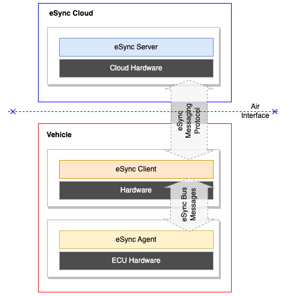

세 하위 시스템(Server·Client·Agent)이 차량과 인프라 양 끝에서 암호화된 컴포넌트의 전달·설치를 담당한다. 세 시스템은
서로 독립적으로 동작하며, 한쪽이 다른 쪽을 막거나 기다리지 않고 매끄럽게 협력해 OTA 업데이트를 수행한다.

- **eSync Cloud:** eSync Server + 클라우드 하드웨어
- **Vehicle:** eSync Client(차량 내 게이트웨이) + eSync Agent(ECU 상주)
- 서버↔차량은 **eSync Messaging Protocol**(Air Interface), 차량 내부는 **eSync Bus Messages**로 통신한다.

### eSync 전반의 보안 레벨 (Security Levels across eSync)

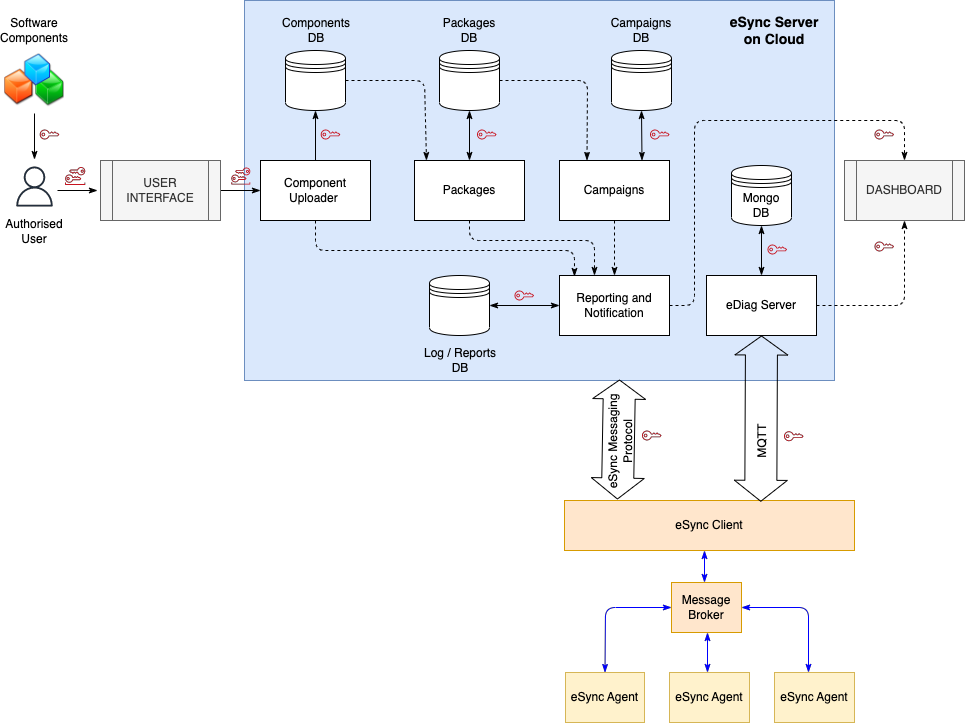

OTA 업데이트는 원격 차량 내부의 엣지 디바이스까지 도달하므로, 전 과정에서 업데이트가 훼손되지 않도록 광범위한 보안이
필요하다. eSync 시스템의 모든 인터페이스에 보안이 적용된다(사용자 인터페이스, 컴포넌트 업로더, 패키지·캠페인 DB,
리포팅/알림, eDiag 서버, MongoDB·대시보드, eSync Client, 메시지 브로커, eSync Agent 등).

### 중요 노트 — 최소 보안 요건 (Important notes)

eSync OTA는 최소 보안 요건을 정하고, 그 위에 파이프라인 보안을 강화하는 구조를 제공한다. 충족해야 할 최소 조건:

- **인증서:** eSync Server의 SSL/인증서, eSync Client·Agent·사용자(로그인·컴포넌트 서명·업로드·캠페인 배포)용 인증서.
- **암호화:** 종단간 암호화가 원칙. 단, 엣지 디바이스가 복호화 능력이 없으면 예외로 하되, 구현자는 평문 페이로드를 안전하게 다뤄 대상 디바이스까지 전달해야 한다.
- **TLS:** 별도 언급이 없으면 모든 통신은 최신 표준이 요구하는 버전의 TLS로 한다.
- **인증기관(CA):** 구현자는 신뢰할 수 있는 CA를 도입한다.
- **PKI:** 원하는 공개키 기반구조는 **구현자가 직접 관리**한다. † *PKI 인프라의 규정은 eSync 사양의 범위를 벗어난다.*
- **인증서 갱신/폐기:** 모든 인증서는 주기적으로 갱신·교체한다. 갱신 시점은 구현자가 정하되 eSync Alliance는 45~90일을 제안한다.
  - 인증서는 "장수명"이면 안 된다. 단수명 인증서(예: 90일)를 다룰 수 있어야 한다.
  - NIST 권고상 3년을 넘지 않아야 하며, Apple 등은 398일 초과 인증서를 거부한다.
  - UNECE·NIST·NHTSA·ITU-T X.1373 등 해당 규정을 만족해야 한다.
- **알고리즘:** 가능하면 독자·특허 알고리즘으로 보안을 강화할 수 있으나, eSync OTA 솔루션 전반에서 동일하게 유지해야 한다.
- **컴플라이언스:** 구현 지역의 규제 기관이 정한 보안 지침을 준수해야 한다.

---

## 최상위 아키텍처 (Top Level Architecture)

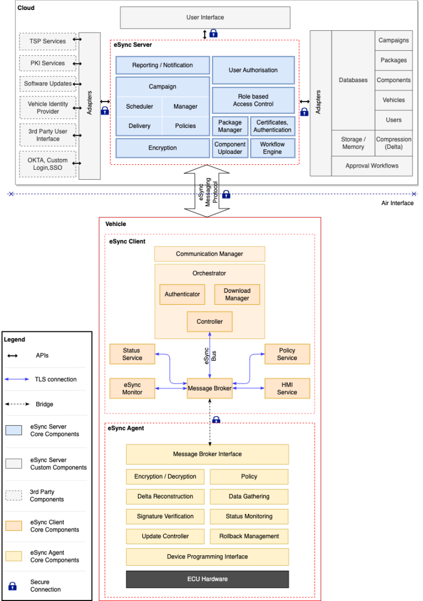

보안은 다음 모든 인터페이스에 적용된다.

- 사용자 인터페이스 ↔ eSync Server
- 3rd Party 컴포넌트 ↔ eSync Server
- 의존 컴포넌트 ↔ eSync Server
- eSync Server ↔ eSync Client
- eSync Client ↔ eSync Agent

**클라우드(eSync Server) 주요 구성요소:** 리포팅/알림, 사용자 인가, 캠페인(Scheduler·Manager·Delivery·Policies),
역할 기반 접근제어(RBAC), Package Manager, Certificates/Authentication, Component Uploader, Workflow Engine, Encryption.
어댑터를 통해 TSP·PKI·SW 업데이트·차량 신원 제공자·3rd Party·OKTA/SSO 등과 연동하고, DB(캠페인·패키지·컴포넌트·차량·사용자·승인 워크플로)와 스토리지(델타 압축)를 둔다.

**차량(eSync Client) 주요 구성요소:** Communication Manager, Orchestrator(Authenticator·Download Manager·Controller),
Message Broker, Status/Policy/HMI Service, eSync Monitor. **eSync Agent:** Message Broker Interface, 암복호화, 델타 재구성,
서명 검증, 업데이트 컨트롤러, 롤백 관리, Device Programming Interface, 상태 모니터링 등.

---

## 일반 종단간 보안 (General end to end Security)

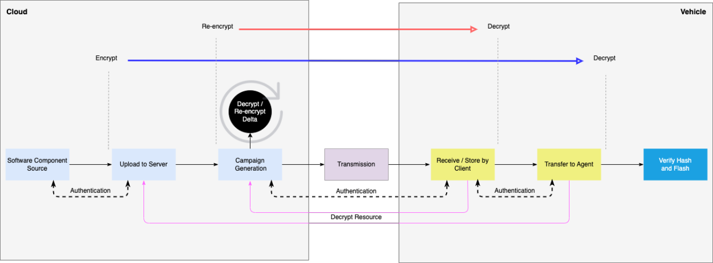

OTA 전 단계에서 **인증서로 인증·검증한 뒤에야** 업데이트가 진행된다. 데이터는 클라우드에서 암호화되어 차량까지
전달되고, 필요 시 중간에서 재암호화(re-encrypt)된다. 전달 링크 예: eSync Cloud→차량 내 eSync Client, eSync Client→eSync Agent,
eSync Agent→ECU. **모든 단계의 인증으로 데이터 무결성을 보장한다.**

### 다중 보안 레벨 (Multiple Levels of Security)

OEM은 링크별 암호화 수준을 선택할 수 있다.

- 송수신자용 **X.509 인증서**, 전 키에 대한 **PKI**, (고성능 프로세서 기기의) **개인키**
- **데이터 무결성**: SHA로 전송 중 변조 여부 확인
- SHA 값에 인증서로 서명(다단계 서명 포함)
- 페이로드 **암호화**: 128/192/256비트 AES 또는 Camellia
- 키 관리는 **HSM** 사용. 모든 트래픽은 TLS.

eSync Server가 지원해야 하는 암호 조합:

| 암호화 방식 | ECDH | DH | RSA |
|-------------|:----:|:--:|:---:|
| AES-GCM | X | X | X |
| AES-256 | X | X | |
| AES-128 | X | | |
| AES | | X | X |
| Camellia-128 | | X | X |
| Camellia-256 | | X | X |

**구현 선택과 이점:** 일부 알고리즘은 연산 부담이 커서 저사양 ECU엔 무리다. 사양은 링크별 조합 최적화를 권한다. 시스템
설계자는 링크마다 다른 수준을 자유롭게 쓸 수 있고, eSync Client는 이에 무관하다. 예를 들어 어떤 ECU는 AES-128만
이해하고, 다른 트래픽은 다른 표준으로 암호화될 수 있다.

---

## 인증서 프로세스 (Certificate Process)

### 최초 인증서 생성 (First-time certificate generation)

eSync Server는 RSA/ECC 개인키와 CSR을 만들어 PKI 제공자에 제출해 eSync Server 인증서를 발급받는다.

1. eSync 관리자가 ECC 개인키를 생성한다.
2. 그 개인키로 CSR을 만든다.
3. PKI 제공자 애플리케이션에 로그인해 CSR을 제출한다(검증·서명·반환).
4. PKI 제공자가 선호 방식으로 CSR을 검증한다: `admin@<OTA_server_FQDN>`로 검증 링크 이메일 / DNS에 CNAME 추가 / 서버 루트에 텍스트 파일 업로드 중 하나.
5. 검증이 끝나면 인증서 다운로드 링크를 주거나 이메일 첨부로 보낸다.

---

## 서버 서명 (Server Signing)

eSync Server는 업로드 시 인증서를 검증한 뒤, **원 서명을 제거하고 자신의 서명으로 교체**한다. 서명에 쓰는 값:

- X.509 인증서 체인(다중 인증서 허용), PEM 인코딩
- 대응 개인키(PKCS#1 또는 PKCS#8, PEM), 필요 시 개인키 암호(`server-private-key` 설정)

> **주의:** 디바이스는 **eSync Server가 서명한 콘텐츠만 수용**하고, 개발자가 서명한 콘텐츠는 인정하지 않아야 한다.

### 서버 서명 콘텐츠의 인증서 검증

eSync Server는 자기 서명의 유효성도 확인한다. 업로드 콘텐츠 검증과 유사하되: 사용자명 확인은 없고, 서명자가 eSync
Server 그룹에 속하며 "sign" 인가를 포함해야 한다.

### 디바이스 인증 (Device Authentication)

eSync Server는 들어오는 모든 디바이스를 **상호 SSL(mTLS)**로 인증한다. 모든 디바이스는 유효한 X.509 인증서를 제시해야
하고, 지정된 신뢰 앵커(trust anchor) 목록에 대해 유효해야 한다. SSL 인증 성공 후 인가를 수행한다: 인증서 내 디바이스 ID
확인, 디바이스 그룹 소속 확인, "SOTA" 인가 확인.

### 인증서 갱신 (Certificate Renewal)

eSync Server 인증서가 만료 임박(보통 만료 45~90일 전, 구현마다 다름)이면 관리자가 PKI 포털에서 갱신 요청을 제출하고,
검증 후 새 인증서를 받는다.

### 인증서 검증 (Certificate validation)

eSync Client가 인증서를 검증한다. 발급 PKI가 인증서를 폐기하지 않았는지 확인하며, eSync Server는 **OCSP Stapling과
Must-Staple**로 폐기 인증서를 탐지한다. eSync Server가 TSP·차량 내 eSync Client로부터 SSL 인증서를 받으면 다음을 수행한다.

- **신뢰 체인(Chain of trust):** 로컬 신뢰 저장소의 Root·Intermediate CA 인증서와 제시된 인증서로 체인을 구성해 Root CA까지 잇는다.
- **유효기간:** "Not Before"/"Not After"로 만료 여부 확인.
- **Common Name:** CN 값으로 인증서가 제시 주체의 것인지 확인.
- **폐기 상태:** PKI 인터페이스가 정의한 대로 OCSP 호출.
- **코드 서명 인증서:** 업로드 전 PKI 제공자 인증서로 업데이트 SW 서명. 업로드 후 eSync Server가 서명을 검증하고, 확인되면 자기 개인키로 패키지에 서명해 컴포넌트 DB에 저장한다.
  - *(권고 워크플로)* 업로드 컴포넌트를 임시 메모리 풀에 두고, 업로더에게 확인 이메일을 보낸 뒤, 인가된 사용자가 확인하면 컴포넌트 DB로 옮긴다.

코드 서명 인증서는 eSync Server가 유효성·인가 사용자 소속을 판별할 수 있는 특정 형식을 따른다. 벤더 인증서를 올바로
검증하려면 그 형식을 벤더에 전달하거나 형식을 설명해야 한다.

---

## 디바이스 인증서 (Device certificates)

- **CN:** eSync Client 인증서의 CN은 eSync Client가 설치·구동되는 시스템의 시리얼 번호다.
- **유효기간:** eSync Client·Agent 인증서는 자주 만료되도록(보통 45~90일) 설정해 신선도를 유지하고 침입을 막는다. 매번 만료 여부를 확인한다.
- **최초 프로비저닝:** ECU 벤더가 PKI와 연동해, ECU 이미지(또는 eSync Client)를 플래시하기 전에 ECU 인증서를 요청한다. ECU 시리얼로 CSR을 만들어(CN=ECU 시리얼) PKI에 요청하고, PKI가 CN=`<ECU_Serial_Number>`로 OEM 유효기간의 인증서·개인키를 발급한다. 벤더는 파일시스템 인증서를 eSync Client가 접근 가능한 위치에 저장한다.
  - *보안상, Excelfore는 ECU 벤더가 **개인키를 직접(ECC로) 생성**하고 CN=`<ECU_Serial_Number>`로 CSR을 만들어 PKI에 보내 그 CSR로 발급받기를 권한다. ECU가 CSR 생성이 전혀 불가능할 때만 위 방식(PKI가 키 생성)을 쓴다.*
- **인증서 교체:** eSync Client 인증서는 OEM이 정한 기간에 만료된다. 폐기되면 eSync Server가 새 클라이언트 인증서를 요청해 차량 내 클라이언트로 내려보낼 수 있다(새 RSA 키+CSR, 캠페인으로 배포, Agent가 구 인증서를 교체, 검증 호출로 확인, 실패 시 롤백).
- **업로드 콘텐츠 검증:** 업로드 콘텐츠 서명 인증서는 ① 업로더 사용자명과 일치, ② Developers 그룹 소속, ③ "sign" 인가 포함이어야 한다.
- **OCSP:** eSync Server·Client는 OCSP로 서로의 인증서를 검증한다. 설정 가능한 단정값: `DISABLED`(기본, 검사 안 함)·`NONE`(검사하되 OCSP 실패해도 수용)·`REQUIRED`(OCSP 속성 없으면 인증 실패)·`ENFORCED`(OCSP 응답이 명시적 "GOOD"이 아니면 실패).

### 보안 권고 [Uptane/TUF]

- **키 침해 취약성:** 단일 키(또는 임계값 미만의 키)만 장악해도 클라이언트를 침해할 수 있다(온라인 단일 키·오프라인 단일 키 모두). eSync Server의 완화책: 인증서 서명 키, 승인 후 컴포넌트 서명 키, eSync Client의 서버 통신 키를 각각 분리한다. 이로써 미러 서버발 악성 업데이트를 막는다.
- **신뢰(Trust):** 신뢰는 영구적이면 안 되고(미갱신 시 만료), 모든 당사자에게 동등하면 안 된다(구획화된 신뢰 — 루트가 정한 파일에 한해서만 신뢰). eSync Server는 인증서를 45~90일마다 만료·재발급하도록 요구한다(갱신 절차는 본 문서 범위 밖).

### eSync OTA 폴트 톨러런스

- 캠페인 중 업데이트 실패는 일시적으로 간주하고 정해진 횟수만큼 재시도한다. 캠페인 종료 시에만 'Fail'이 확정된다.
- 클라우드↔차량 장애: 연결 실패 시 서버가 재시도 예약, 전송 중단 시 클라이언트가 버퍼링하고 누락분 재전송 요청.
- 차량 내부: 업데이트 실패 시 Agent가 자동 재시도, 손상 시 클라이언트가 서버에 재전송 요청. eSync는 클라이언트에 "미러" 저장공간을 요구하지 않고 Agent로 직접 전송한다.
- **중요 장치(Critical device):** OS 구동 기기, 게이트웨이/스위치 등. 손상 시 복구를 위해 **Insurance Kernel**(최소 코드베이스)로 통신을 유지하고 호스트 OS를 재설치할 수 있게 한다.

### 보안 시퀀스 (Security Sequence Diagram)

OTA 업데이트 흐름: **ECU 벤더 → OEM → OTA Server → eSync Client → eSync Agent → ECU**(최종 플래시). 최종 바이너리
이미지의 무결성이 핵심이며, eSync Server는 SHA로 이미지 무결성을 보장한다.

- **컴플라이언스 노트:** SHA-256 권고(NIST). 최신 합의 표준의 해시 사용 권고. NIST는 SHA-224를 아직 허용하나 독일 BSI는 권장하지 않는다.
- **동작 원리:** 캠페인 내 각 컴포넌트에 Secure Hash가 결합(승인 시 생성, 영구 유지). 해시 키는 RSA/DH로 암호화되어 인증된 송신자가 만들었음을 보장한다. 종단 디바이스가 수신 이미지의 SHA를 계산해 복호화된 SHA와 비교한다. 불일치 시 전송 오류·변조로 판단한다.

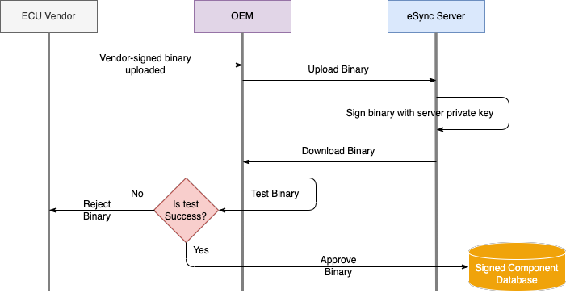

> **컴포넌트 업로드 (ECU 벤더 → eSync Server):** 벤더가 서명한 바이너리를 OEM이 업로드 → eSync Server가 서버 개인키로 서명 → OEM이 다운로드·테스트 → 성공 시 승인 → **서명된 컴포넌트 DB**에 저장. *(권고이며 강제 아님. 컴포넌트 서명은 보안상 eSync Server 밖에 두되, 필요 시 업로드 워크플로에 통합 가능.)*

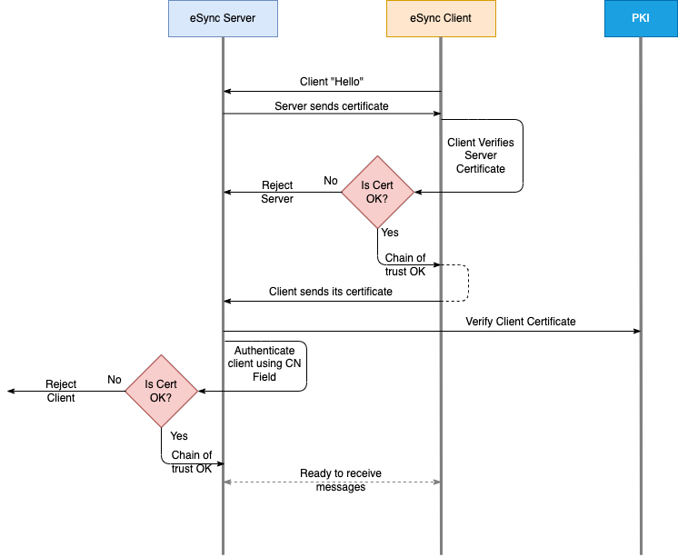

> **eSync Server ↔ eSync Client 인증서 검증(상호):** Client "Hello" → 서버가 인증서 제시 → 클라이언트가 서버 인증서 검증(체인) → 클라이언트가 자기 인증서 제시 → 서버가 CN으로 인증 → 양측 OCSP 검증 후 TLS 수립. 실패 시 거부. 모든 검증은 감사 로그로 남긴다.

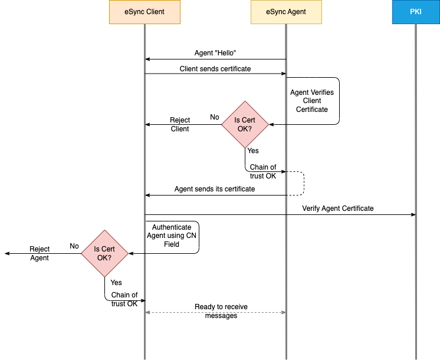

> **eSync Client ↔ eSync Agent 인증서 검증(상호):** 위와 유사하되 **OCSP 호출 없음**. 성공 후에만 상태·정보를 주고받는다.

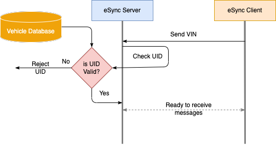

> **Secure UID 검증:** Client가 VIN 전송 → 서버가 차량 DB의 UID와 대조(make·model·year·location 등) → 유효 시 진행, 불일치 시 무통보 거부. UID 호출 로그는 선택(사양 강제 아님).

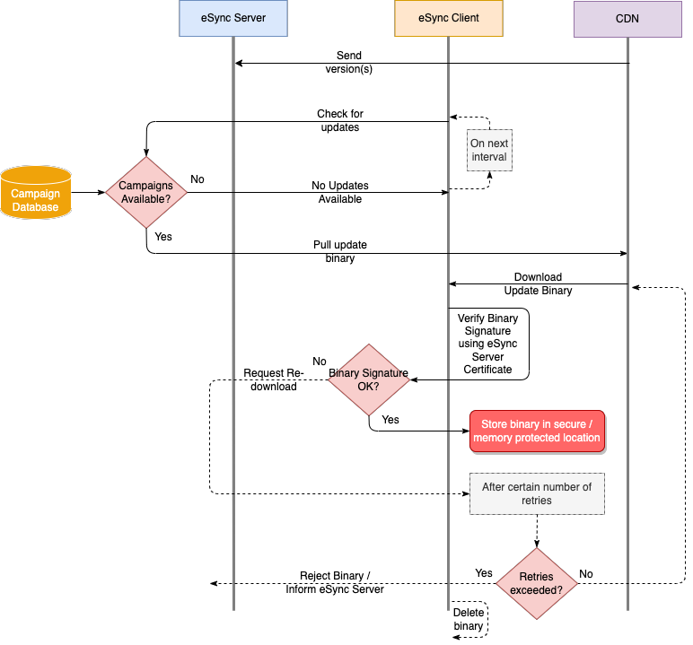

> **업데이트 확인·다운로드:** Client가 버전 전송 → 서버가 캠페인 DB 확인 → 있으면 CDN에서 바이너리 다운로드 → **eSync Server 인증서로 바이너리 서명 검증** → 유효 시 보호 메모리에 저장, 무효 시 재시도, 초과 시 폐기·서버 통보. 다운로드는 바이너리 모드, 청크 해시로 무결성 확인.

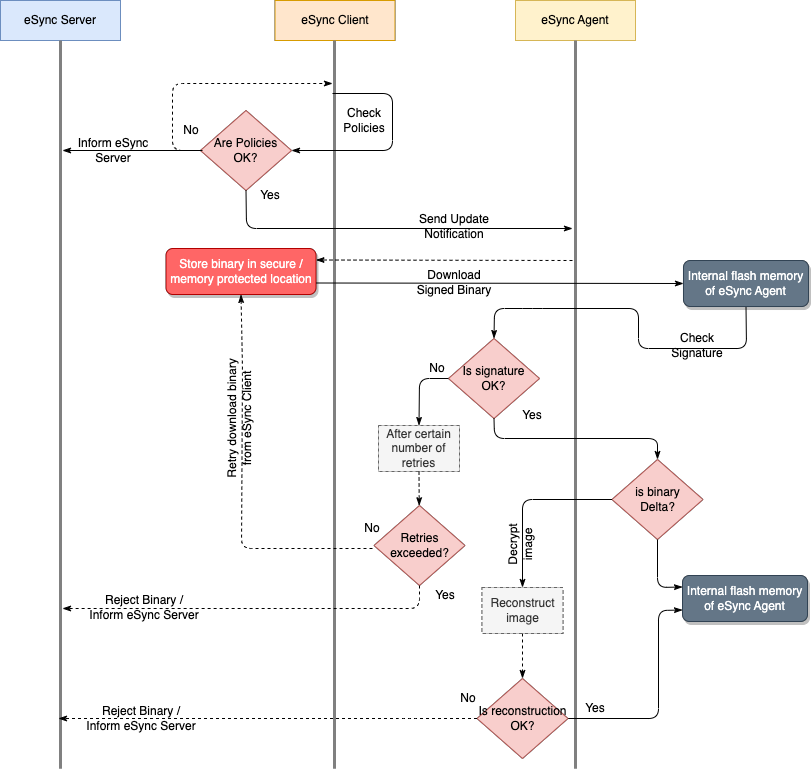

> **정책 확인·Agent 전송:** Client가 정책 확인 → 서명된 바이너리를 Agent 플래시 메모리로 다운로드 → Agent가 자체 SHA 검증 → 델타면 이미지 재구성 → 플래시 준비. 무효 시 재시도 후 거부.

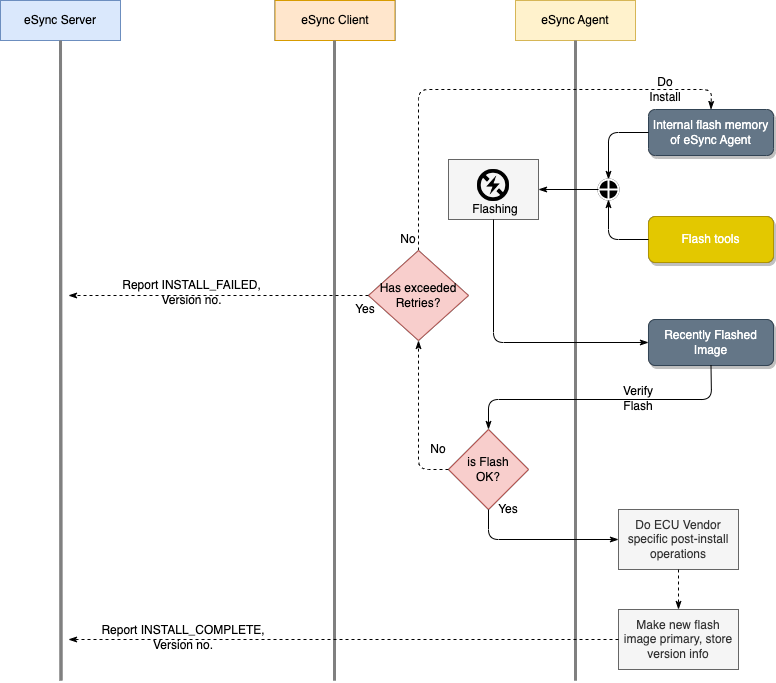

> **플래시·상태 갱신:** Agent가 플래시 → 검증 → 성공 시 벤더별 후처리·새 이미지 primary 지정·버전 저장 → `INSTALL_COMPLETE` 보고. 실패 시 재시도 후 `INSTALL_FAILED` 보고.

---

## 서버와 애플리케이션 사이 (Between Server and Application)

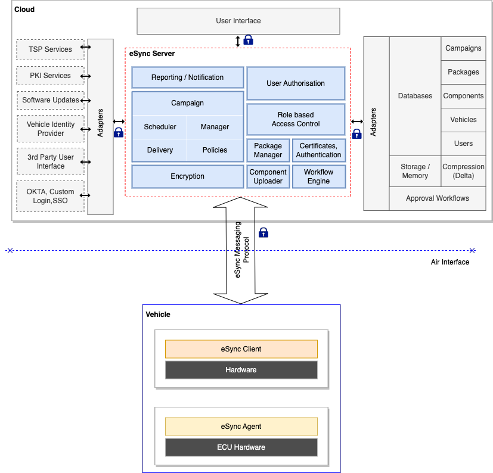

eSync 클라우드 내 eSync Server↔애플리케이션 보안. 컴포넌트 업로드부터 종단 소비·상태 보고까지 종단간 보안을 적용한다.

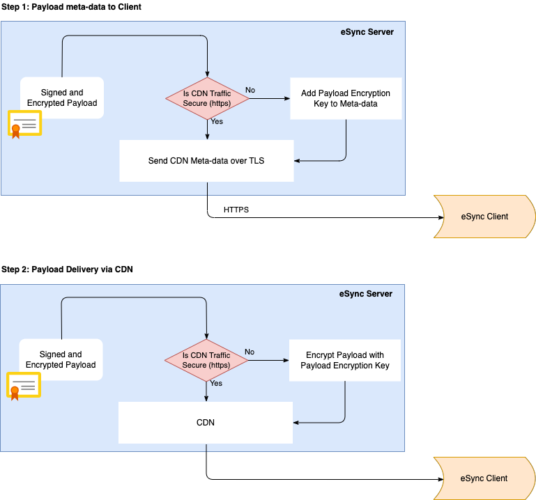

- **Secure CDN 워크플로:** ① 메타데이터를 클라이언트에 전달 — CDN 트래픽이 HTTPS면 그대로, 아니면 페이로드 암호화 키를 메타데이터에 추가해 TLS로 전송. ② CDN으로 페이로드 전달 — HTTPS면 그대로, 아니면 페이로드 암호화 키로 암호화해 전달.
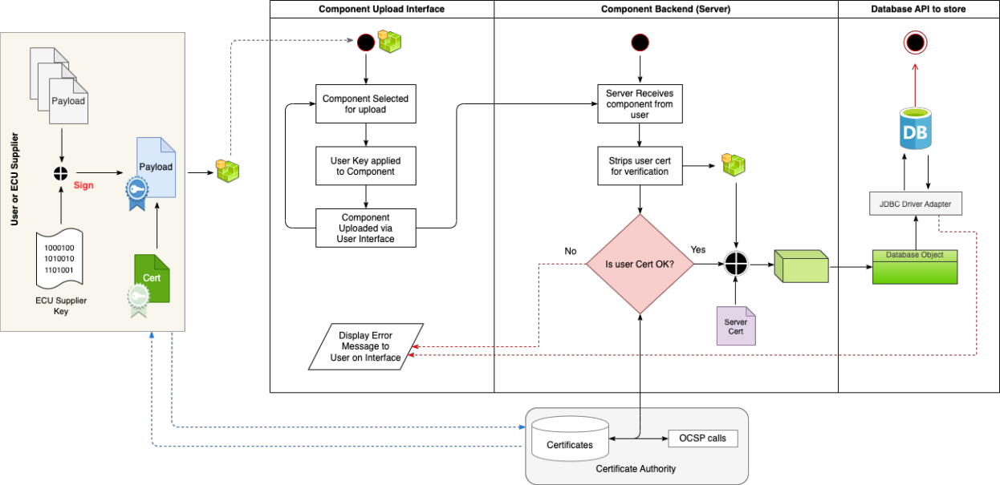
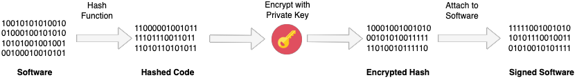

- **컴포넌트 업로드 보안 흐름:** 사용자/벤더가 키로 서명한 페이로드를 UI로 업로드 → 서버가 사용자 인증서를 떼어 검증(OCSP) → 유효하면 DB 저장, 무효면 오류 표시.

**eSync Server 세부:**
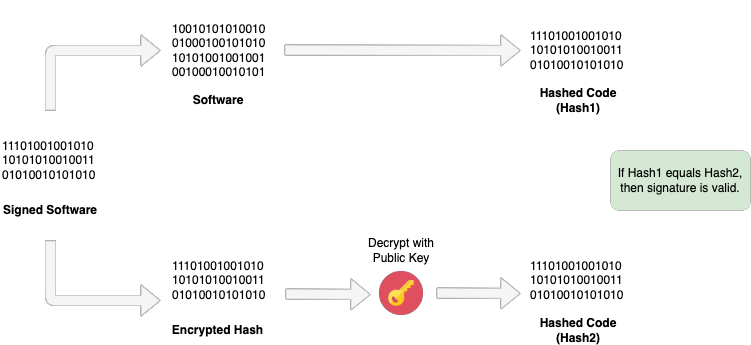

- **SW 서명·검증:** 업로드 SW는 개발자 개인키로 서명해야 한다. 서명 = SHA-256 해시 → 개인키로 암호화 → SW에 부착. 검증 = 개발자 X.509 인증서로 서명 확인(Hash1 == Hash2 이면 유효).
- **SW 관리:** eSync Server가 자기 키로 서명 후 저장(저장 시 암호화).
- **접근:** 캠페인 매니저 접근은 인증 필요. OEM SSO 연동으로 MFA 적용.
- **DDoS 방지:** 퍼블릭 클라우드 서비스 활용, 온프레미스면 OEM이 직접 구축.
- **애플리케이션 방화벽:** HTTPS 보안 포트 외 외부 포트 차단.
- **DB:** 외부에서 인바운드 불가, 애플리케이션 서버만 보안 채널로 접근.
- **로그·감사:** 로그인 시도(성공·실패), SW 검증 과정, 사용자·역할 관리 변경을 기록·감사.

---

## 서버와 클라이언트 사이 (Between Server and Client)

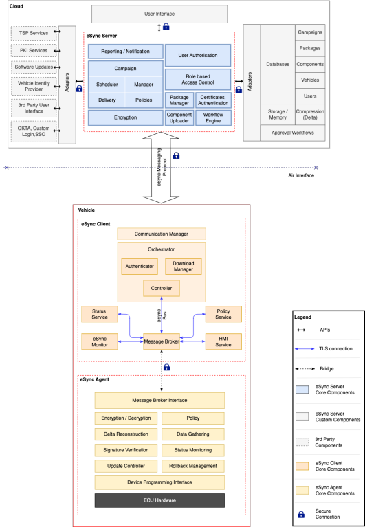

- **통신:** TCP/IP 위 TLS. 대칭 암호로 기밀성, 상대 인증, MAC로 무결성 보장.
- **인증:** eSync Server가 차량이 제시한 X.509 인증서를 검증(CA까지 체인·유효기간·CN, OCSP로 폐기·만료 확인).
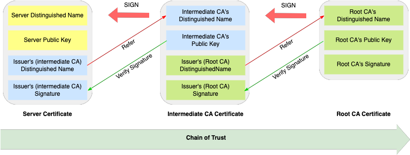

- **신뢰 체인:** Server 인증서 ← Intermediate CA ← Root CA. 각 상위 CA의 공개키로 하위 서명을 검증하며 Root까지 잇는다.
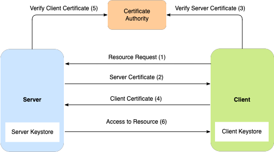

- **클라이언트-서버 인증:** ① 자원 요청 → ② 서버 인증서 → ③ CA로 서버 인증서 검증 → ④ 클라이언트 인증서 → ⑤ CA로 클라이언트 인증서 검증 → ⑥ 자원 접근 허용.
- **암호화:** 서버↔클라이언트 전 통신은 TLS로 암호화.
- **SW 전송:** eSync Server가 서명한 업데이트 SW를 TLS 링크로 차량 클라이언트에 전송(암호화됨).
- **eSync Client:** 서버 X.509 인증서를 CN·신뢰 체인으로 검증. 다운로드한 SW의 서명·해시를 **eSync Server 인증서**로 검증(두 해시 일치 확인). Agent도 서명을 재검증해 **last mile까지** 무결성을 보장한다.

---

## 클라이언트와 에이전트 사이 (Between Client and Agent)

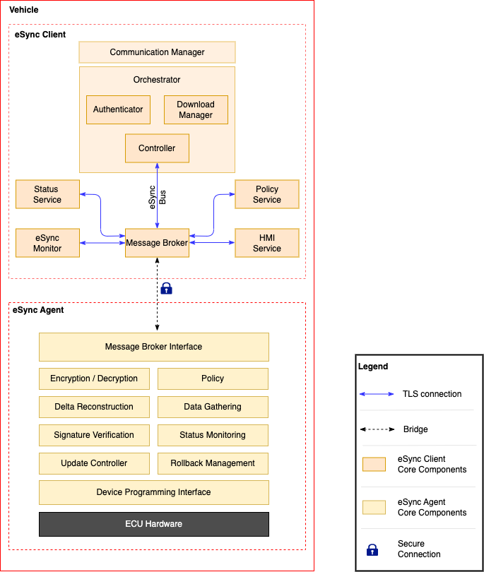

- **통신:** eSync Client↔Agent는 **TLS 버스**로 통신(전 메시지 암호화).
- **인증:** Client가 Agent의 X.509 인증서로 인증하고, Agent도 Client의 X.509 인증서를 검증한 뒤 TLS를 수립한다.
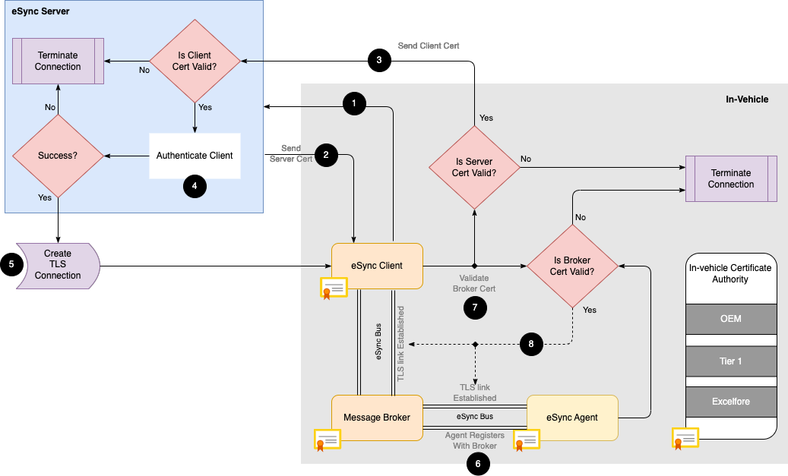

- **차량 내부 채널 보안:** 차량 내 채널은 X.509로 보호한다. Client↔Server가 인증서를 교환·검증해 보안 파이프를 만든다. 차량 시동 시마다(설정 가능) Client가 인증서를 제시·검증하고 웹소켓 연결로 UID 전송·업데이트 확인·다운로드·상태 보고·데이터 수집을 수행한다. **차량 내 인증기관(in-vehicle CA)**이 차량 내부 구성요소 인증서를 관리해야 한다.
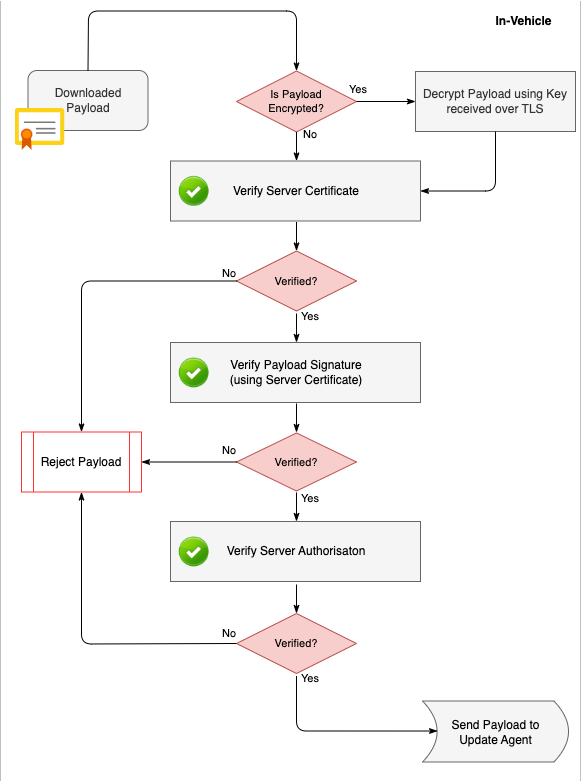

- **보안 in-vehicle 워크플로:** 페이로드 암호화 시 TLS로 받은 키로 복호화 → 서버 인증서 검증 → 페이로드 서명 검증(서버 인증서) → 서버 인가 검증 → 모두 통과해야 Update Agent로 전달, 하나라도 실패 시 거부. 페이로드 인증서 검사를 "hard decision"으로 두어 무효 페이로드가 종단에 도달하지 못하게 한다.

---

## 부록: 우리 프로젝트(CRA) 대응표 — 번역자 정리

> 원문에 없는 내용. eSync 개념을 우리 DOC 체계와 잇기 위한 참조. (상세 대응·충돌은 별도 검토 대상)

| eSync | 우리 프로젝트 |
|-------|---------------|
| eSync Server (클라우드) | 배포 시스템(자체 OTA Platform) |
| eSync Client (차량 내 게이트웨이) | **TGU**(인스톨러) |
| eSync Agent (ECU 상주) | **타겟 제어기**의 업데이트 에이전트 |
| PKI는 구현자 몫(범위 밖) | **DOC-10 PKI**(Root/Dev-IC/CS-IC/KMS)가 그 자리 |
| 서버 재서명(디바이스는 서버 서명만 신뢰) | 우리는 이중서명(배포 서명=CS-IC + 펌웨어 서명=개발자). **검증 대상 차이 — 조정 필요** |
| 디바이스 인증서 단수명 45~90일 | 부품 정품 인증서 20년. **충돌 — 재검토** |
| OCSP 필수(서버↔클라이언트) | 오프라인 타겟은 OCSP 불가. **폐기 전략 과제(트래커 B6)** |
| CN=시리얼, ECC 키+CSR 자체생성, HSM | 부품 정품 인증서 CN=Serial, DOC-20 §4.1과 일치 |
| vdb / 차량 UID·VIN 검증 | **VLM의 실체 후보** |
| campaigns / 캠페인 매니저 | 배포 캠페인 구조 |
| CRA 미언급 | **CRA 대응은 우리 몫** |
