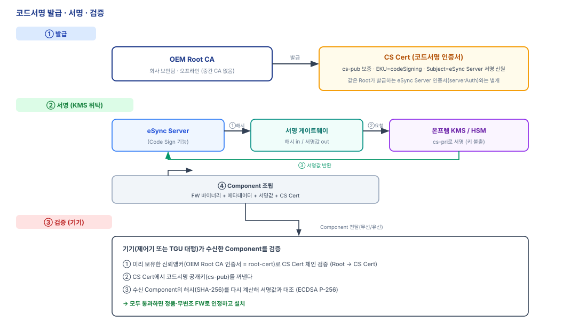

# PKI 사양서

| 항목 | 내용 |
|------|------|
| **문서 성격** | eSync 기반 OTA의 PKI(공개키 기반구조) 사양 |
| **상태** | Draft |
| **관계** | [20 프로비저닝 사양서](20-프로비저닝-사양서.md) · [30 eSync OTA 공통 아키텍처](30-eSync-OTA-공통아키텍처.md)와 함께 읽는다. 제어기별 사양은 [31 EPOS-10i](31-EPOS-10i-OTA사양서.md) · [32 EPOS-30i](32-EPOS-30i-업데이트-사양서.md). |
| **용어 기준** | [00 용어집](00-용어집.md) |

OTA에 쓰이는 인증기관 계층, 인증서 프로파일, 신뢰 체인, 키 보관, 인증서 생애주기를 정의한다.

---

## 1. PKI 계층


*[그림] PKI 계층*

### 1.1 인증기관 계층

- **OEM Root CA** — 회사 보안팀이 관리하는 최상위(발급) 인증기관. 개인키는 오프라인 보관한다. 사내 시스템·서버 인증서를 발급하는 신뢰의 뿌리이며, 각 제어기가 보유하는 신뢰앵커(Root CA 인증서)의 출처다. (자기서명 여부·하위 발급 CA 위임 정책은 보안팀 확인 대상 → §7.)
- **코드서명(FW 서명)** — 코드서명 인증서(CS Cert)는 **별도 중간 CA 없이 OEM Root CA가 직접 발급**한다(중간 CA는 필요 시 이후 도입). 상세는 §2.2·§4.
- **Device CA / Diagnostic License CA** — 디바이스 인증서·DMS License를 발급하는 인증기관(개인키 KMS). 이 두 갈래의 CA 구조는 **이후 단계에서 재검토**한다(이번 개정 범위 밖).

### 1.2 신뢰 구조

- 자체 PKI 검증의 신뢰앵커는 **OEM Root CA 인증서 하나**다(전송용 Amazon Root CA는 별개, §3.1).
- 디바이스는 **"Root → (필요 시 중간 CA) → 최종 인증서"** 규칙으로 체인을 구성해 검증한다.
- **코드서명**은 중간 CA 없이 `OEM Root CA → CS Cert`로 단순화한다(§2.2). 디바이스 신원·진단 라이선스 갈래는 각각 Device CA·Diagnostic License CA를 두며, 이 구조는 이후 재검토한다(§1.1).

### 1.3 암호 스위트

- 서명: **ECDSA**, 곡선 `secp256r1(P-256)`, 해시 `SHA-256`.
- 전 계층(Root CA·중간 CA·최종 인증서)에 동일 스위트를 적용한다.

---

## 2. 인증서 프로파일

### 2.1 디바이스 인증서

| 항목 | 값 |
|------|-----|
| 발급기관 | Device CA |
| Subject CN | 시스템 시리얼 번호 |
| Key Usage | `digitalSignature` |
| Extended Key Usage | `clientAuth (1.3.6.1.5.5.7.3.2)` |
| 용도 | mTLS 클라이언트 인증(eSync Client 신원) |

### 2.2 코드서명 인증서 (CS Cert)

코드서명 인증서(CS Cert, Code Signing Certificate)는 "이 공개키(cs-pub)로 검증되는 서명은 정품 FW다"를 보증하는 최종 인증서다. 짝이 되는 개인키(cs-pri, KMS 보관)로 eSync Server가 Component에 서명하고, 이 인증서를 Component에 동봉해 기기가 검증하게 한다.

| 항목 | 값 |
|------|-----|
| 발급기관 | OEM Root CA (보안팀 CA) — 별도 중간 CA 없음 |
| Subject CN | eSync Server 서명 신원(예: `eSync Release Signing`) |
| 보증 대상 | 코드서명 공개키(cs-pub) |
| Key Usage | `digitalSignature` (keyCertSign 없음) |
| Extended Key Usage | `codeSigning (1.3.6.1.5.5.7.3.3)` |
| 용도 | Component 서명. 개인키(cs-pri)는 온프렘 KMS 보관 |
| 배포 | 검증을 위해 Component에 동봉 |

> `codeSigning` EKU가 이 인증서를 **코드서명 전용**으로 못박는다 — 같은 OEM Root CA가 발급하더라도 eSync Server의 전송용 인증서(mTLS, `serverAuth`)와 용도가 갈린다(§4의 "cs 키 ≠ mTLS 키" 참고).

### 2.3 DMS License 인증서

| 항목 | 값 |
|------|-----|
| 발급기관 | Diagnostic License CA |
| Subject | `CN=<PC 고유 ID>, O=<OEM>, OU=Diagnostics` |
| 공개키·서명 | ECDSA P-256 · `ecdsa-with-SHA256` |
| Key Usage | `digitalSignature` |
| Extended Key Usage | `clientAuth (1.3.6.1.5.5.7.3.2)` |
| Role 확장(사용자정의) | OID `1.3.6.1.4.1.<PEN>.4.1` — 진단 Role 값 |
| 유효기간 | 단수명. 단, 만료 강제는 절대시각이 아닌 방식(→ [40 §9](40-유선업데이트-사양서.md)) |
| 용도 | 이중 — SGW의 UDS `0x29` APCE 검증 + TGU의 mTLS 클라이언트 인증 |

**Role 값**

| 값 | Role | 개요 |
|----|------|------|
| `0x01` | Engineering | 전체 서비스·대상 |
| `0x02` | Dealer-Service | 서비스 선로·승인 대상, 플래시 |
| `0x03` | Read-Only | 진단 조회만 |

Role → 허용 CAN 선로/대상/서비스의 구체 매핑은 [40 §8](40-유선업데이트-사양서.md)에 둔다.

**예시** (openssl `x509 -text` 발췌)

```
Certificate:
  Data:
    Signature Algorithm: ecdsa-with-SHA256
    Issuer: CN=Diagnostic License CA, O=<OEM>
    Subject: CN=DMS-PC-3F2A91, O=<OEM>, OU=Diagnostics
    Subject Public Key Info:
      Public Key Algorithm: id-ecPublicKey (prime256v1)
    X509v3 extensions:
      X509v3 Key Usage: critical
        Digital Signature
      X509v3 Extended Key Usage:
        TLS Web Client Authentication
      1.3.6.1.4.1.<PEN>.4.1: 0x02   # Role = Dealer-Service
  Signature Algorithm: ecdsa-with-SHA256
```

DMS License는 하나의 인증서를 두 게이트웨이가 각자의 방식으로 검증한다([40 §5](40-유선업데이트-사양서.md)). `<PEN>`(Private Enterprise Number)은 TODO(§7).

### 2.4 인증기관 인증서

Root CA·Device CA·Diagnostic License CA 인증서는 `basicConstraints: cA=TRUE`, `Key Usage: keyCertSign`을 가진다. Root는 자기서명(self-signed)이다(자기서명 여부는 보안팀 확인 대상, §7). 코드서명은 중간 CA를 두지 않으므로 이 목록에 없다.

### 2.5 EPOS 이미지 서명 검증 공개키 (HSM 제어기)

HSM 보유 제어기(EPOS-30i)는 코드서명이 **두 계층**으로 나뉜다. 검증 주체와 검증 자산이 다르다.

| 계층 | 서명 주체 | 검증 주체 | 검증 자산 |
|------|----------|----------|-----------|
| eSync CS Cert (외부) | KMS(cs-pri) | TGU eSync Agent | **인증서 체인**(Root → CS Cert) |
| EPOS 이미지 서명 (내부) | KMS(이미지 서명 개인키) | EPOS-30i HSM | **raw 공개키 앵커**(HSM 슬롯) |

- 외부 계층은 §2.2·§3의 인증서 체인 검증을 따른다.
- 내부 계층은 EPOS-30i HSM 슬롯에 주입한 **원시 P-256 공개키**로 이미지 서명(ECDSA)을 직접 검증한다. 인증서 체인이 아니라 앵커 공개키 하나로 검증하며(경량), 공개키는 유출돼도 위조가 불가능하므로 플릿 공통으로 둔다. 슬롯 배치·주입은 [32 §7](32-EPOS-30i-업데이트-사양서.md)·[20](20-프로비저닝-사양서.md).
- 두 계층 모두 알고리즘은 ECDSA P-256이다(§1.3). 개발자 서명은 두 계층 어디에도 없다(중앙 KMS 서명, §4.2).

---

## 3. 신뢰앵커와 체인 검증

### 3.1 신뢰앵커

- **신뢰앵커는 공개키가 아니라 인증서다(자기서명 CA 인증서).** 경로 검증에는 앵커의 이름(DN)·공개키·제약(basicConstraints·keyUsage)이 필요하다(RFC 5280 §6.1.1). 공개키만으로는 서명 확인은 되어도 이름 체이닝·제약 검사를 할 수 없다.
- 디바이스는 **목적별로 복수의 신뢰앵커를 인증서로** 보유한다.
  - **OEM Root CA 인증서** — 자체 PKI 검증. 코드서명(CS Cert 체인)과 eSync Server 앱 신원을 검증한다.
  - **Amazon Root CA 인증서** — AWS IoT Core 엔드포인트(전송 mTLS) 검증([20 §2.3](20-프로비저닝-사양서.md)).
- 앵커는 공장에서 주입한다([20 §1](20-프로비저닝-사양서.md)). 중간 CA·리프 인증서는 앵커가 아니라 검증 대상이며, 검증 시점에 동봉/제시된다.

### 3.2 체인 구성

- 코드 서명 검증: Component에 **CS Cert를 동봉**한다. 디바이스는 `Root → CS Cert` 체인을 구성해 검증한다(중간 CA를 이후 도입하면 그 인증서도 함께 동봉).
- 디바이스 신원(mTLS) 검증: 상대가 제시한 리프와 중간 CA로 `Root → Device CA → 디바이스 인증서` 체인을 구성해 검증한다.
- 인터넷 없이도 신뢰앵커(Root)만으로 체인을 수학적으로 검증할 수 있다. (폐기 확인은 §5.2.)

### 3.3 통일 검증 규칙

두 갈래 모두 다음 순서로 검증한다.

1. 리프에서 Root까지 인증서 체인을 구성한다.
2. 각 상위 인증서의 공개키로 하위 서명을 검증해 Root 앵커까지 잇는다.
3. 유효기간을 확인한다. **기준 시점이 용도별로 다르다:**
   - **코드서명(CS Cert):** **서명 시점**의 유효성을 확인한다(신뢰 타임스탬프). 이후 CS Cert가 만료·회전돼도 과거에 서명된 Component는 계속 검증된다.
   - **전송(mTLS 인증서):** **접속 현재 시점**의 유효기간을 확인한다(§6 신뢰 시각 필요).
4. 용도(EKU)를 확인한다. 코드서명 검증은 `codeSigning`을, mTLS는 `clientAuth`를 요구한다.
5. 폐기 상태를 확인한다(§5.2).

> **Component/Package는 독립적 만료를 갖지 않는다.** 코드서명을 서명 시점 기준으로 검증하므로(3항), 짧은 수명의 CS Cert가 회전·만료돼도 이미 서명된 펌웨어는 유효하다. 펌웨어 수명(장비 생애)과 CS Cert 수명이 분리된다. 신뢰 타임스탬프 소스는 §7. (EPOS/유선 경로는 신뢰 시계가 없어 시각을 게이트로 쓰지 않는다 → [40 §9](40-유선업데이트-사양서.md).)

---

## 4. 키 보관·서명 서비스

### 4.1 키 보관 (KMS)

- 코드서명 개인키(cs-pri)는 **온프렘 KMS/HSM 안에만** 존재하며 밖으로 나오지 않는다.
- OEM Root CA 개인키는 보안팀이 오프라인(에어갭)에 보관한다.
- (Device CA·Diagnostic License CA 개인키 보관은 이후 재검토 — §1.1.)

### 4.2 서명 서비스(Code Sign)와 서명 게이트웨이

- **Code Sign**은 FW에 서명해 Component를 만드는 eSync Server의 *기능*이며, 실제 서명은 KMS에 위탁한다. (인증서를 발급하는 CA가 아니다.)
- 개발자·벤더는 서명 키를 갖지 않는다(중앙 KMS 서명).
- 클라우드의 OTA Platform(eSync Server)과 온프렘 KMS는 **서명 게이트웨이**로 잇는다. eSync Server가 Component의 **해시**를 게이트웨이로 보내면 KMS가 cs-pri로 서명해 **서명값**만 돌려준다 — 개인키(cs-pri)는 KMS 밖으로 나오지 않는다. 공개키(cs-pub) 추출도 이 경로를 쓴다.
- **cs 키 ≠ mTLS 키:** 코드서명 키(cs-pri, KMS·릴리스마다 드물게 사용)와 eSync Server의 전송 신원 키(서버 로컬·연결마다 사용)는 **별개**다. 한 키로 겸하지 않는다.

발급→서명→검증의 전체 흐름은 [그림 · 코드서명 발급·서명·검증](assets/코드서명-발행검증.svg)과 같다.



*[그림] 코드서명 발급·서명·검증*

---

## 5. 인증서 수명·폐기·회전

### 5.1 수명

| 인증서 | 수명 정책 |
|--------|-----------|
| 디바이스 인증서 | TBD (§7) |
| CS Cert (코드서명 리프) | 단수명 · 주기 회전 |
| DMS License | 단수명. 만료 강제는 절대시각이 아닌 방식(→ [40 §9](40-유선업데이트-사양서.md)) |
| 중간 CA | 장수명 |
| Root CA | 장수명 |

### 5.2 폐기 (Revocation)

- **온라인 경계(TGU ↔ 클라우드):** OCSP로 폐기를 확인한다. 확인 강도는 설정값으로 정한다.

| 설정값 | 동작 |
|--------|------|
| `DISABLED` | 폐기 확인 안 함 |
| `NONE` | 확인하되 OCSP 실패는 수용 |
| `REQUIRED` | OCSP 속성이 없으면 인증 실패 |
| `ENFORCED` | 응답이 명시적 `GOOD`이 아니면 실패 |

- OCSP Stapling / Must-Staple을 사용한다.
- **오프라인 경계(TGU → EPOS-10i, CAN):** EPOS-10i는 폐기를 확인할 수 없다. 이 구간의 무결성은 TGU가 대행 검증하며([31 §4](31-EPOS-10i-OTA사양서.md)), CS Cert는 단수명 회전으로 폐기 노출을 줄인다.

### 5.3 갱신·교체·회전

- **디바이스 인증서:** 만료 전 갱신한다. 폐기 시 새 인증서를 발급해 Campaign으로 내려보내고, 검증 성공 후 교체한다(실패 시 이전 인증서로 복귀).
- **CS Cert:** OEM Root CA가 새 CS Cert를 발급해 회전한다. 신뢰앵커(Root)는 고정되므로 디바이스 재프로비저닝이 필요 없다. 회전·만료는 **이미 서명된 Component의 유효성에 영향을 주지 않는다**(서명 시점 검증, §3.3).

---

## 6. 신뢰 시각 (Trusted Time)

인증서 유효기간(§3.3-3)과 OCSP 검증(§5.2)은 신뢰할 수 있는 현재 시각을 전제한다.

- **온라인 경계(TGU ↔ 클라우드):** TGU는 신뢰 시각 소스를 보유해, 유효기간·OCSP를 검증한다. 소스·동기화 방식은 TBD(§7).
- **유선 경계(SGW·DMS PC·EPOS):** 시각 동기화가 불가능하고(EPOS는 RTC 없음) 조작될 수 있다. 이 경계에서는 **절대시각을 보안 게이트로 쓰지 않는다.** 유효성은 세션 nonce·폐기·단조 방식으로 판단한다(→ [40 §9](40-유선업데이트-사양서.md)).

---

## 7. 미정 (TBD)

- OEM Root CA 자기서명 여부·하위 발급 CA 위임·코드서명 EKU 발급 정책(보안팀 확인).
- 코드서명 중간 CA 도입 여부(현재 미도입 — OEM Root CA 직접 발급).
- 디바이스 인증서 유효기간 값.
- CS Cert 회전 주기.
- OCSP 설정값(DISABLED/NONE/REQUIRED/ENFORCED) 확정.
- 신뢰 시각 소스·동기화 방식.
- 코드서명 **서명 시점 검증용 신뢰 타임스탬프** 소스·형식(§3.3).
- 장수명 대응 암호 알고리즘 식별자(크립토 애자일리티).
