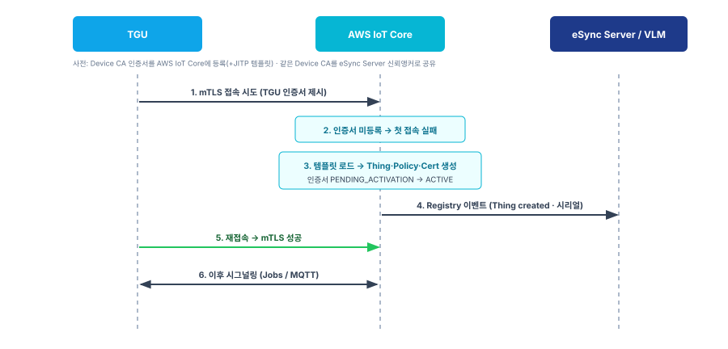

# 프로비저닝 사양서

| 항목 | 내용 |
|------|------|
| **문서 성격** | 디바이스 사전주입·등록(프로비저닝) 사양 |
| **상태** | Draft |
| **관계** | [10 PKI 사양서](10-PKI-사양서.md) · [30 OTA 시스템 사양서](30-OTA-시스템사양서.md)와 함께 읽는다. |
| **용어 기준** | [00 용어집](00-용어집.md) |

디바이스가 OTA에 참여하기 전에 갖춰야 할 키·인증서·신뢰앵커의 주입과, 클라우드 등록 절차를 정의한다.

---

## 1. Tier-1 디바이스 프로비저닝

부품 공정(Tier-1)에서 제어기에 신원과 신뢰앵커를 주입한다.

### 1.1 키쌍 생성·CSR

- 제어기가 **키쌍을 자체 생성**한다. 개인키는 제어기 밖으로 나오지 않는다.
- 제어기가 `CN=Serial`로 CSR을 만든다.

### 1.2 인증서 발급

- CSR을 Device CA에 제출하면 Device CA가 `CN=Serial`로 디바이스 인증서를 발급한다([10 §2.1](10-PKI-사양서.md)).
- 발급된 인증서를 제어기에 주입한다.

### 1.3 신뢰앵커 주입

- **Root CA 공개키**를 제어기에 신뢰앵커로 주입한다([10 §3.1](10-PKI-사양서.md)). 이후 모든 체인 검증의 기준이 된다.

### 1.4 대상 제어기(EPOS-10i) 초기 이미지

- EPOS-10i는 공정에서 초기 펌웨어를 유선으로 주입한다.
- 초기 이미지에는 **Root CA 공개키(신뢰앵커)**와 복구 부트로더(Insurance Kernel, [30 §8.2](30-OTA-시스템사양서.md))를 포함한다.
- EPOS-10i는 자체 검증 능력이 없으므로 디바이스 인증서를 갖지 않는다. 신원 인증서는 게이트웨이(TGU)가 보유한다.

---

## 2. AWS IoT Core 등록

TGU가 클라우드에 접속하려면 TGU 인증서를 서명한 인증기관을 AWS IoT Core에 등록해 두어야 한다.

### 2.1 Device CA 등록

- **Device CA 인증서를 AWS IoT Core에 등록**한다(`RegisterCACertificate`). 자동 등록(auto-registration)을 활성화하고 JITP 프로비저닝 템플릿을 연결한다.
- 같은 Device CA 인증서를 **eSync Server의 신뢰앵커로도 공유**한다. 그러면 AWS IoT Core와 eSync Server가 동일한 기준으로 TGU 인증서를 검증한다.

### 2.2 프로비저닝 템플릿

- 템플릿은 최초 접속 시 생성할 리소스(Thing·Policy·Certificate)와, 디바이스 인증서 Subject에서 뽑을 파라미터(`CommonName=Serial` 등)를 정의한다.
- 템플릿이 요구하는 모든 파라미터가 인증서에 있어야 한다. 없으면 등록이 실패한다.

---

## 3. JITP 최초 접속 등록

TGU 인증서는 Device CA(Tier-1)가 발급한 것이며, JITP는 이를 **발급하는 것이 아니라 최초 접속 시 등록**한다.

*[그림] JITP 최초 접속 등록*

### 3.1 최초 접속 흐름

1. TGU가 자기 인증서로 AWS IoT Core에 mTLS 접속을 시도한다.
2. 인증서가 아직 계정에 없어 **첫 TLS 핸드셰이크는 실패**한다.
3. AWS IoT Core가 등록된 Device CA에 연결된 템플릿을 로드해 Thing·Policy·Certificate를 생성한다.
4. 인증서가 `PENDING_ACTIVATION`으로 등록되고, 절차 완료 후 `ACTIVE`가 된다.
5. TGU가 재접속하면 성공한다. 이후 재접속 로직은 TGU가 갖춰야 한다.

### 3.2 인증서 상태

- 인증서는 등록되는 CA와 동일한 모드로 관리된다.
- 활성화 이후 TGU는 정상적으로 연결·시그널링([30 §5](30-OTA-시스템사양서.md))할 수 있다.

---

## 4. 디바이스 신원 백엔드 공유

### 4.1 Registry 이벤트

- JITP로 Thing이 생성되면 AWS IoT Core가 **Registry 이벤트**(예: `$aws/events/thing/{thingName}/created`)를 발행한다. 이벤트에는 Thing 이름·속성(시리얼 등)이 담긴다.
- 이 이벤트를 규칙(Rule)으로 받아 **eSync Server / VLM에 전달**한다. VLM은 시리얼↔VIN↔장비 옵션을 관리한다.

### 4.2 단일 키·인증서 겸용

- TGU는 **하나의 키쌍·인증서**를 사용한다. 이 인증서가 AWS IoT Core의 전송 인증(mTLS)과 애플리케이션 계층 신원 양쪽에 쓰인다.
- 인증서가 곧 디바이스의 신원(principal)이므로, eSync Server는 같은 인증서로 TGU를 식별·검증한다.

---

## 5. SGW 프로비저닝

SGW는 CAN 게이트웨이로서 DMS 라이선스를 검증한다([40 §6](40-유선업데이트-사양서.md)). 검증에 필요한 자료를 공정에서 주입한다.

- **HSM** — SGW는 HSM을 보유한다. 검증 연산과 비밀을 HSM에서 처리한다.
- **신뢰앵커 주입** — Root CA 공개키와 진단 라이선스 CA 인증서를 주입해, DMS 라이선스 체인(`Root → 진단 라이선스 CA → DMS 라이선스`)을 오프라인으로 검증한다.
- **장비 식별자** — VIN 등 장비 식별자를 주입한다.
- **폐기·만료 기준 주입(TODO)** — 시각 없이 만료·폐기를 강제하는 기준(CRL / HSM 단조 epoch floor)을 초기 주입·갱신한다(→ [40 §9](40-유선업데이트-사양서.md)).
- **(보조) 신뢰 시각** — 로그·감사용 시각은 연결 시 확보하되, 보안 게이트로 쓰지 않는다([10 §6](10-PKI-사양서.md)).
- SGW는 UDS `0x29` APCE의 검증자(server)이므로 자기 서명 인증서는 필수가 아니다.

## 6. DMS 라이선스 발급

DMS(Windows PC 진단툴)는 항구적 신원이 아니라 **단수명 라이선스**를 받는다.

- **발급 조건** — PC 고유 ID + 사용자 인증.
- **발급** — 진단 라이선스 CA가 `CN`=PC/조작자, Role OID를 담은 단수명 인증서를 발급한다([10 §2.3](10-PKI-사양서.md)). 개인키는 DMS PC가 보관한다. 만료를 시각 없이 강제하려면 라이선스에 epoch를 담을 수 있다(TODO, [40 §9](40-유선업데이트-사양서.md)).
- **신뢰앵커** — DMS PC에 Root CA 공개키를 주입·갱신한다(서명 검증용).
- **폐기** — 현장 오프라인을 위해 단수명 + CRL 사전배포로 대응한다([40 §9](40-유선업데이트-사양서.md)).

## 7. 미정 (TBD)

- 신뢰앵커·초기 이미지 주입의 공정 상세.
- AWS IoT Core CA 등록 모드(단일 계정 vs 다계정)·프로비저닝 템플릿 상세 — 전송 담당 팀과 협의.
- Registry 이벤트 → VLM 연동 구현.
- SGW HSM 키·비밀 구성, DMS 라이선스 CRL 배포 방식.
