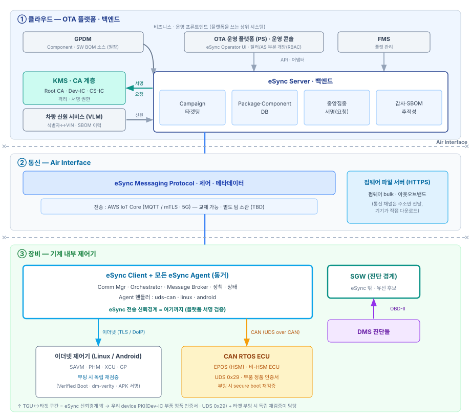
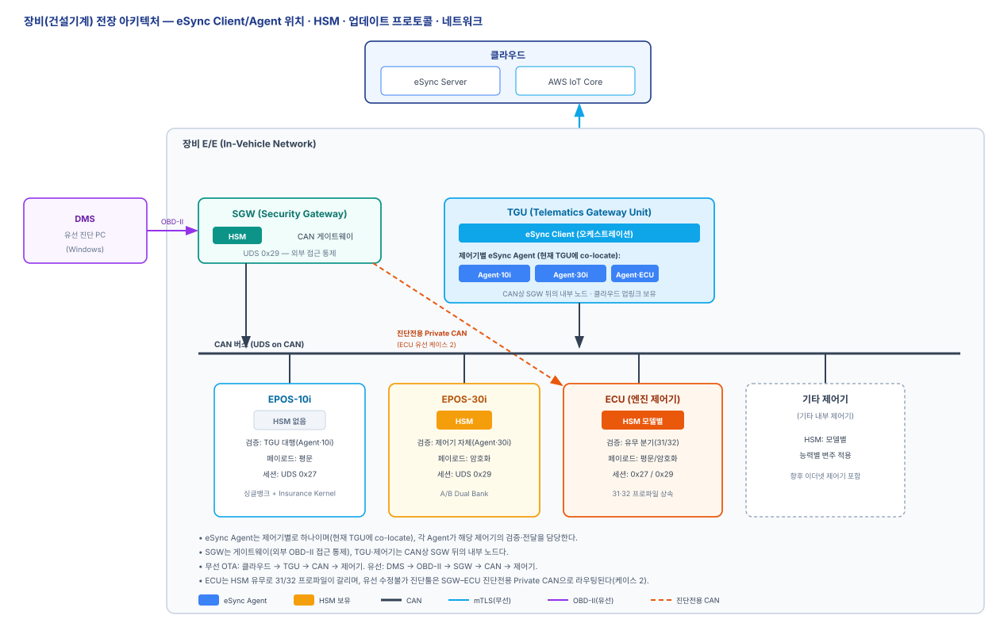
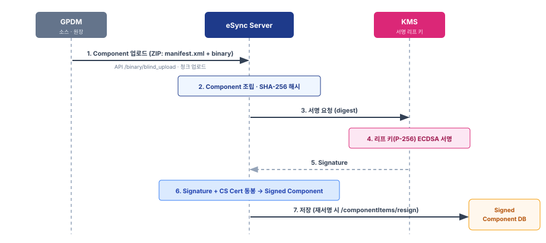
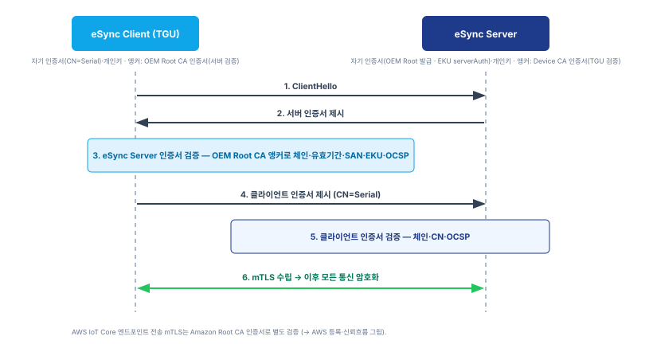

# eSync OTA 공통 아키텍처

| 항목 | 내용 |
|------|------|
| **문서 성격** | eSync 기반 OTA 공통 아키텍처 (제어기 무관) |
| **상태** | Draft |
| **적용 대상** | eSync Server · TGU(eSync Client·Agent) · 소스·신원 서비스(GPDM·VLM·KMS) |
| **관계** | [10 PKI 사양서](10-PKI-사양서.md) · [20 프로비저닝 사양서](20-프로비저닝-사양서.md)를 전제로 한다. 제어기별 종단간 사양은 [31 EPOS-10i](31-EPOS-10i-OTA사양서.md) · [32 EPOS-30i](32-EPOS-30i-업데이트-사양서.md)에서, 유선 경로는 [40 유선 업데이트](40-유선업데이트-사양서.md)에서 다룬다. |
| **용어 기준** | [00 용어집](00-용어집.md) |

건설기계 제어기의 무선 소프트웨어 업데이트(OTA)를 Excelfore eSync 위에 정의하는 **공통 골격**이다. OTA 워크플로는 하나이며, **대상 제어기의 능력에 따라 검증 위치·페이로드·뱅크·세션이 달라진다**(§1.4). 본 문서는 모든 제어기에 공통인 아키텍처·데이터 모델·서명·전송·타겟팅·정책·감사를 정의하고, 제어기별 런타임 상세는 각 제어기 사양(31·32…)에 위임한다.

---

## 1. 개요·아키텍처

시스템을 **클라우드 · 통신 · 장비** 세 계층으로 나눈다.



*[그림 1] 전체 구조*

### 1.1 세 계층 개요

- **클라우드** — eSync Server(백엔드), 운영 프론트엔드, 소스·신원 서비스(GPDM·VLM·KMS).
- **통신(Air Interface)** — AWS IoT Core를 통한 eSync Server ↔ TGU 채널(§5).
- **장비** — TGU(eSync Client·Agent)와 대상 제어기.

장비 내부의 전장(E/E) 배치 — eSync Client·Agent의 위치, 제어기별 HSM 보유 여부, 업데이트 프로토콜, CAN/Ethernet 구성 — 는 [그림 2]와 같다.



*[그림 2] 장비 전장 아키텍처 (Client/Agent 위치 · HSM · 프로토콜 · 네트워크)*

### 1.2 계층별 구성

- **eSync Server** — Campaign·타겟팅, Component·Package DB, 서명, 감사.
- **GPDM** — Component와 SW BOM의 출처 원장이자, **eSync Server에 Component 소스를 제공하는 단일 상류**(SSOT)다. **Component 소스** = 릴리스 산출물(바이너리 + 메타데이터: 버전·품번·호환성·롤백). eSync Server는 언제나 GPDM으로부터 Component 소스를 입력받는다. 상류 발행 준비(서명·암호화 시점·주체)와 제조 배포(공급망) 세부는 **본 사양 범위 밖**이며 Component 소스에 캡슐화된다(§3.2.4·§10).
- **VLM** — 시리얼↔VIN↔장비 옵션 매핑, SBOM 이력.
- **KMS** — 서명 개인키 보관([10 §4](10-PKI-사양서.md)). HSM 보유 제어기의 경우 이미지 서명·암호화의 보안처리 주체를 겸한다([32 §4·§5](32-EPOS-30i-업데이트-사양서.md)).
- **TGU** — eSync Client(오케스트레이션)와 **제어기별 eSync Agent**(검증·전달)를 한 노드에 둔다. CAN 관점에서는 SGW 뒤의 내부 노드이며, 클라우드 업링크를 보유한다(그림 2). eSync의 신뢰 경계는 TGU까지다.
- **SGW** — 외부 진단 단자(OBD-II)와 내부 CAN을 분리·통제하는 보안 게이트웨이. TGU·대상 제어기는 CAN상 SGW 뒤에 놓인다([40](40-유선업데이트-사양서.md)).
- **대상 제어기** — 담당 eSync Agent가 UDS on CAN(또는 제어기별 채널)으로 플래시하는 대상. 능력별 변주는 §1.4. Component의 `type`이 담당 Agent를 지정한다(§3.1).

### 1.3 신뢰 경계

- 서명은 클라우드(KMS)에서 이뤄진다. 개발자·벤더는 서명 키를 갖지 않는다([10 §1.3](10-PKI-사양서.md)).
- 검증 신뢰앵커(Root CA 인증서)는 각 노드가 로컬 보유한다([10 §3.1](10-PKI-사양서.md)).
- **검증 위치는 제어기 능력에 따라 다르다**(§1.4, §4.2):
  - 검증 능력이 없는 제어기 → 무결성 검증이 **TGU까지** 보장된다(TGU→제어기 구간은 평문, UDS 세션으로 보호). 상세는 [31 EPOS-10i](31-EPOS-10i-OTA사양서.md).
  - HSM 보유 제어기 → **제어기 자체가** 서명 검증·복호화를 수행한다(암호화 페이로드). 상세는 [32 EPOS-30i](32-EPOS-30i-업데이트-사양서.md).

### 1.4 업데이트 대상 제어기 특성표

제어기 능력이 워크플로의 변주를 결정한다. 아래 축이 각 제어기 사양(31·32…)의 기준이다.

| 제어기 | HSM | 무결성 검증 위치 | 페이로드 | 뱅크 | 세션(UDS) | 업데이트 프로토콜 | 네트워크 | 제어기 사양 |
|--------|-----|------------------|----------|------|-----------|-------------------|----------|------------|
| **EPOS-10i** | 없음 | TGU(eSync Agent) 대행 | 평문 | 싱글뱅크 + Insurance Kernel | `0x27` SecurityAccess | UDS on CAN(`0x34/36/37`) | CAN | [31](31-EPOS-10i-OTA사양서.md) |
| **EPOS-30i** | 보유(Cortex-M3) | 대상 제어기 자체 | 암호화(Secure Flash) | A/B Dual Bank | `0x29` 인증서 인증 | UDS on CAN(`0x34/36/37`) | CAN | [32](32-EPOS-30i-업데이트-사양서.md) |
| 이더넷 제어기(Linux/Android) | 플랫폼별 | 대상 자체(Verified Boot 등) | (별도) | (별도) | (별도) | (별도) | Ethernet | (향후) |

- **HSM** — 서명 검증·복호화·키 보관 능력. 유무가 검증 위치와 페이로드 형태를 가른다.
- **검증 위치** — HSM이 없으면 TGU가 대행하고(§4.2), 있으면 제어기가 자체 검증한다.
- **세션(UDS)** — HSM 미보유는 시드-키(`0x27`), 보유는 인증서 기반(`0x29`).
- **업데이트 프로토콜/네트워크** — 현재 대상 제어기는 UDS on CAN. 이더넷 제어기는 향후 별도 프로토콜.

**설치 경로**는 두 가지다. 같은 서명 Component/Package를 재사용한다.

- **무선(OTA):** eSync Server → 통신 계층 → TGU. 본 문서와 제어기별 사양(31·32…)이 다룬다.
- **유선(DMS):** eSync Server/Dashboard → DMS(진단툴) → OBD-II → SGW/TGU 게이트웨이 → 대상. → [40 유선 업데이트 사양서](40-유선업데이트-사양서.md).

---

## 2. 종단간 업데이트 워크플로 (공통 단계 모델)

소스(GPDM)에서 시작해 eSync Server에서 서명·패키징하고, Campaign으로 대상 장비를 선정한 뒤, AWS IoT Core를 통해 TGU에 전달한다. TGU가 검증·호환성 확인·설치 정책을 거쳐 대상 제어기를 플래시하고 상태를 보고한다.

워크플로는 제어기와 무관하게 다음 단계로 구성된다.

1. **발행** — GPDM이 Component 소스를 eSync Server에 제공 → eSync Server 조립·서명·패키징(§3·§4). 상류 준비 세부는 범위 밖(§1.2).
2. **타겟팅** — Campaign이 대상 장비를 선정하고 다운로드 메타데이터를 내려준다(§6).
3. **전송** — TGU가 mTLS로 접속해 시그널링을 받고, 펌웨어를 HTTPS로 다운로드해 보호 저장한다(§5).
4. **설치** — eSync Agent가 검증·호환성 확인·세션 개방을 거쳐 대상 제어기를 플래시한다. **검증 위치와 페이로드 형태, 세션 게이트, 뱅크 전략은 제어기 능력에 따라 달라진다**(§1.4).
5. **커밋·보고** — 활성화(원자적 커밋 또는 A/B 스왑) 후 상태를 eSync Server에 보고한다(§8·§9).

제어기별 런타임 시퀀스(단계 번호와 UDS 서비스까지)는 각 제어기 사양에서 상술한다 — [31 EPOS-10i §2](31-EPOS-10i-OTA사양서.md), [32 EPOS-30i §3](32-EPOS-30i-업데이트-사양서.md).

---

## 3. Component·Package·매니페스트

### 3.1 데이터 모델

- **Component** — 대상 엔드포인트용 소프트웨어 단위. `name`, `nodeName`(업데이트 엔드포인트 ID), `type`(담당 eSync Agent), `versions`.
- **ComponentVersion** — `version`, `deltaSha`(바이너리 SHA-256), `dependencies`.
- **Package** — Component 묶음. `components`, `componentRules`(§6.3), `atomicRollback`.

### 3.2 매니페스트 (manifest.xml)

#### 3.2.1 패키징

Component는 다음을 담은 ZIP이다. manifest.xml은 Component 안에 포함되어 서명 대상에 함께 들어간다(§4.1).

```
📦 eSync Component (ZIP)
├── 📄 manifest.xml
├── 📦 binary
└── 📄 manifest_diff.xml   (Delta 시)
```

HSM 보유 제어기의 `binary`는 **암호화·서명된 이미지**(SE Binary)이며, eSync는 이를 불투명(opaque) 페이로드로 취급한다. 이미지 내부 헤더 메타데이터는 manifest.xml과 별개로 관리하되 같은 GPDM 프로퍼티에서 공동 생성한다([32 §6](32-EPOS-30i-업데이트-사양서.md)).

#### 3.2.2 필드

| 필드 | 용도 |
|------|------|
| 대상 노드 · type | 업데이트 엔드포인트와 담당 eSync Agent |
| version | 소프트웨어 버전 |
| SW 품번 | 장비 옵션별 SW 변종의 **구분자**(호환성 정보 아님, §6.1) |
| 호환성(HW) | 적용 가능한 HW 버전·모델(호환성 판정용, §6.2) |
| rollback | 다운그레이드 방지 기준 버전(§8.3) |
| delta | Delta 기준 버전(§3.3) |
| binary sha256 | 바이너리 무결성 |

#### 3.2.3 예시

```xml
<manifest>
  <package name="EPOS-10i-APP" version="2.4.0"/>
  <component node="epos-10i-app" type="uds-can-agent"/>

  <!-- 옵션별 SW 변종 구분자 (호환성 정보 아님; 타겟팅은 VLM+정책 §6.1) -->
  <software partNumber="EPOS10I-SW-A21"/>

  <!-- 호환성 판정 (디바이스측 대조, §6.2) -->
  <compatibility>
    <hardware model="EPOS-10i" hwVersion=">=1.2"/>
  </compatibility>

  <rollback allowedFrom="2.3.0"/>
  <binary sha256="a1b2c3…" size="1048576"/>
  <!-- Delta 시: <delta from="2.3.0" reference="…"/> -->
</manifest>
```

> 태그 구성은 eSync manifest.xml 규약을 따르며 업로드 시 검증된다. 위는 대표 예시다.

#### 3.2.4 작성 주체·툴 (GPDM 단일 원천)

- manifest.xml은 사람이 손으로 쓰지 않는다. **릴리스 패키징 툴**이 GPDM 릴리스 메타데이터(버전·품번·호환성·롤백)에서 **생성**한다.
- Component ZIP은 eSync Server 업로드 시 사전검증(preValidate)되어 필수 태그·형식이 강제된다.
- HSM 보유 제어기는 **같은 GPDM 프로퍼티**에서 이미지 헤더 메타데이터도 공동 생성한다 → manifest와 이미지 헤더가 구성상 일치([32 §6](32-EPOS-30i-업데이트-사양서.md)).

### 3.3 Delta 업데이트

- Delta Component는 `manifest_diff.xml`과 기준 버전 참조를 포함한다.
- eSync Agent(또는 대상 제어기)가 기준 버전을 확인하고 이미지를 재구성한 뒤 검증·플래시한다.

---

## 4. 서명과 검증

### 4.1 서명

- **알고리즘:** ECDSA `P-256` / `SHA-256`([10 §1.3](10-PKI-사양서.md)).
- **주체·키:** eSync Server가 KMS에 서명을 요청하고, KMS가 CS Cert(코드서명 인증서) 개인키로 서명한다. 개발자·벤더는 서명 키를 갖지 않는다.
- **대상:** Component(ZIP) 전체. manifest.xml이 안에 있으므로 하나의 서명이 바이너리와 메타데이터를 함께 보증한다.



*[그림 3] 서명 발행 시퀀스*

1. GPDM이 Component 소스(릴리스 산출물)를 eSync Server에 제공한다(§1.2).
2. eSync Server가 Component를 조립하고 SHA-256으로 해시한다.
3. eSync Server가 KMS에 서명을 요청한다.
4. KMS가 CS Cert 개인키(P-256)로 ECDSA 서명한다.
5. 서명값을 반환한다.
6. eSync Server가 서명값과 CS Cert(체인 포함)를 Component에 동봉한다.
7. 서명된 Component를 저장한다.

> HSM 보유 제어기는 이 eSync CS Cert 서명(외부 계층) **이전에**, 보안처리 주체가 이미지 자체에 암호화와 별도 진위 서명(내부 계층)을 적용한다. 두 계층의 관계는 [32 §2](32-EPOS-30i-업데이트-사양서.md).

### 4.2 검증 위치

검증은 서명 체인·서명값·재해시로 이뤄진다(규칙·유효기간·폐기·신뢰앵커는 [10 §3](10-PKI-사양서.md)). **검증을 수행하는 주체는 제어기 능력에 따라 다르다.**

- **검증 불가형 제어기(예: EPOS-10i)** — 제어기가 서명을 검증하지 못하므로 **TGU의 eSync Agent가 대행 검증**한 뒤 평문으로 플래시한다. 상세·시퀀스는 [31 §4](31-EPOS-10i-OTA사양서.md).
- **HSM 보유 제어기(예: EPOS-30i)** — eSync CS Cert 검증은 TGU에서 이뤄지고, 이미지 내부 진위 검증·복호화는 **대상 제어기(HSM)가 자체 수행**한다. 상세는 [32 §4·§8](32-EPOS-30i-업데이트-사양서.md).

코드서명은 **서명 시점** 기준으로 검증하므로, CS Cert가 회전·만료돼도 **Component/Package는 만료되지 않는다**([10 §3.3](10-PKI-사양서.md)).

---

## 5. 전송·연결 (AWS IoT Core)

### 5.1 mTLS 연결

- TGU는 자기 디바이스 인증서로 AWS IoT Core에 상호 TLS(mTLS)로 접속한다(TLS 1.2/1.3, MQTT/TLS 8883 또는 443+ALPN, SNI 전송).
- 하나의 TGU 인증서/키가 전송 인증과 애플리케이션 신원을 겸한다([20 §4.2](20-프로비저닝-사양서.md)).
- **TGU의 서버 검증 앵커(인증서)는 대상에 따라 다르다:** AWS IoT Core 엔드포인트는 **Amazon Root CA**로, eSync Server 애플리케이션 신원은 **OEM Root CA**로 검증한다([20 §2.3](20-프로비저닝-사양서.md)). 반대 방향(서버가 TGU 검증)의 앵커는 등록·공유된 Device CA 인증서다.



*[그림 4] mTLS 핸드셰이크 시퀀스 (eSync Server ↔ eSync Client)*

1. ClientHello.
2. 서버 인증서 제시.
3. 클라이언트가 서버 인증서 검증(해당 앵커 인증서로 체인·유효기간·CN·OCSP).
4. 클라이언트 인증서 제시(CN=Serial).
5. 서버가 클라이언트 인증서 검증(Device CA 앵커로 체인·CN·OCSP).
6. 검증 성공 시 mTLS 수립.

### 5.2 시그널링

- eSync Server ↔ TGU 신호는 AWS IoT Core를 통한다. 업데이트 잡(job)과 상태를 MQTT 토픽으로 주고받는다.
- eSync Messaging Protocol이 제어·메타데이터를 나르고, 전송은 이 채널이 담당한다.

### 5.3 다운로드·보안 저장

- 펌웨어 bulk는 시그널링 채널로 보내지 않는다. 메타데이터로 다운로드 위치만 전달하고, TGU가 펌웨어 파일 서버에서 HTTPS로 직접 내려받는다.
- 다운로드는 청크 해시로 무결성을 확인하며, 완료분은 **보호 저장소**에 둔다. 중단 시 누락분만 재요청한다.

---

## 6. 대상 선정·호환성

### 6.1 Campaign 타겟팅

- Campaign은 **차량(장비) 단위**로 대상을 선정한다(VIN·그룹). 개별 제어기를 등록하지 않는다.
- **SW 품번(옵션 변종) 선택은 VLM·정책과 연동**한다. VLM이 장비의 옵션→적용 품번을 알고, Campaign이 그에 맞는 변종을 대상 장비군에 배포한다. 품번만으로 디바이스에서 자동 설치가 일어나지 않는다.
- 단계적 롤아웃(일부→확대)과 중단(halt)을 지원한다.

### 6.2 호환성 판정

정품이지만 비호환인 펌웨어의 오설치를 막기 위해, 서명이 아니라 메타데이터로 호환성을 판정한다.

- **HW 호환성:** eSync Agent가 UDS `0x22`로 대상 제어기의 HW 버전·모델을 읽어 manifest의 호환성 정보와 대조한다.
- **SW 버전·의존성:** rollback 기준(§8.3)과 `dependencies`/`componentRules`(§6.3)로 버전 적합성을 판정한다.
- SW 품번은 판정 기준이 아니라 구분자다(§6.1).

### 6.3 componentRules (설치 규칙)

Package는 Component별 설치 규칙과 원자적 롤백을 정의한다.

```json
{
  "componentRules": [
    { "id": "<componentVersionId>", "atomicity": "PersistentAtomic" }
  ],
  "atomicRollback": {
    "layers": [
      { "items": [ { "atomic": true, "componentVersion": "<componentVersionId>" } ] }
    ]
  }
}
```

- `atomicity` — `NonAtomic` / `PersistentAtomic` / `NonPersistentAtomic` / `ServerAtomic`. 묶인 Component는 모두 성공하거나 모두 롤백된다.
- `atomicRollback.layers` — 이전 계층 설치 실패 시 설치할 대체(롤백) 계층.

---

## 7. 설치 정책·트리거

### 7.1 설치 정책 (InstallationPolicy)

설치 시점·조건을 정책으로 통제한다.

```json
{
  "policies": [
    { "type": "IPDrivingMode",       "mode": "ignition_off" },
    { "type": "IPNetworkConnection", "connection": "any" },
    { "type": "IPTimeWindow",        "start_time": "01:00", "end_time": "05:00",
                                     "timezone": "Asia/Seoul", "source": "fixed" }
  ]
}
```

- **IPDrivingMode** — `any` / `ignition_off`. 건설기계는 안전을 위해 `ignition_off`(시동/작동 정지) 조건을 권장한다.
- **IPNetworkConnection** — `any` / `broadband`. 다운로드 네트워크 조건.
- **IPTimeWindow** — 설치 허용 시간창.

### 7.2 업데이트 확인·설치 시점

- eSync Client는 설정된 주기/이벤트(예: 시동 시)에 업데이트를 확인한다.
- 다운로드·설치는 설치 정책(§7.1)을 만족할 때만 진행한다.

---

## 8. 실패·재시도·복구·롤백

### 8.1 폴트 톨러런스

- Campaign 중 실패는 일시적으로 보고 정해진 횟수만큼 **재시도**한다. `Fail`은 Campaign 종료 시에만 확정된다.
- 연결 실패 시 재시도를 예약하고, 전송 중단 시 누락분만 재전송한다(§5.3).

### 8.2 원자적 커밋·복구 (제어기별)

- 플래시는 **원자적 커밋**(전송·검증 완료 후 활성화)으로 처리한다.
- 활성화 전략과 복구 수단은 제어기 능력에 따라 다르다:
  - **싱글뱅크형(EPOS-10i)** — A/B 대체 뱅크가 없어 보호 영역의 **복구 부트로더**(Insurance Kernel)로 재플래시를 보장한다. 상세는 [31 §5](31-EPOS-10i-OTA사양서.md).
  - **A/B Dual Bank형(EPOS-30i)** — 비활성 뱅크에 기록 후 스왑으로 활성화하며, 실패 시 활성 뱅크가 그대로 남아 무중단 복귀한다. 상세는 [32 §9](32-EPOS-30i-업데이트-사양서.md).

### 8.3 롤백 방지·정상 복귀

- **롤백 방지:** manifest의 rollback 기준·버전으로 다운그레이드 배포를 차단한다. HSM 보유 제어기는 이미지 헤더의 버전과 모노토닉 카운터로 기기 자체가 안티롤백을 강제한다([32 §9](32-EPOS-30i-업데이트-사양서.md)).
- **정상 복귀:** 설치 실패로 판정되면 이전 정상 버전으로 되돌린다(§6.3 `atomicRollback`).

---

## 9. 상태·감사

### 9.1 설치 상태 보고

- eSync Agent가 단계별 상태(진행·성공·실패)를 eSync Client 경유로 eSync Server에 보고한다.
- 최종 상태는 `INSTALL_COMPLETE` / `INSTALL_FAILED`로 확정한다.

### 9.2 감사·추적

- 설치 이력은 이벤트 순서대로 추적(trail)으로 남긴다.
- 인증·서명 검증·설치 결과·사용자/역할 변경을 감사 로그로 기록한다.

---

## 10. 범위·미정 (Scope · TBD)

**범위 밖(상류 인프라 과제):** 상류 발행 준비(이미지 서명·암호화의 시점·주체), 제조 배포(공급망·SRM→업체), GPDM 저장 형태(암호화 vs 평문)는 본 OTA 사양에서 다루지 않는다. OTA 사양은 GPDM이 제공하는 **Component 소스를 그대로 소비**하며(§1.2), 상류 준비 결과는 그 소스에 캡슐화된다. 제어기 기기 측 능력(복호화·검증·플래시)은 제어기 사양(31·32)에서 정의한다.

**미정(TBD):**
- eSync Server ↔ TGU 시그널링 상세(MQTT 토픽·잡 구조) — 전송 담당 팀과 협의.
- 업데이트 확인 주기·이벤트 정의.
- 이더넷 Linux/Android 제어기 계열의 검증·플래시 모델(향후 제어기 사양).
