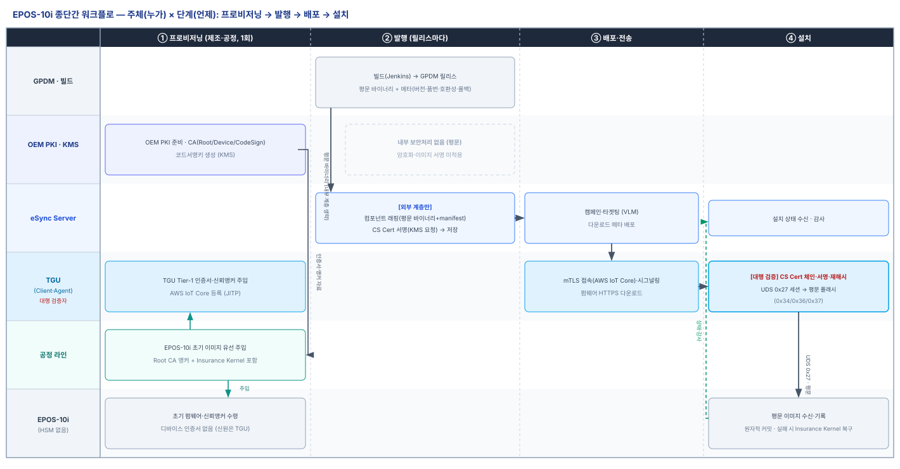
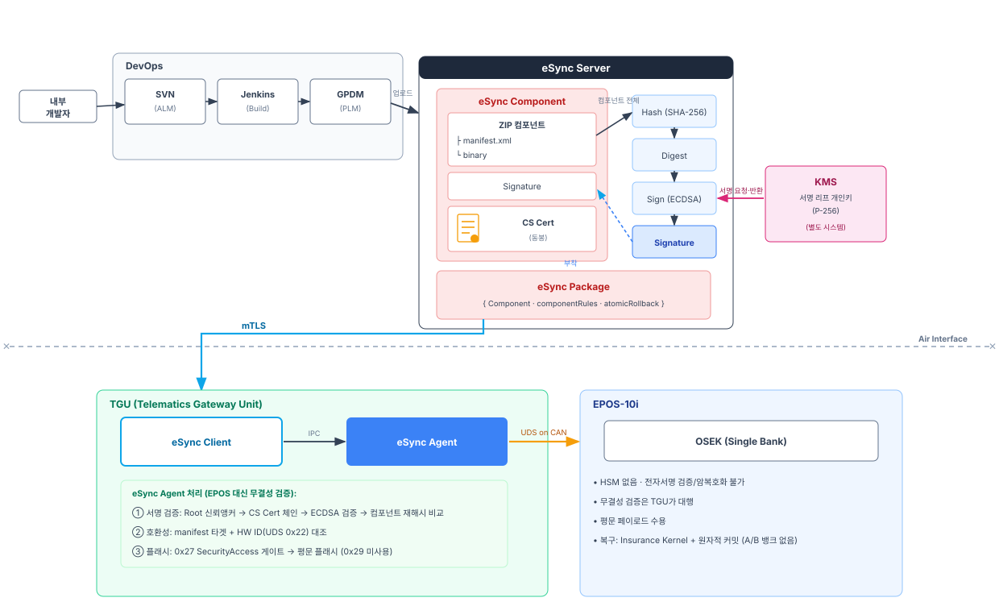
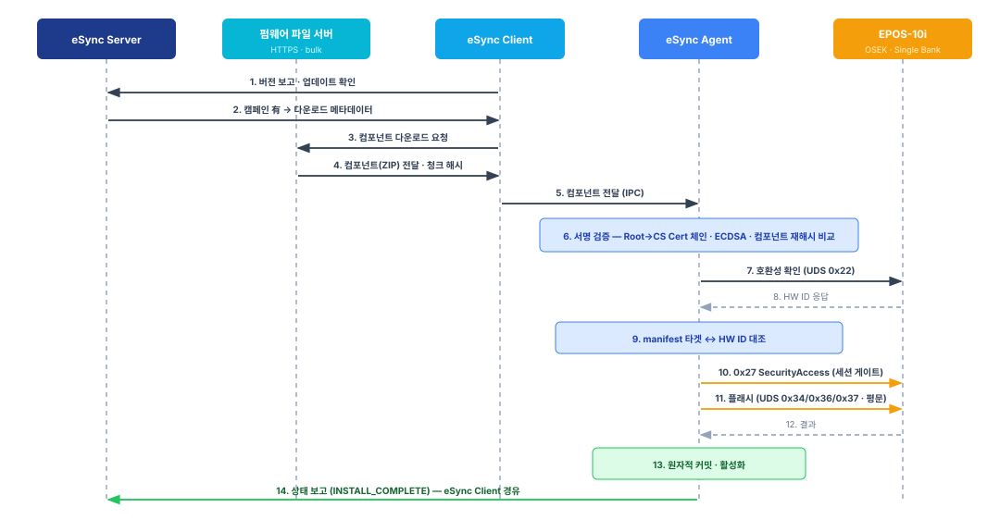
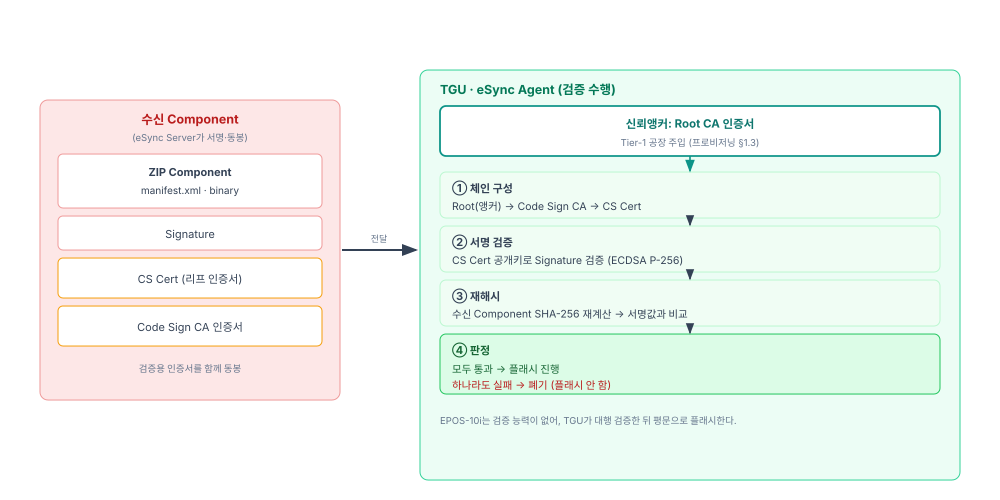

# EPOS-10i OTA 사양서

| 항목 | 내용 |
|------|------|
| **문서 성격** | EPOS-10i 제어기 OTA 종단간 사양 |
| **상태** | Draft |
| **적용 대상** | eSync Server · TGU(eSync Client·Agent) · EPOS-10i |
| **관계** | [30 eSync OTA 공통 아키텍처](30-eSync-OTA-공통아키텍처.md)를 상속한다. PKI·프로비저닝은 [10](10-PKI-사양서.md)·[20](20-프로비저닝-사양서.md), 유선 경로는 [40](40-유선업데이트-사양서.md). |
| **용어 기준** | [00 용어집](00-용어집.md) |

EPOS-10i(**HSM 없음 · 서명검증/암복호화 불가 · 싱글뱅크 · OSEK**)를 대상으로, [30 공통 아키텍처](30-eSync-OTA-공통아키텍처.md)의 워크플로를 종단간(End-to-End)으로 구체화한다. 공통 골격(데이터 모델·서명·전송·타겟팅·정책·감사)은 30을 따르고, 본 문서는 **EPOS-10i 능력에서 비롯되는 변주**(TGU 대행 검증·평문 플래시·`0x27` 세션·싱글뱅크 복구)를 다룬다.

EPOS-10i의 공통 변주 축은 [30 §1.4](30-eSync-OTA-공통아키텍처.md) 표를 따른다: **검증 위치 = TGU(eSync Agent) 대행 · 페이로드 = 평문 · 뱅크 = 싱글뱅크 + Insurance Kernel · 세션 게이트 = UDS `0x27`.**

---

## 1. EPOS-10i 신뢰 경계

- 서명은 클라우드(KMS)에서 이뤄지고 **eSync Agent가 검증**한다([30 §4](30-eSync-OTA-공통아키텍처.md)).
- 검증 신뢰앵커(Root CA 인증서)는 TGU가 로컬 보유한다([10 §3.1](10-PKI-사양서.md)).
- EPOS-10i는 검증 능력이 없어, 무결성 검증이 **TGU까지** 보장된다(§4). TGU→EPOS 구간은 평문이며 UDS 세션으로 보호한다(§2, §6).

---

## 2. 종단간 업데이트 워크플로

### 2.0 주체 × 단계 (누가·무엇·언제)

프로비저닝부터 설치까지, **어느 주체가 어느 단계에서 무엇을 하는지**를 [그림 1]로 개괄한다. 발행에서는 **GPDM이 Component 소스(평문 바이너리)를 eSync에 제공**한다([30 §1.2](30-eSync-OTA-공통아키텍처.md)). EPOS-10i는 HSM이 없어 **내부 계층(암호화·이미지 서명)이 없고**, 검증은 **TGU(eSync Agent)가 대행**하며, 세션은 `0x27`·복구는 Insurance Kernel이다. 프로비저닝 상세는 [20](20-프로비저닝-사양서.md), 공통 골격은 [30 §2](30-eSync-OTA-공통아키텍처.md). (HSM 보유 EPOS-30i와의 대비는 [32 §3.0](32-EPOS-30i-업데이트-사양서.md).)

*[그림 1] EPOS-10i 종단간 워크플로 (주체 × 단계)*

### 2.1 개요

[30 §2](30-eSync-OTA-공통아키텍처.md)의 공통 단계 모델(발행→타겟팅→전송→설치→커밋·보고)을 EPOS-10i에 적용한다. 발행·타겟팅·전송은 공통을 따르고, 본 문서는 **설치(검증·플래시) 단계**를 EPOS-10i 능력에 맞게 상술한다.

*[그림 2] EPOS-10i 업데이트 워크플로*

### 2.2 런타임 실행 단계

아래 번호는 [그림 3]의 시퀀스 번호와 일치한다.

*[그림 3] EPOS-10i 런타임 시퀀스*

1. **업데이트 확인** — eSync Client가 현재 버전을 보고하고 업데이트를 확인한다.
2. **Campaign 매칭** — Campaign이 있으면 eSync Server가 다운로드 메타데이터를 내려준다([30 §6](30-eSync-OTA-공통아키텍처.md)).
3. **다운로드 요청** — eSync Client가 펌웨어 파일 서버에 Component를 요청한다([30 §5.3](30-eSync-OTA-공통아키텍처.md)).
4. **Component 수신** — Component(ZIP)를 청크 해시로 무결성 확인하며 받아 보호 저장한다.
5. **Agent 전달** — eSync Client가 Component를 eSync Agent로 전달한다(IPC).
6. **서명 검증** — eSync Agent가 체인·서명·재해시를 검증한다(§4).
7. **호환성 조회** — eSync Agent가 UDS `0x22`로 EPOS-10i의 HW ID를 읽는다([30 §6.2](30-eSync-OTA-공통아키텍처.md)).
8. **HW ID 응답** — EPOS-10i가 HW ID를 반환한다.
9. **호환성 판정** — manifest의 호환성 정보와 HW ID를 대조한다([30 §6.2](30-eSync-OTA-공통아키텍처.md)).
10. **세션 게이트** — eSync Agent가 UDS `0x27`로 프로그래밍 세션을 연다(§6).
11. **플래시** — UDS `0x34/0x36/0x37`로 평문 바이너리를 전송한다.
12. **결과 수신** — EPOS-10i가 플래시 결과를 반환한다.
13. **원자적 커밋** — eSync Agent가 새 이미지를 활성화한다(§5).
14. **상태 보고** — `INSTALL_COMPLETE`를 eSync Client 경유로 eSync Server에 보고한다([30 §9](30-eSync-OTA-공통아키텍처.md)).

각 단계의 실행 시점은 설치 정책([30 §7](30-eSync-OTA-공통아키텍처.md))이 통제한다.

---

## 3. Component·페이로드

- 데이터 모델·매니페스트·GPDM 연동은 [30 §3](30-eSync-OTA-공통아키텍처.md)을 따른다.
- EPOS-10i의 `binary`는 **평문**이다. EPOS-10i는 복호화 능력이 없으므로 암호화 페이로드를 쓰지 않는다.
- Delta 업데이트는 [30 §3.3](30-eSync-OTA-공통아키텍처.md)을 따르며, 이미지 재구성은 TGU(eSync Agent)가 수행한다.

---

## 4. TGU 대행 검증

EPOS-10i는 서명을 검증하지 못하므로 **TGU의 eSync Agent가 대행 검증**한다. TGU는 Root CA 인증서를 신뢰앵커로 보유한다([20 §1.3](20-프로비저닝-사양서.md)).

*[그림 4] 서명 검증 상세*

1. **체인 구성** — 동봉된 CS Cert로 `Root → CS Cert` 체인을 만든다(코드서명은 중간 CA 없이 OEM Root CA 직접 발급, [10 §1](10-PKI-사양서.md)).
2. **서명 검증** — CS Cert 공개키로 서명을 검증한다(ECDSA P-256).
3. **재해시** — 수신 Component를 SHA-256으로 다시 해시해 서명값과 대조한다.
4. **판정** — 모두 통과해야 진행한다. 하나라도 실패하면 폐기한다.

체인 검증 규칙·유효기간·폐기·신뢰앵커는 [10 §3](10-PKI-사양서.md)을 따른다. 코드서명은 **서명 시점** 기준으로 검증하므로, CS Cert가 회전·만료돼도 **Component/Package는 만료되지 않는다**([10 §3.3](10-PKI-사양서.md)).

검증을 통과하면 TGU가 평문 바이너리를 UDS로 플래시한다(§2.2-11). **무결성 보장은 TGU까지**이며, TGU→EPOS 구간은 UDS 세션(§6)으로 보호한다.

---

## 5. 실패·복구 (싱글뱅크)

- 실패·재시도·롤백 방지의 공통 정책은 [30 §8](30-eSync-OTA-공통아키텍처.md)을 따른다.
- **원자적 커밋·복구:** 플래시는 원자적 커밋(전송·검증 완료 후 활성화)으로 처리한다. EPOS-10i는 싱글뱅크라 A/B 대체 뱅크가 없다. 보호 영역의 **복구 부트로더**(Insurance Kernel)가 플래시 실패 시에도 재플래시를 가능하게 한다([20 §1.4](20-프로비저닝-사양서.md)).
- **롤백 방지:** 롤백 카운터가 없으므로, TGU측 버전 게이트(manifest의 rollback 기준)로 다운그레이드 배포를 차단한다.

---

## 6. 세션 보호 (UDS 0x27)

- EPOS-10i는 UDS `0x29`(인증서 기반 인증)를 지원하지 않는다. 플래시 세션은 UDS `0x27` SecurityAccess(시드-키)로 보호한다.
- `0x27`은 암호 하드웨어를 요구하지 않는다. 시드-키 비밀의 관리 정책은 §8 TBD.
- 세션 개방은 호환성 판정(§2.2-9) 통과 후에만 이뤄진다(§2.2-10).

---

## 7. EPOS-10i 특성 종합

| 특성 | 대응 |
|------|------|
| HSM 없음·서명검증 불가 | TGU(eSync Agent)가 대행 검증(§4) |
| 암복호화 불가 | 평문 페이로드 수용, 전송 구간은 상위에서 보호 |
| UDS `0x29` 미지원 | 인증서 기반 인증 미사용 |
| 플래시 세션 보호 | UDS `0x27` SecurityAccess(암호 하드웨어 불요, §6) |
| 싱글뱅크 | 원자적 커밋 + Insurance Kernel 복구(§5) |
| 롤백 카운터 없음 | TGU측 버전 게이트로 다운그레이드 차단(§5) |

---

## 8. 미정 (TBD)

- UDS `0x27` 시드-키 비밀의 관리 정책.
- SW 벤더 납품 경로(참고).
