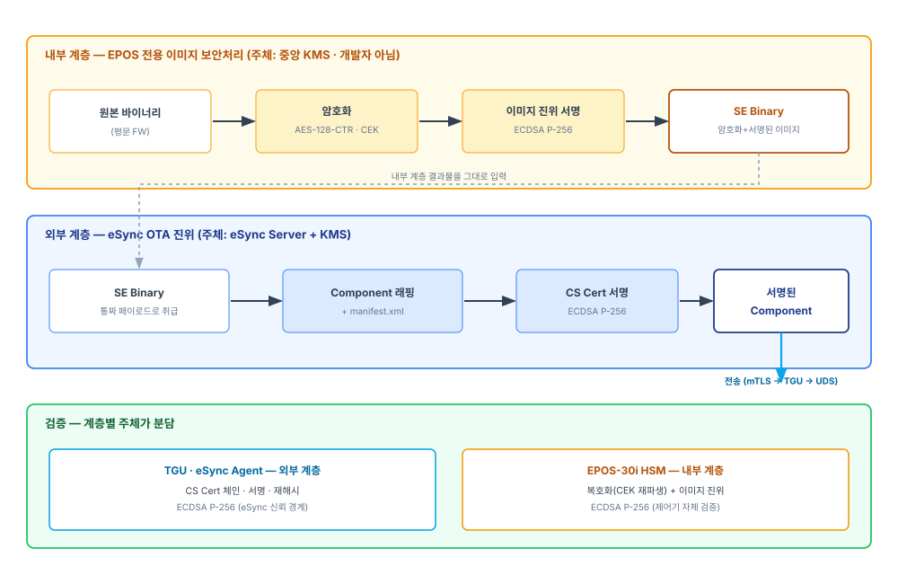
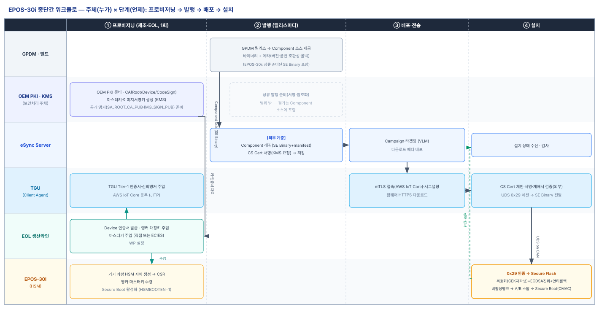
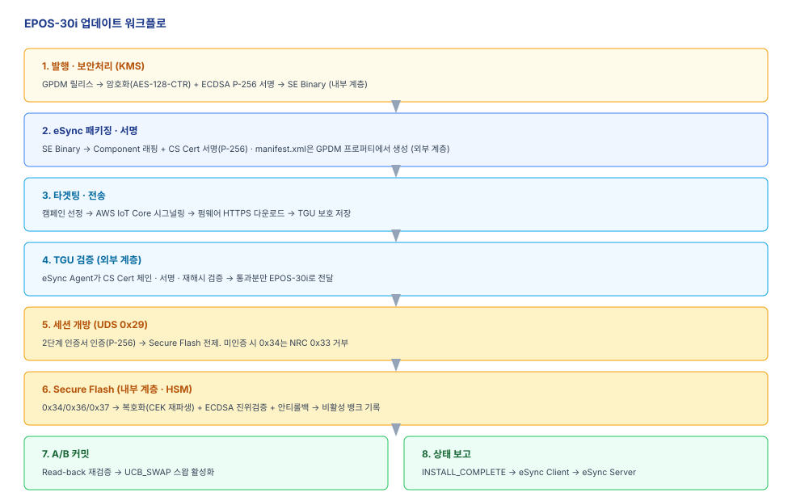
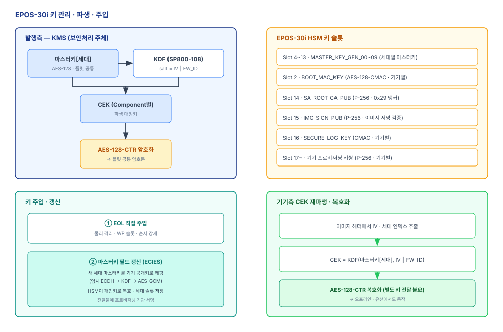
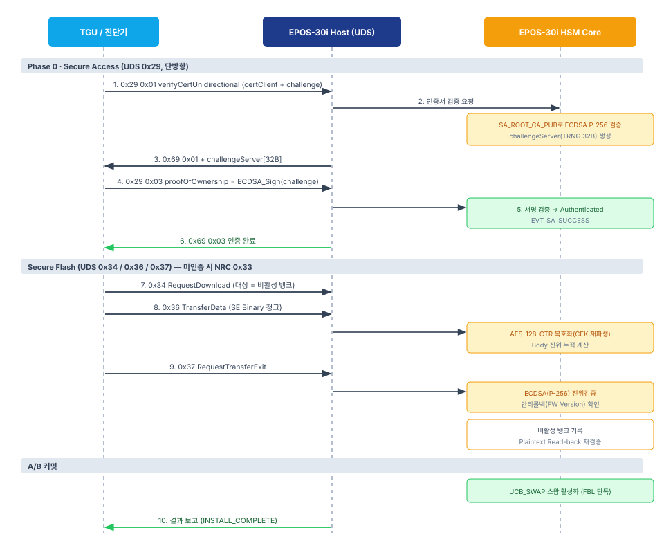

# EPOS-30i 업데이트 사양서 (OTA·유선)

| 항목 | 내용 |
|------|------|
| **문서 성격** | EPOS-30i 제어기 업데이트(OTA·유선) 종단간 사양 |
| **상태** | Draft |
| **적용 대상** | eSync Server · KMS(보안처리 주체) · TGU(eSync Client·Agent) · EPOS-30i(HSM) · DMS/SGW(유선) |
| **관계** | [30 eSync OTA 공통 아키텍처](30-eSync-OTA-공통아키텍처.md)를 상속한다. PKI·프로비저닝은 [10](10-PKI-사양서.md)·[20](20-프로비저닝-사양서.md), 유선 인프라는 [40](40-유선업데이트-사양서.md). |
| **용어 기준** | [00 용어집](00-용어집.md) |

EPOS-30i(**HSM 보유 · A/B Dual Bank**)를 대상으로, [30 공통 아키텍처](30-eSync-OTA-공통아키텍처.md)의 워크플로를 종단간으로 구체화한다. EPOS-30i는 EPOS-10i를 CRA에 대응해 업그레이드한 유압 제어기로, **서명 검증·복호화를 제어기 자체(HSM)가 수행**한다는 점이 EPOS-10i와 근본적으로 다르다.

본 문서는 개발사(모빌위더스) 제안서(SA-001·CRS-001 V1.0 및 2026-06-10 검토회의)를 입력으로 삼되, eSync 공식 사양과 외부 표준에 근거해 상충을 해소한 **협의안**이다. 개발사 원안과 다른 결정은 그 이유를 함께 밝히고, 개발사 제안서의 질문에는 [부록 A](#부록-a-개발사-제안서2026-06-10-질문-답변서)에서 답한다.

EPOS-30i의 공통 변주 축은 [30 §1.4](30-eSync-OTA-공통아키텍처.md)를 따른다: **검증 위치 = 대상 제어기 자체(HSM) · 페이로드 = 암호화(Secure Flash) · 뱅크 = A/B Dual Bank · 세션 게이트 = UDS `0x29`.**

---

## 1. 개요·아키텍처

### 1.1 EPOS-30i 플랫폼

- **MCU:** Infineon AURIX TC387QP. 보안 서브시스템으로 **HSM(Cortex-M3)**을 내장한다.
- **Secure Boot 강제:** `UCB_HSMCOTP.HSMBOOTEN=1`로 HSM Secure Boot를 하드웨어 수준에서 활성화한다.
- **신뢰 연쇄(Chain of Trust):** 전원 인가 후 **HSM → FBL → App** 순으로 이전 단계가 다음 단계를 검증한다(§8).
- **A/B Dual Bank:** 두 개의 프로그램 뱅크를 두고 비활성 뱅크에 기록 후 스왑으로 활성화한다. 뱅크 스왑은 FBL이 단독으로 수행한다(§9).

### 1.2 신뢰 경계와 검증 주체

- **eSync 신뢰 경계는 TGU까지**다. eSync Agent는 TGU에 위치하고, OTA 다운로드·전달까지를 담당한다(§12).
- **EPOS-30i는 서명 검증·복호화를 HSM으로 자체 수행**한다. TGU는 eSync CS Cert(외부 계층)를 검증하지만, 이미지 내부 진위·복호화는 EPOS-30i가 책임진다(§2).
- 이 배치로 무결성·기밀성 보장이 **최종 대상 제어기까지** 연장된다(EPOS-10i가 TGU까지였던 것과 대비).

### 1.3 보안 요구 영역

EPOS-30i 사이버보안은 다음 영역으로 구성된다(개발사 제안서 §사이버보안 요구사항 대응).

| 영역 | 본 문서 절 |
|------|-----------|
| Secure Access(UDS `0x29`) | §10 |
| Secure Update(암호화·서명·플래시) | §3·§4·§5·§8 |
| Secure Boot | §8 |
| Secure Debug | [부록 A](#부록-a-개발사-제안서2026-06-10-질문-답변서) A-5 |
| 키관리 & HSM | §7 |
| 통신 보안 | §10·§11, [10](10-PKI-사양서.md) |
| Secure Log | §9.3 |

---

## 2. 2계층 보안 모델

EPOS-30i 이미지는 **두 계층의 독립적 보안 처리**를 거친다. 이 구분이 eSync 경계 오해(개발자가 eSync 밖에서 Package를 만든다는 서술)를 해소하는 핵심이다.



*[그림 1] EPOS-30i 2계층 보안 모델*

### 2.1 내부 계층 — EPOS 전용 이미지 보안처리

- **준비 위치·주체:** 내부 계층(원본 바이너리 **암호화**(AES-128-CTR, §5) + 이미지 **ECDSA P-256 서명**(§4))은 **상류(GPDM 릴리스 단계)에서 중앙이 준비**한다. **개발자가 아니다.** 그 결과물 SE Binary(Signed-Encrypted Binary, 이미지 헤더 포함, §6)는 **GPDM의 Component 소스로 eSync에 전달**된다([30 §1.2](30-eSync-OTA-공통아키텍처.md)). 준비의 시점·주체·제조 배포 세부는 상류 인프라 과제로 본 사양 범위 밖이며, eSync는 이를 **불투명(opaque) 페이로드**로 취급한다.
- **검증자:** EPOS-30i HSM이 복호화·서명검증을 수행한다(§8). 본 문서는 이 **기기 측 능력**을 정의한다.

### 2.2 외부 계층 — eSync OTA 진위

- **주체:** eSync Server + KMS.
- **처리:** eSync Server가 SE Binary를 **불투명 페이로드로 취급**해 Component(ZIP)로 감싸고, 그 위에 **CS Cert 서명**(ECDSA P-256)을 얹는다([30 §4.1](30-eSync-OTA-공통아키텍처.md)).
- **검증자:** TGU eSync Agent가 CS Cert 체인·서명을 검증한다([30 §4.2](30-eSync-OTA-공통아키텍처.md)).

### 2.3 "개발자 서명 제거"와의 관계

eSync 절차가 제거하는 "개발자 서명"은 **업로더가 자기 키로 업로드물에 붙이는 서명**이다. EPOS-30i의 내부 계층 서명은 이것이 아니라, **보안처리 주체(KMS)가 EPOS 키로 만드는 이미지 진위값**이다. 두 계층 모두 중앙에서 서명하므로 "개발자 서명 제거" 원칙과 충돌하지 않는다. eSync 입장에서 내부 계층 결과물(SE Binary)은 **의미를 해석하지 않는 불투명 바이너리**다.

---

## 3. OTA 종단간 워크플로

[30 §2](30-eSync-OTA-공통아키텍처.md)의 공통 단계 모델을 EPOS-30i에 적용한다.

### 3.0 주체 × 단계 (누가·무엇·언제)

프로비저닝부터 설치까지, **어느 주체가 어느 단계에서 무엇을 하는지**를 [그림 2]로 개괄한다. 발행에서는 **GPDM이 Component 소스(EPOS-30i는 상류 준비된 SE Binary 포함)를 제공**하고 **eSync Server**가 외부 계층(Component·CS Cert)을 얹는다. 프로비저닝 주입은 **EOL 생산라인**이, 설치 검증·복호화는 **EPOS-30i(HSM)**가 담당한다. 상류 발행 준비(서명·암호화 시점·주체)·제조 배포는 범위 밖(§2.1). 프로비저닝 상세는 [20](20-프로비저닝-사양서.md).



*[그림 2] EPOS-30i 종단간 워크플로 (주체 × 단계)*

### 3.1 OTA 실행 단계



*[그림 3] EPOS-30i 업데이트 워크플로*

1. **발행** — GPDM이 Component 소스를 eSync에 제공한다. EPOS-30i의 소스 바이너리는 상류에서 준비된 **SE Binary**(내부 계층: 암호화 §5 + ECDSA 서명 §4 완료본)다. 상류 준비의 시점·주체·제조 배포는 범위 밖(§2.1, [30 §1.2](30-eSync-OTA-공통아키텍처.md)).
2. **eSync 패키징·서명** — eSync Server가 SE Binary를 Component로 감싸고 CS Cert 서명(외부 계층). manifest.xml은 GPDM 프로퍼티에서 생성(§6, [30 §3.2.4](30-eSync-OTA-공통아키텍처.md)).
3. **타겟팅·전송** — Campaign 선정 후 AWS IoT Core로 TGU에 시그널링, 펌웨어는 HTTPS 다운로드([30 §5·§6](30-eSync-OTA-공통아키텍처.md)).
4. **TGU 검증** — eSync Agent가 CS Cert 체인·서명·재해시를 검증(외부 계층). 통과분만 EPOS-30i로 전달.
5. **세션 개방** — UDS `0x29`(2단계 인증서 인증)로 프로그래밍 세션을 연다(§10). Secure Flash의 전제조건이다.
6. **Secure Flash** — UDS `0x34/0x36/0x37`로 SE Binary를 전송. EPOS-30i HSM이 복호화·진위검증·안티롤백을 수행하며 **비활성 뱅크**에 기록(§8).
7. **A/B 커밋** — Read-back 재검증 통과 후 뱅크 스왑으로 활성화(§9).
8. **상태 보고** — `INSTALL_COMPLETE`를 eSync Client 경유로 보고([30 §9](30-eSync-OTA-공통아키텍처.md)).

Secure Flash 상세 시퀀스는 §8, 그림 5.

---

## 4. 이미지 진위·무결성 (ECDSA P-256)

### 4.1 알고리즘 결정

- **OTA 이미지 진위(내부 계층):** **ECDSA P-256 / SHA-256**(비대칭 서명). 서명 개인키는 중앙 KMS에만, 검증 공개키는 EPOS-30i 슬롯(§7).
- **부팅 무결성(Secure Boot):** **AES-128-CMAC**(BOOT_MAC_KEY) 유지. 기기 내부 로컬 검증이며 §8에서 다룬다.

> **개발사 원안 정정:** SA-001/CRS-001 V1.0은 App/OTA 이미지 검증을 대칭 **AES-128-CMAC**으로 명세했다. 본 사양은 이를 **ECDSA P-256으로 정정**한다. 이는 개발사 검토회의(2026-06-10)가 이미 요청한 정정(p.9 *"전자서명 생성방식을 AES-CMAC이 아닌 ECDSA(p256)으로 정정"*)과 일치한다.

### 4.2 대칭 CMAC이 OTA 진위에 부적합한 이유

대칭 MAC은 검증자가 곧 위조자다(같은 키로 검증·생성).

- 검증키를 **플릿 공통**으로 두면 → 한 대만 탈취돼도 전체 EPOS-30i용 위조 이미지를 만들 수 있다.
- 검증키를 **기기별**로 두면 → 중앙이 모든 기기 키를 알아야 하고 기기마다 다른 이미지가 되어 오프라인·유선 배포와 충돌한다.

**비대칭 ECDSA는 이 딜레마가 없다.** 서명 개인키는 중앙에만 있고 기기는 공개키만 가지므로, 기기 탈취로 위조가 불가능하고 이미지는 플릿 공통(한 번 서명, 전 기기 사용)이다. EPOS-30i는 이미 `SA_ROOT_CA_PUB`(P-256)과 UDS `0x29` ECDSA 검증 능력을 갖고 있어 추가 하드웨어 없이 재사용된다.

### 4.3 서명 대상·구조

- **서명 대상:** 이미지 헤더 메타데이터 + 암호화된 Body 전체(§6). 하나의 ECDSA P-256 서명(64B, 이미지 레이아웃의 Body ECDSA Block)이 메타데이터와 암호문을 함께 보증한다.
- **검증 시점:** EPOS-30i HSM이 Secure Flash(설치 시)와 Secure Boot(매 부팅 시 CMAC)로 이중 확인(§8).
- 진위와 기밀성은 **독립**이다(§5). 암호화 키가 유출돼도 서명 개인키 없이는 유효 이미지를 만들 수 없다.

### 4.4 Ed25519 대안

개발사가 검토 요청한 Ed25519는 경량·고속이나, EPOS-30i의 기존 P-256 자산(`SA_ROOT_CA_PUB`·`0x29`·인증서 체인)과 곡선이 달라 별도 구현·상호운용 검토가 필요하다. 본 사양은 **P-256 단일화**를 채택한다(§13 협의 포인트).

---

## 5. 암호화 (기밀성)

### 5.1 목표

- **Component별 암호화**로 릴리스마다 신선한 키를 쓴다.
- **플릿 공통 암호문**으로 오프라인·유선 배포에 지장이 없어야 한다(업데이트 시점 온라인 키교환 불요).

### 5.2 키 파생 (세대 마스터키 + KDF)

```
CEK = SP800-108 KBKDF-CMAC( MasterKey[세대], label="EPOS-30i-CEK", context = IV ‖ FW_ID )
암호문 = AES-128-CTR( CEK, IV, PlainBody )
```

- **MasterKey[세대]** — 플릿 공통 대칭 시드키. 세대(버전)로 구분한다(§7).
- **CEK(Content Encryption Key)** — Component별 파생 대칭키. 마스터키에서 KDF로 유도한다.
- **IV** — 난수 16B, 이미지 헤더 0x20에 평문 동행(§6). 세대 인덱스도 헤더에 실린다.
- **복호화:** EPOS-30i HSM이 헤더의 IV·세대로 CEK를 **재파생**해 AES-128-CTR 복호화한다. 래핑된 키를 별도 전달하지 않으므로 오프라인·유선에서 그대로 동작한다.
- **KDF/AES는 EPOS HSM이 이미 지원**하는 AES-CMAC·AES-CTR 위에서 구현되어 추가 하드웨어가 필요 없다.

### 5.3 개발사 10-키풀 방식 미반영

> **개발사 원안 정정:** SA-001/논의 PDF는 EOL에 10개 대칭키(IMG_KEY_00~09)를 미리 주입하고 `keyIndex=SHA-256(IV)[0] mod 10`으로 **선택**하며, 유출 시 "풀에서 해당 index 제외"로 대응한다. 본 사양은 이를 반영하지 않는다.
>
> 이유: ① 키가 영구 10개로 상한이라 로테이션이 조잡하고 고갈된다 ② 10개 공유 비밀이 모든 기기에 상주해 탈취 시 노출면이 넓다 ③ keyIndex를 IV 해시로 정하는 것은 명시 인덱스 대비 이점이 없다 ④ 세대·롤포워드 개념과 맞지 않는다. 대신 §5.2의 **세대 마스터키 + KDF 파생**을 채택한다.
>
> 다만 **IV(난수)·AES-128-CTR·ECDSA 서명은 그대로 재사용**하며, 개발사의 IMG_KEY 슬롯(4~13)은 "선택 키풀"이 아니라 "세대별 마스터키 슬롯"으로 의미를 재정의한다(§7).

### 5.4 진위 ⊥ 기밀성 분리

암호화(대칭 CEK/마스터키)와 진위(비대칭 ECDSA)를 분리하므로, **마스터키가 유출돼도 위조는 불가능**하다(기밀성만 손실). 유출 대비는 §7.4.

---

## 6. 메타데이터·GPDM 연동

### 6.1 두 메타데이터의 이원화

EPOS-30i는 계층이 다른 두 메타데이터를 가진다. **물리적으로 합치지 않되, GPDM을 단일 진실원천(SSOT)으로 공동 생성**한다.

| 메타데이터 | 소비 주체 | 용도 |
|-----------|----------|------|
| **eSync manifest.xml** (OTA층) | eSync Server·TGU | 타겟팅·호환성·롤백 판정. SE Binary는 불투명하므로 열어보지 않음 |
| **이미지 헤더** (기기층) | EPOS-30i HSM·FBL | 복호화(IV)·서명검증·안티롤백(FW Version)·플래시(FW Size·FW ID) |

### 6.2 이미지 헤더 레이아웃

개발사 제안서(p.9) 레이아웃을 기준으로, 본 사양의 정정(세대 인덱스 신설, 서명 알고리즘 ECDSA)을 반영한다.

| 구분 | 오프셋 | 필드 | 크기 | 설명 |
|------|--------|------|------|------|
| 메타데이터 | 0x00 | Image Header Delimiter | 4B | 이미지 시작 식별자 |
| | 0x04 | Metadata Length | 4B | 0x0100 고정 |
| | 0x08 | FW ID | 4B | APP/FBL 구분 식별자 |
| | 0x0C | FW Version | 4B | 안티롤백 비교 기준(§9) |
| | 0x10 | FW Size | 8B | Body 서명·복호화 범위 |
| | 0x18 | Timestamp | 8B | 이미지 생성 시각 |
| | 0x20 | IV(nonce) | 16B | AES-128-CTR IV(난수), CEK 재파생 입력(§5.2) |
| | 0x28 | **세대 인덱스(Key Generation)** | (Reserved 활용) | 마스터키 세대 선택(§7). *본 사양 신설* |
| | 0x30 | Reserved | 192B | 향후 확장(세대 인덱스 편입) |
| 암호화 Body | 0x100 | Encrypted FW Body | N B | AES-128-CTR(CEK, IV, Plain FW Body) |
| 전자서명 | 0x100+N | Body ECDSA Block | 64B | ECDSA(P-256) 서명 — 메타데이터+암호문 진위(§4.3) |
| | 끝 | 0xFF Padding | ~ | 256B 정렬(DFLASH Erase 기본값 0xFF) |

> **정정 반영:** 개발사 원안의 `Metadata Signate(0xF0, 16B)`는 ECDSA P-256 서명(64B)을 담기에 크기가 맞지 않는다. 본 사양은 **메타데이터+암호문을 하나의 Body ECDSA Block(64B)으로 서명**해 이 불일치를 해소한다. 별도 16B Metadata MAC이 필요하면 크기·용도를 재정의한다(§13).

### 6.3 GPDM 공동 생성

GPDM 프로퍼티(버전·품번·호환성·롤백·**세대·FW ID**)가 두 산출물의 단일 원천이다.

- GPDM → 릴리스 패키징 툴 → **manifest.xml**([30 §3.2.4](30-eSync-OTA-공통아키텍처.md), 기존 경로).
- 같은 GPDM 프로퍼티 → 보안처리 주체(KMS) → **이미지 헤더**.
- → 두 메타데이터가 **구성상 자동 일치**하며 이중 수기관리가 없다.
- **추적성 상호참조:** manifest에 이미지 정체성(FW ID·FW Version·세대·이미지 해시)을 실어 두 층이 동일 산출물임을 증명한다. 안티롤백 기준(manifest rollback ↔ 헤더 FW Version)도 GPDM에서 일원 유래한다.

---

## 7. 키 관리

### 7.1 키 종류 (역할 분리)

| 키 | 유형 | 공유 범위 | 검증/사용 주체 |
|----|------|----------|---------------|
| BOOT_MAC_KEY | AES-128-CMAC | **기기별 고유** | HSM(부팅 무결성, §8) |
| 이미지 서명 검증 공개키 | ECDSA P-256(공개키) | **플릿 공통**(공개키라 무해) | HSM(이미지 진위, §4) |
| 마스터키(시드키) | AES-128 | **플릿 공통 + 세대 로테이션** | HSM(CEK 재파생, §5) |
| CEK | AES-128(파생) | Component별 | 주입 안 함 — 헤더 IV·세대로 재파생 |
| 기기 프로비저닝 키쌍 | ECDSA P-256 | **기기별 고유** | 마스터키 ECIES 수신(§7.3) |
| SA_ROOT_CA_PUB | ECDSA P-256(공개키) | 플릿 공통 | HSM(UDS `0x29` Secure Access, §10) |
| SECURE_LOG_KEY | AES-128-CMAC | 기기별 | HSM(Secure Log 무결성, §9.3) |

### 7.2 HSM 슬롯 배치

개발사 KeySlot 표(SA-001 표19)를 기준으로, 본 사양의 재정의를 반영한다. SHE V1.1 슬롯 0~13 + EPOS 확장 14~31.

| Slot | Key ID | 알고리즘 | 용도 | 비고 |
|------|--------|----------|------|------|
| 0 | SECRET_KEY | AES-128 | 키 레코드 CMAC 기준키 | WP, 최초 주입 필수 |
| 2 | BOOT_MAC_KEY | AES-128-CMAC | FBL/APP Body CMAC(부팅) | WP, 기기별 |
| 4~13 | **MASTER_KEY_GEN_00~09** | AES-128 | **세대별 마스터키(CEK 파생)** | *재정의:* 개발사 IMG_KEY 선택풀 → 세대 마스터키 슬롯 |
| 14 | SA_ROOT_CA_PUB | ECDSA P-256 | UDS `0x29` Secure Access 앵커 | WP, 64B 공개키 |
| 15 | **IMG_SIGN_PUB** | ECDSA P-256 | **이미지 서명 검증 공개키(§4)** | *신설 권장* (또는 Slot 14 재사용, §13) |
| 16 | SECURE_LOG_KEY | AES-128-CMAC | Secure Log 무결성 | WP, 기기별 |
| 17~31 | (프로비저닝 키쌍 등) | ECDSA P-256 | 기기 프로비저닝 개인키(§7.3) | 기기별, HSM 내 생성 |

### 7.3 키 주입·갱신 (EOL + ECIES)

- **EOL 직접 주입:** 생산 종단 물리 격리 구역에서 안전 채널로 슬롯에 직접 기록. 순서 = `SECRET_KEY → BOOT_MAC_KEY → MASTER_KEY_GEN → SA_ROOT_CA_PUB/IMG_SIGN_PUB → SECURE_LOG_KEY`. 필수 슬롯은 WP(운영 중 변경 불가).
- **기기 프로비저닝 키쌍:** HSM 내부에서 생성(개인키 비반출), CSR로 공개키 제출·소유증명(PoP) 검증 후 인증서 발급([20](20-프로비저닝-사양서.md)).
- **마스터키 필드 갱신(ECIES):** 새 세대 마스터키를 기기 공개키로 **ECIES**(임시 ECDH → KDF → AES-GCM 래핑)로 전달 → HSM이 개인키로 복호해 세대 슬롯에 저장. 전달물에는 프로비저닝 기관 서명을 붙여 악성 주입을 차단한다. → EOL 이후에도 세대 로테이션이 가능하다(개발사 WP 슬롯의 필드 갱신 불가 갭 보완).

### 7.4 마스터키 유출 리스크·대비

- **리스크:** 마스터키(+평문 IV·세대)로 해당 세대의 모든 Component를 복호화 가능(펌웨어 기밀성 손실). **단, 위조·악성 업데이트는 불가**(§5.4, 진위는 비대칭 ECDSA).
- **대비:** ① 세대 로테이션으로 유출 시 해당 세대만 노출·롤포워드 ② KDF 일방향으로 파생키→마스터키 역산 차단 ③ HSM 경계 밖 평문 노출 금지·WP 슬롯 ④ 진위⊥기밀성 분리 유지 ⑤ 유출 모니터링·세대 폐기·강제 재프로비저닝·Secure Log(§9.3) ⑥ 펌웨어에 2차 비밀(키·자격증명) 미탑재.
- **공유 범위(확정):** **단일 플릿 마스터키 + 세대 로테이션.** 그룹(배치·리전)별 키·per-device 엔벨로프는 blast-radius 축소가 필요할 때의 확장 옵션이다(§13).



*[그림 4] EPOS-30i 키 관리·주입*

---

## 8. Secure Boot·Secure Flash

### 8.1 Secure Boot (매 부팅)

- **주체·방식:** HSM Core가 Secure Boot를 수행하는 **One-way 방식(CASE 1, 개발사 권장)**. 전원 인가 후 HSM이 활성 뱅크의 FBL 이미지를 **AES-128-CMAC**(BOOT_MAC_KEY)으로 검증하고, 통과해야 Host TriCore 실행을 허가한다. 이후 **FBL이 App**을 검증한다(신뢰 연쇄).
- **실패 처리:** 검증 실패 시 Host CPU Release 미발행, **Boot Halt**. Boot Counter 증가, Secure Log에 `EVT_BOOT_FAIL` 기록. 복구는 A/B 롤백(§9)으로 처리한다([부록 A](#부록-a-개발사-제안서2026-06-10-질문-답변서) A-4).

### 8.2 Secure Flash (설치 시)

UDS `0x29` 인증(§10)을 전제로 하며, 미인증 상태에서 `0x34`는 NRC `0x33`(securityAccessDenied)로 거부된다.



*[그림 5] EPOS-30i Secure Flash 시퀀스*

- **Phase 0 — Secure Access 선행:** UDS `0x29` 2단계 인증 완료(§10).
- **Phase 1 — 다운로드 개시:** `0x34 RequestDownload`(대상=비활성 뱅크).
- **Phase 2 — 메타데이터 검증:** 헤더 무결성 확인 후 신뢰(FW ID·Version·Size·IV·세대).
- **Phase 3 — 복호화·진위검증:** `0x36 TransferData` 수신마다 AES-128-CTR 복호화(CEK 재파생, §5.2). `0x37 RequestTransferExit`에서 **Body ECDSA Block(P-256)** 검증(§4).
- **Phase 4 — 안티롤백:** 헤더 FW Version이 현재 이상인지 확인(§9).
- **Phase 5 — 비활성 뱅크 기록·Read-back:** 기록 완료 후 Plaintext Read-back으로 재검증.
- **Phase 6 — 매니페스트 갱신:** 뱅크 스왑 준비, 상태 갱신(§9).

---

## 9. A/B Dual Bank·안티롤백

### 9.1 A/B 스왑

- 비활성 뱅크에 기록·검증 완료 후 `UCB_SWAP`으로 활성 뱅크를 전환한다. 스왑은 **FBL이 단독 수행**한다.
- 실패 시 기존 활성 뱅크가 그대로 남아 **무중단 복귀**한다(EPOS-10i의 Insurance Kernel 재플래시와 대비되는 이점).

### 9.2 안티롤백

- 이미지 헤더 FW Version과 **모노토닉 카운터**로 다운그레이드를 기기 자체가 차단한다.
- App 이미지 검증 실패가 임계(기본 3회) 초과 시 FBL이 `UCB_SWAP`을 이전 뱅크로 되돌려 **롤백**한다([부록 A](#부록-a-개발사-제안서2026-06-10-질문-답변서) A-4).

### 9.3 Secure Log

- 인증·서명검증·부팅·플래시·롤백·Secure Access 이벤트를 `SECURE_LOG_KEY`(AES-128-CMAC)로 무결성 태깅해 기록한다(`EVT_BOOT_FAIL`·`EVT_APP_VERIFY_FAIL`·`EVT_SA_SUCCESS`·`EVT_SA_DEAUTH` 등).

---

## 10. UDS 0x29 인증 (Secure Access)

진단·플래시 세션의 세션 게이트다. **단방향 인증**(제어기가 진단기/툴을 인증)이며, 인증서 기반(X.509 v3) ECDSA P-256이다. 시퀀스는 [그림 5]의 Phase 0에 포함된다.

- **Phase 1 — verifyCertificateUnidirectional (`0x29 0x01`):** 진단기가 `certificateClient`(X.509 DER)·`challengeClient`를 제시. HSM이 `SA_ROOT_CA_PUB`로 인증서를 ECDSA P-256 검증(SHA-256·KeyUsage 확인·PubKey 추출)하고 TRNG로 `challengeServer[32B]` 생성. 응답 `0x69 0x01` + `authReturnParam(0x10)` + `challengeServer`.
- **Phase 2 — proofOfOwnership (`0x29 0x03`):** 진단기가 `ownershipProof = ECDSA_Sign(privKey, SHA-256(challengeServer))` 제시. HSM이 진단기 공개키로 검증 → 상태=Authenticated, `EVT_SA_SUCCESS`. 응답 `0x69 0x03` + `authReturnParam(0x11)`.
- **deAuthenticate (`0x29 0x00`):** 상태=Deauthenticated, Context Zeroization, `EVT_SA_DEAUTH`.
- **NRC:** 인증 전 `0x34` 등은 `0x33`(securityAccessDenied). 인증서/서명 오류는 `0x50~0x58` 대역.

인증서 프로파일·체인·유효기간·신뢰앵커는 [10 PKI 사양서](10-PKI-사양서.md)를 따른다.

---

## 11. 유선 업데이트 변주

유선(DMS) 인프라(DMS·SGW·OBD-II·게이트웨이)는 [40 유선 업데이트 사양서](40-유선업데이트-사양서.md)를 재사용한다. EPOS-30i의 차이는 다음과 같다.

- **동일 SE Binary 재사용:** OTA와 같은 서명·암호화 이미지를 유선으로도 배포한다([30 §1.4](30-eSync-OTA-공통아키텍처.md)).
- **EPOS-30i 자체 검증·복호화:** 유선 경로에서도 EPOS-30i HSM이 `0x29` 인증·복호화·ECDSA 검증·Secure Flash를 수행한다(TGU 대행 아님).
- **오프라인 키 불요:** CEK는 헤더 IV·세대로 기기가 KDF 재파생하므로(§5.2), 유선·오프라인에서 별도 키 전달이 없다.

### 11.1 SGW·EPOS-30i 이중 `0x29` (EPOS-10i와의 차이)

DMS가 SGW를 거쳐 EPOS-30i에 접속하면 **SGW `0x29`와 EPOS-30i `0x29`가 같은 DMS 라이선스로 각각 수행**된다. EPOS-10i에는 없던 구조다.

- **EPOS-10i:** `0x29`를 지원하지 않아 DMS 라이선스는 **SGW에서만 1회** 검증됐다(엔드포인트 세션은 `0x27`, 펌웨어 진위는 DMS 대행 → 서로 다른 세 검사). 같은 라이선스를 두 번 쓰는 구간이 없었다.
- **EPOS-30i:** 세션 게이트가 `0x29`이므로 SGW와 EPOS-30i가 같은 라이선스를 각각 검증한다.
- **중복이 아니라 엔드포인트 자기방어(제로트러스트):** 두 검사는 서로 다른 우회를 막는다 — SGW는 **OBD-II → 내부 CAN 진입**을, EPOS-30i는 **이미 내부 CAN에 올라온 공격자**(물리 탭·내부 노드 오염·SGW 오설정)를 막는다. EPOS-30i의 `0x29`를 빼면 내부 CAN상의 누구든 플래시가 가능해진다. 이는 EPOS-10i가 못 하던 자기방어로, 보안 강화다.
- **의미 분리(Role 기반 인가):** DMS 라이선스의 Role OID([40 §8](40-유선업데이트-사양서.md))를 두 관문이 다르게 해석한다 — SGW="이 CAN 세그먼트 접근 허용?", EPOS-30i="이 ECU 플래시 허용?". 같은 인증서지만 **서로 다른 인가 판정**이므로 "같은 인증 두 번"이 아니라 "두 경계의 다계층 인가"다. 추가 비용은 `0x29` 핸드셰이크 1회로 미미하다.
- **자격증명 유출 대응:** "하나 뚫리면 둘 다"는 계층 수와 무관한 라이선스 유출 문제이며, 단수명 라이선스 + 폐기(nonce/CRL, [40 §9](40-유선업데이트-사양서.md))로 대응한다. 상세는 [부록 A-3](#부록-a-개발사-제안서2026-06-10-질문-답변서).

---

## 12. eSync Agent 위치

- **확정(권장):** eSync Agent는 **TGU**에 둔다. eSync 신뢰 경계는 OTA 다운로드·전달까지이고, 서명 검증(내부 계층)·복호화는 **EPOS-30i가 자체 수행**한다. EPOS-30i가 HSM으로 ECDSA 검증·AES 복호화 능력을 갖추므로 이 배치가 자연스럽다.
- **제어기별 Agent:** eSync Agent는 대상 제어기별로 하나이며(Component `type`이 담당 Agent 지정, [30 §3.1](30-eSync-OTA-공통아키텍처.md)), 현재 모두 TGU에 co-locate한다. EPOS-30i용 Agent는 전달을 담당하고 검증·복호화는 제어기 HSM이 수행한다. CAN 관점에서 TGU는 SGW 뒤의 내부 노드다([30 §1 그림 2](30-eSync-OTA-공통아키텍처.md)).
- **대안(상세설계 TODO):** eSync Agent를 EPOS-30i에 두는 방안은 HSM 리소스·eSync Agent 이식성·CAN 대역 등 구체 설계 논의가 필요하다(§13).

---

## 13. 미정(TBD)·협의 포인트

- **이미지 서명 검증 공개키 슬롯:** 전용 슬롯(IMG_SIGN_PUB) 신설 vs `SA_ROOT_CA_PUB`(Slot 14) 재사용 — 목적 분리 관점에서 신설 권장(§7.2).
- **Ed25519 채택 여부:** 본 사양은 P-256 단일화. Ed25519 전환 시 상호운용·구현 재검토(§4.4).
- **Metadata MAC/서명 필드 재정의:** 개발사 16B Metadata Signate와의 정합(§6.2).
- **인증서 유효기간·시각원:** RTC/TSN 부재 환경에서의 유효기간 정책([부록 A](#부록-a-개발사-제안서2026-06-10-질문-답변서) A-2, [10 §7](10-PKI-사양서.md)).
- **eSync Agent를 EPOS-30i에 두는 대안**(§12).
- **KMS/OEM 인프라:** 보안처리 주체 KMS 구축은 Out-of-Scope(별도 인프라 과제).
- **CSC-001(사이버보안 개념서):** 암호 잠금으로 미판독. 원문 확보 시 재대조.

---

## 부록 A. 개발사 제안서(2026-06-10) 질문 답변서

개발사 검토회의 자료 *"EPOS-30i 제어기 사이버보안 검토회의(모빌위더스, 2026-06-10)"* 및 인용 문서(SA-001·CRS-001·SDD-001 V1.0)의 질문에 대한 답변이다. 각 답변은 본문 해당 절과 외부 표준에 근거한다.

### A-1. SA_ROOT_CA_PUB·기기 인증 PKI 체계 (메일 발췌 1)

- EPOS-30i·DMS·UDS 통신 대상 제어기 모두에 **기기 인증 PKI**를 수립한다. 각 기기는 P-256 개인키를 **HSM 내부에서 생성**하고 CSR로 OEM PKI의 인증을 받는다([20](20-프로비저닝-사양서.md), §7.3).
- 신뢰앵커는 **인증서**(자기서명 CA 인증서)이지 공개키 원문이 아니다. `SA_ROOT_CA_PUB`는 HSM이 UDS `0x29` 검증에 쓰는 **OEM Root CA 공개키**로, Root CA 인증서로부터 유래한다([10 §3.1](10-PKI-사양서.md)).
- 코드서명·기기신원·진단 라이선스는 OEM Root CA 아래 목적별 CA로 분기한다([10 §1·§3](10-PKI-사양서.md)).

### A-2. 인증서 유효기간·시각원 (메일 발췌 2, 인증서 이슈)

- **코드서명은 서명 시점 기준으로 검증**하므로 Component/이미지는 만료되지 않는다([10 §3.3](10-PKI-사양서.md)). 신뢰 시각원은 서명 시 부여하는 신뢰 타임스탬프다.
- **전송·세션 인증서(mTLS·`0x29`)**는 접속 시점 유효성을 본다. EPOS-30i는 신뢰할 RTC/TSN이 없을 수 있으므로(제안서 의견 B·C의 한계 지적에 동의), **절대시각 게이트 대신 nonce·챌린지 기반**으로 신선도를 보장하고, 유효기간 강제는 폐기 목록·세대 관리로 보완한다([10 §7](10-PKI-사양서.md), [40 §9](40-유선업데이트-사양서.md)). 진단도구 제공 시각은 신뢰 기준으로 쓰지 않는다.

### A-3. "이중 Secure Access"는 실효성 있는 별개 계층 (메일 발췌 3)

DMS가 SGW를 거쳐 EPOS-30i에 접속할 때 SGW `0x29`와 EPOS-30i `0x29`가 각각 수행되는 것은 **중복이 아니라 서로 다른 신뢰 경계의 방어**다. 상세 설계는 §11.1.

- **EPOS-10i와의 차이:** EPOS-10i는 `0x29`를 못 해 DMS 라이선스가 SGW에서만 1회 검증됐다(엔드포인트는 `0x27`). EPOS-30i는 세션 게이트가 `0x29`라 이중이 되지만, 이는 EPOS-10i가 못 하던 **엔드포인트 자기방어**가 생긴 것으로 보안 강화다.
- SGW `0x29`는 **OBD-II → 내부 CAN 진입**을, EPOS-30i `0x29`는 **이미 내부 CAN에 올라온 공격자**(물리 탭·내부 노드 오염·SGW 오설정)를 막는다. 두 검사는 서로 다른 우회를 방어하므로 중복이 아니다.
- "하나가 뚫리면 둘 다 뚫린다"는 **자격증명 유출** 문제이며 계층 수와 무관하다. 단수명 라이선스 + 폐기(nonce/CRL, [40 §9](40-유선업데이트-사양서.md))로 대응한다.
- **의미 분리:** DMS 라이선스의 Role OID를 두 관문이 다르게 해석(SGW=세그먼트 접근, EPOS-30i=ECU 플래시)해 "같은 인증 두 번"이 아니라 "두 경계의 다계층 인가"로 둔다([40 §5·§8](40-유선업데이트-사양서.md)).

### A-4. 코드사인·이미지 무결성 — 대칭키가 아니라 ECDSA (메일 발췌 4, 문의사항 1~3)

- **대칭키(CMAC) 서명검증은 협의 대상이 아니다.** 본 사양은 OTA/App 이미지 진위를 **ECDSA P-256**으로 확정한다(§4). 이는 검토회의 p.9의 정정 요청과 일치한다.
- **키 범위:** 서명 검증키는 **공개키(플릿 공통)**라 "모든 EPOS 동일 vs 개별" 딜레마가 없다 — 공개키는 유출돼도 위조 불가하므로 플릿 공통으로 두고, 서명 개인키만 KMS에 단독 보관한다(§4.2). "서명된 이미지가 돌아다닌다"는 우려는 비대칭에서는 문제되지 않는다(위조 불가).
- **Ed25519 제안:** 검토했으나 기존 P-256 자산과의 정합을 위해 P-256으로 단일화한다(§4.4, §13).
- **부팅 검증 실패 복구(문의사항 1·2):** Secure Boot 실패 시 Boot Halt는 맞다(§8.1). 복구는 **A/B 롤백**으로 처리한다 — 활성 뱅크 부팅 실패 시 FBL이 정상 뱅크로 스왑한다(§9). FBL 자체 손상은 EOL 보호영역·재프로비저닝으로 대응한다. "필드에서 FBL 검증이 실패했다 성공"하는 일은 정상 설계에서는 발생하지 않으며(FBL은 무결), 발생 시 하드웨어 결함으로 간주해 입고 처리한다.
- **App 3회 실패 롤백(문의사항 3):** 롤백은 **업데이트를 수행해 새 이미지가 비활성 뱅크에 있는 경우**에 이전(정상) 뱅크로 되돌리는 것을 의미한다(§9.2). 단일 정상 이미지만 있는 상태에서의 반복 실패는 하드웨어 장애 경로로 처리한다.

### A-5. Secure Debug — Password 정책 (문의사항 5, Secure Debug)

- **생애주기:** Development(Inactive) → Production(Active, 보안설정 변경 불가) → In-Field. **One-way**이며 `UNCONFIGURED` 복귀는 불가하다(제안서 p.12).
- **Password:** 길이 32B, UCB one-time 또는 dflash UCB 영역. **최초/현재 password를 알아야 변경 가능**하다(임의 변경 불가).
- **필드 분석 편의 vs 보안:** "접속 때마다 password 입력이 번거롭다"는 요구는 **개발용 디버그 자격을 별도 역할로 분리**해 해소한다 — Super/User 모드 구분(칩 브랜드별 지원) 또는 OEM PKI 기반 디버그 인가서로 세션 인증을 대신하고, password 원문 반복 입력을 피한다(TC387·고객사 요청에 따라 설계 조정).
- **전송 보호:** 진단툴이 password를 보낼 때는 **암호화 전송 후 제어기에서 복호·검증**한다(평문 전송 금지). 맞다.
- **제어기별 password:** 제어기마다 **개별 설정**을 원칙으로 한다(단일 유출의 영향 국한). 개발 툴 직접 입력 허용 여부는 인가된 개발 역할에 한해 정책으로 정한다(§13).

### A-6. Secure Update 프로토콜·키 슬롯·알고리즘 (추가 문의 1~4)

- **인증 방향(추가문의 1):** 현재 **단방향 인증**(제어기가 진단기/툴을 인증)이다(§10). 양방향이 필요하면 상호 인증서 교환으로 확장 가능하나, 현 사양은 단방향으로 확정한다.
- **Secure Access 키(추가문의 2):** `0x29`는 **ECDSA P-256**으로 진행한다. SGW·진단기 모두 P-256으로 통일한다(§10). 업데이트 서명검증도 P-256으로 단일화한다(Ed25519 미채택, §4.4).
- **대칭키 강도 AES-128 vs 256(추가문의 3):** 암호화는 **AES-128-CTR**로 진행한다(NIST 강도표상 2019–2030+ 유효, 제안서 p.10). 고객사가 AES-256을 요청하면 KMS·HSM 정책으로 상향 가능하다.
- **이미지 생성 단위(추가문의 4):** BSW+ASW를 합쳐 하나의 이미지로 생성하는 방식을 표준으로 한다. 분리 생성이 필요한 특수 경우만 별도 정의한다.

### A-7. 인증서 처리·타입 (인증서 이슈, p.6)

- **인증서 타입:** X.509 v3.
- **OEM Root 인증서 처리:** 제어기에 **사전 탑재(A안)**를 채택한다 — 체인 구조를 확정해 HSM 슬롯에 앵커를 주입한다(요청 시 전달하는 B안은 지연·공격면 증가로 비권장). 체인은 `OEM Root CA → OEM Cert(목적별 CA) → 진단기 Cert` 순으로, HSM이 앵커(`SA_ROOT_CA_PUB`)까지 검증한다(§10, [10 §3](10-PKI-사양서.md)).
- **제어기 cert:** 단방향 인증에서는 선택적이다. 다만 mTLS·상호인증이 필요한 경로에서는 기기 인증서가 필요하다([20](20-프로비저닝-사양서.md)).
