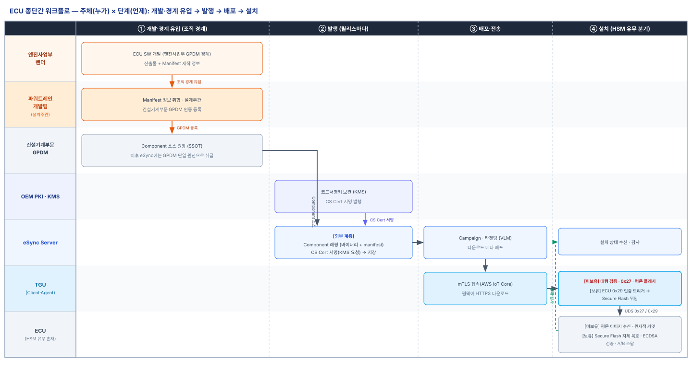
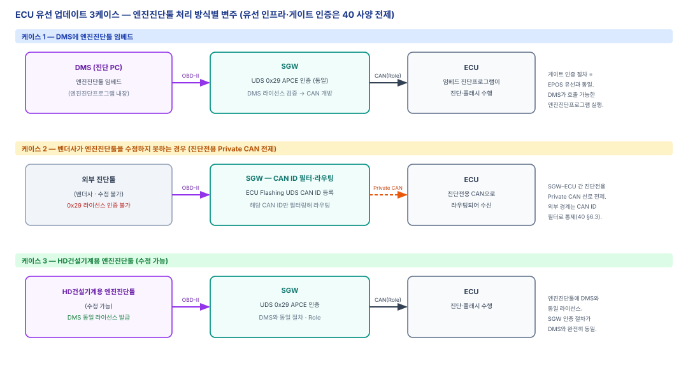

# ECU OTA 사양서

| 항목 | 내용 |
|------|------|
| **문서 성격** | ECU(엔진 제어기) OTA 종단간 사양 |
| **상태** | Draft |
| **적용 대상** | eSync Server · TGU(eSync Client·Agent) · ECU(HSM 유무 혼재) |
| **관계** | [30 eSync OTA 공통 아키텍처](30-eSync-OTA-공통아키텍처.md)를 상속한다. PKI·프로비저닝은 [10](10-PKI-사양서.md)·[20](20-프로비저닝-사양서.md), 유선 경로는 [40](40-유선업데이트-사양서.md). 보안 프로파일은 HSM 미보유 시 [31 EPOS-10i](31-EPOS-10i-OTA사양서.md), HSM 보유 시 [32 EPOS-30i](32-EPOS-30i-업데이트-사양서.md)를 따른다. |
| **용어 기준** | [00 용어집](00-용어집.md) |

ECU(엔진 제어기, Engine Control Unit)를 대상으로, [30 공통 아키텍처](30-eSync-OTA-공통아키텍처.md)의 워크플로를 종단간(End-to-End)으로 구체화한다. **OTA 자체의 흐름·절차·구조는 EPOS-10i·EPOS-30i와 동일**하며, 공통 골격(데이터 모델·서명·전송·타겟팅·정책·감사)은 30을 그대로 따른다.

ECU는 두 가지가 고유하다.

1. **개발주체가 조직 경계를 넘는다.** ECU 벤더는 HD건설기계 **엔진사업부**의 GPDM 경계에 있으므로, 산출물이 **건설기계부문 GPDM**에 연동 업로드되어야 하고, Manifest 제작 정보와 함께 설계주관부서인 **파워트레인개발팀**을 거쳐 진행된다(§3).
2. **유선 업데이트가 다르다.** 엔진진단툴(엔진진단프로그램)의 수정 가능 여부와 임베드 방식에 따라 세 가지로 갈린다(§4).

ECU는 HSM 보유 모델과 미보유 모델이 함께 존재한다. 보안 세부(검증 위치·페이로드·세션·뱅크)는 [30 §1.4](30-eSync-OTA-공통아키텍처.md)의 변주 축을 따르되, **HSM 유무로 프로파일이 갈린다**: 미보유 ECU는 EPOS-10i 모델(TGU 대행 검증·평문·`0x27`), 보유 ECU는 EPOS-30i 모델(자체 검증·Secure Flash·`0x29`)을 상속한다. 본 문서는 두 프로파일을 중복 서술하지 않고 31·32를 분기 참조하며, **ECU 고유 사항(개발주체·유선 변주)에 집중**한다.

---

## 1. ECU 신뢰 경계 (HSM 유무 분기)

서명은 클라우드(KMS)에서 이뤄지고, 검증 신뢰앵커(Root CA 인증서)는 각 노드가 로컬 보유한다([30 §1.3](30-eSync-OTA-공통아키텍처.md), [10 §3.1](10-PKI-사양서.md)). 무결성 검증 위치와 페이로드 형태는 ECU의 HSM 보유 여부로 갈린다.

| 구분 | HSM 미보유 ECU | HSM 보유 ECU |
|------|----------------|--------------|
| 무결성 검증 위치 | TGU(eSync Agent) 대행 | ECU 자체(HSM) |
| 페이로드 | 평문 | 암호화(Secure Flash) |
| 세션 게이트(UDS) | `0x27` SecurityAccess | `0x29` 인증서 인증 |
| 뱅크 | 모델별(싱글뱅크 + 복구 부트로더 등) | 모델별(A/B Dual Bank 등) |
| 상속 프로파일 | [31 EPOS-10i](31-EPOS-10i-OTA사양서.md) | [32 EPOS-30i](32-EPOS-30i-업데이트-사양서.md) |

- **미보유 ECU** — ECU가 검증 능력이 없어, 무결성 검증이 **TGU까지** 보장된다. TGU→ECU 구간은 평문이며 UDS 세션으로 보호한다([31 §1·§4](31-EPOS-10i-OTA사양서.md)).
- **보유 ECU** — ECU가 자체적으로 서명 검증·복호화를 수행하므로, 무결성·기밀성이 **ECU까지** 확장된다([32 §1.2·§2](32-EPOS-30i-업데이트-사양서.md)).
- 뱅크·복구 전략은 개별 ECU 모델의 플래시 구성에 따르며, 확정값은 §6 TBD.

---

## 2. 종단간 업데이트 워크플로

### 2.0 주체 × 단계 (누가·무엇·언제)

프로비저닝부터 설치까지 **어느 주체가 어느 단계에서 무엇을 하는지**를 [그림 1]로 개괄한다. ECU는 발행 단계의 상류가 EPOS와 다르다: 엔진사업부 벤더의 산출물이 **파워트레인개발팀**을 거쳐 **건설기계부문 GPDM**에 올라가고, 그 뒤부터 **eSync Server 입장에서는 파워트레인개발팀이 SW 개발자**로서 30 §1.2의 GPDM 단일 원천 구조와 동일하게 취급된다(§3). 설치 단계는 HSM 유무에 따라 31(대행 검증·평문·`0x27`) 또는 32(자체 검증·Secure Flash·`0x29`) 프로파일을 따른다. 공통 골격은 [30 §2](30-eSync-OTA-공통아키텍처.md), 프로비저닝 상세는 [20](20-프로비저닝-사양서.md).

*[그림 1] ECU 종단간 워크플로 (주체 × 단계)*

### 2.1 개요

[30 §2](30-eSync-OTA-공통아키텍처.md)의 공통 단계 모델(발행→타겟팅→전송→설치→커밋·보고)을 ECU에 적용한다. 발행 상류는 §3의 조직 경계를 거치되, eSync Server 이후의 타겟팅·전송·설치·보고는 공통을 따른다. 설치(검증·플래시) 단계의 능력별 변주는 §1의 프로파일 분기를 따른다.

### 2.2 런타임 실행 단계

ECU의 런타임 시퀀스는 HSM 유무에 따라 기존 제어기 사양을 그대로 따른다. 중복 서술 없이 해당 프로파일을 참조한다.

- **HSM 미보유 ECU** — [31 §2.2](31-EPOS-10i-OTA사양서.md)의 14단계(업데이트 확인 → Campaign 매칭 → 다운로드 → 대행 서명 검증 → UDS `0x22` 호환성 → UDS `0x27` 세션 → `0x34/0x36/0x37` 평문 플래시 → 원자적 커밋 → 상태 보고)를 따른다.
- **HSM 보유 ECU** — [32 §3.1](32-EPOS-30i-업데이트-사양서.md)의 실행 단계(UDS `0x29` 인증 → Secure Flash: `0x34/0x36/0x37`로 암호화 이미지 전송·ECU 자체 복호화·ECDSA 검증 → A/B 스왑)를 따른다.

공통 타겟팅·호환성 판정·설치 정책은 [30 §6·§7](30-eSync-OTA-공통아키텍처.md)을 따른다.

---

## 3. 개발주체·GPDM 연동 (파워트레인개발팀)

ECU는 산출물이 조직 경계를 넘어 유입되는 점만 EPOS와 다르고, eSync Server에 도달한 이후는 완전히 동일하다.

- **경계 브릿지** — ECU 벤더는 HD건설기계 **엔진사업부**의 GPDM 경계에서 SW를 개발한다. 이 산출물은 **건설기계부문 GPDM**으로 연동 업로드되어야 하며, 이때 Manifest 제작 정보(버전·품번·호환성·롤백 등 릴리스 메타데이터)가 함께 제출된다.
- **설계주관: 파워트레인개발팀** — 이 유입은 설계주관부서인 **파워트레인개발팀**을 통해 진행된다. 파워트레인개발팀이 엔진사업부 산출물과 Manifest 정보를 취합해 건설기계부문 GPDM에 등록하는 역할을 맡는다.
- **eSync Server 관점의 동일 취급** — eSync Server 입장에서 ECU의 **SW 개발자 = 파워트레인개발팀**이다. 건설기계부문 GPDM에 등록된 뒤에는 [30 §1.2·§3.2.4](30-eSync-OTA-공통아키텍처.md)의 **GPDM 단일 원천(SSOT)** 구조로 EPOS와 **동일하게 취급**된다 — eSync Server는 언제나 GPDM으로부터 Component 소스를 입력받는다.
- **서명·키의 위치는 불변** — 개발주체가 조직 경계를 넘더라도 서명은 여전히 클라우드 KMS 중앙에서 이뤄지며, 벤더·파워트레인개발팀은 서명 키를 갖지 않는다([30 §1.3·§4](30-eSync-OTA-공통아키텍처.md)). 상류 발행 준비(서명·암호화 시점·주체)와 제조 배포 세부는 본 사양 범위 밖이며 Component 소스에 캡슐화된다([30 §10](30-eSync-OTA-공통아키텍처.md)).

---

## 4. 유선 업데이트 변주 (엔진진단툴 3케이스)

유선 인프라(DMS·SGW·라이선스·Role·게이트 인증)는 [40 유선 업데이트 사양서](40-유선업데이트-사양서.md)를 그대로 전제한다. ECU 유선 업데이트는 **엔진진단툴**(엔진진단프로그램)을 어떻게 처리하는가에 따라 세 가지로 갈린다. 셋 모두 게이트웨이 접근제어(SGW)와 대상 세션 게이트의 이중 구조([40 §5](40-유선업데이트-사양서.md))는 유지된다.

*[그림 2] ECU 유선 업데이트 3케이스 (임베드 · Private CAN 라우팅 · 동일 라이선스)*

### 4.1 케이스 1 — DMS에 엔진진단툴 임베드

DMS가 엔진진단프로그램을 내장(임베드)하는 경우다.

- DMS가 SGW 인증을 거치는 절차는 EPOS와 **동일**하다([40 §6](40-유선업데이트-사양서.md), UDS `0x29` APCE). SGW는 DMS License를 검증하고 Role에 따라 CAN 선로를 개방한다.
- 이후 DMS가 **호출 가능한 엔진진단프로그램을 실행**해 ECU 진단·플래시를 수행한다. 게이트 인증의 주체·자격은 DMS 그대로이며, 진단 로직만 임베드된 엔진진단프로그램이 담당한다.

### 4.2 케이스 2 — 벤더사가 엔진진단툴을 수정하지 못하는 경우

벤더사 엔진진단툴을 HD건설기계 유선 인증 절차에 맞게 수정할 수 없는 경우다. 이때는 **장비 내 SGW–ECU 간 진단전용 Private CAN 선로 구성**을 전제한다.

- **SGW가 라우팅 게이트 역할** — SGW는 ECU Flashing에 필요한 UDS CAN ID를 등록하고, 외부 진단툴의 접근을 **해당 CAN ID만 필터링**하여 진단전용 CAN(Private CAN)으로 라우팅한다.
- **경계 방어는 유지** — 수정 불가 진단툴이 DMS License 기반 `0x29` 인증을 수행하지 못하더라도, 외부 OBD-II→내부 CAN 진입은 SGW가 CAN ID 필터링으로 통제한다. 이는 [40 §6.3](40-유선업데이트-사양서.md)의 CAN 선로 격리·개방 메커니즘을 ECU 진단전용 선로로 특화한 형태다.
- 등록 대상 CAN ID 집합, 필터 규칙, Private CAN의 물리 토폴로지 확정은 §6 TBD.

### 4.3 케이스 3 — HD건설기계용 엔진진단툴(수정 가능)

엔진진단툴을 HD건설기계용으로 수정할 수 있는 경우다.

- 엔진진단툴에 **DMS와 같은 라이선스를 발급**한다([10 §2.3](10-PKI-사양서.md), [20 §7](20-프로비저닝-사양서.md)).
- 엔진진단툴–SGW 간 인증은 **DMS와 동일한 절차**([40 §6](40-유선업데이트-사양서.md), UDS `0x29` APCE)로 수행한다. Role→권한 매핑([40 §8](40-유선업데이트-사양서.md))도 DMS와 동일하게 적용된다.
- 세 케이스 중 유선 접근제어가 EPOS 유선 경로와 가장 완전히 일치하는 형태다.

---

## 5. ECU 특성 종합

| 특성 | 대응 |
|------|------|
| HSM 유무 혼재 | 미보유 = 31 EPOS-10i 프로파일, 보유 = 32 EPOS-30i 프로파일(§1) |
| 무결성 검증 위치 | 미보유 = TGU 대행, 보유 = ECU 자체(§1) |
| 페이로드 | 미보유 = 평문, 보유 = 암호화(Secure Flash)(§1) |
| 세션 게이트 | 미보유 = UDS `0x27`, 보유 = UDS `0x29`(§1) |
| 업데이트 프로토콜·네트워크 | UDS on CAN(`0x34/36/37`)·CAN(§1) |
| 개발주체 | 엔진사업부 벤더 → 파워트레인개발팀 → 건설기계부문 GPDM, eSync에는 GPDM 단일 원천으로 동일 취급(§3) |
| 유선 변주 | 임베드 / Private CAN 라우팅 / 동일 라이선스 3케이스(§4) |

---

## 6. 미정 (TBD)

- HSM 유무별 ECU 모델 확정 및 뱅크·복구 전략(§1) — 미보유 모델의 복구 부트로더 구성, 보유 모델의 A/B 세부.
- 케이스 2 진단전용 Private CAN의 물리 토폴로지, SGW 등록 CAN ID 집합·필터 규칙(§4.2).
- 케이스 1 임베드 엔진진단프로그램과 DMS 간 인터페이스, 케이스 3 엔진진단툴 라이선스 Role 매핑(§4).
- 엔진사업부↔파워트레인개발팀↔건설기계부문 GPDM 연동 업로드 절차·Manifest 제출 포맷(§3).
