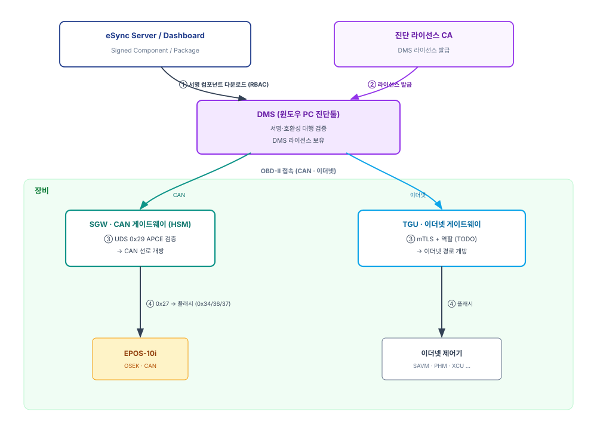
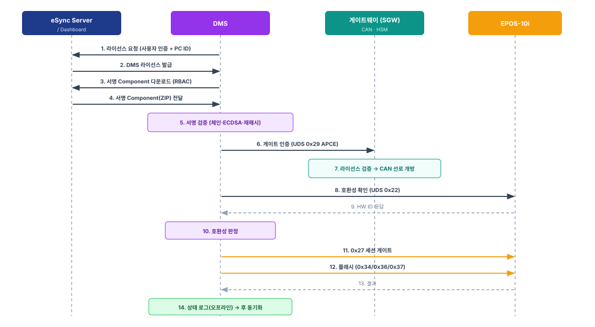
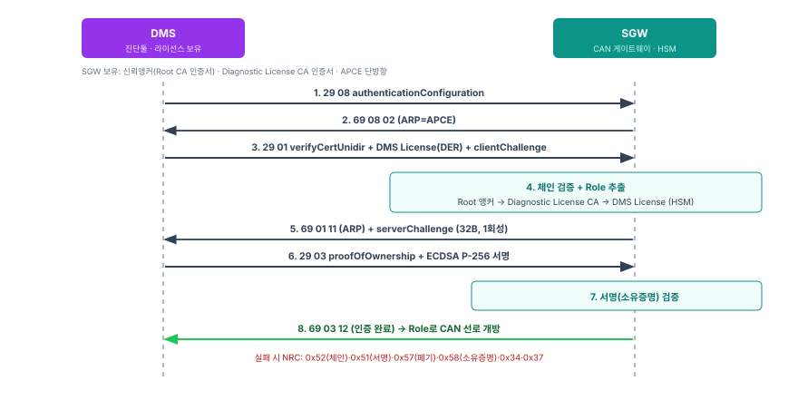

# 유선 업데이트 사양서 (DMS)

| 항목 | 내용 |
|------|------|
| **문서 성격** | 유선(DMS) 업데이트 워크플로·게이트웨이 접근제어 사양 |
| **상태** | Draft |
| **적용 대상** | DMS(진단툴) · SGW · TGU · 대상 제어기 |
| **관계** | [10 PKI 사양서](10-PKI-사양서.md) · [20 프로비저닝 사양서](20-프로비저닝-사양서.md) · [30 eSync OTA 공통 아키텍처](30-eSync-OTA-공통아키텍처.md)를 전제로 한다. 제어기별 변주는 [31 EPOS-10i](31-EPOS-10i-OTA사양서.md) · [32 EPOS-30i §11](32-EPOS-30i-업데이트-사양서.md). |
| **용어 기준** | [00 용어집](00-용어집.md) |

무선 OTA에 쓰는 **서명된 Component/Package를 유선 업데이트에 재활용**한다. 진단툴 **DMS**가 이를 내려받아 검증·설치하고, 장비 게이트웨이(**SGW**·**TGU**)가 DMS를 인증해 내부 경로를 개방한다.

---

## 1. 개요·범위

- **유선 경로:** DMS가 장비 OBD-II로 접속해 대상 제어기를 업데이트한다. 무선 연결이 없거나 서비스 현장에서 쓴다.
- **자원 재사용:** 서명된 Component/Package·검증 로직·호환성 판정을 [30 공통 아키텍처](30-eSync-OTA-공통아키텍처.md)에서 그대로 가져온다. 서명은 Component에 내장되어 전송 매체와 무관하다.
- **대상:** CAN 대상(EPOS-10i)은 **SGW**를 거치고, 이더넷 대상은 **TGU**를 거친다.
- **DMS의 역할:** eSync Client·Agent가 없지만, 서명·호환성을 스스로 검증해 설치하는 **유선 설치자**다. [31 §4](31-EPOS-10i-OTA사양서.md)의 대행 검증자 역할을 PC(Windows)에서 수행한다(EPOS-30i 대상 시에는 제어기가 자체 검증, [32 §11](32-EPOS-30i-업데이트-사양서.md)).

---

## 2. 아키텍처

*[그림 1] 유선 업데이트 아키텍처*

- **DMS** — Windows C# PC 진단툴. 서명 Component를 내려받아 검증하고, OBD-II로 장비에 접속해 설치한다.
- **SGW** — OBD-II 외부 CAN을 격리하는 CAN 게이트웨이. HSM 보유. DMS 라이선스를 검증해 특정 CAN 선로를 개방한다.
- **TGU** — DMS 연동 시 유선 이더넷 게이트웨이 역할. DMS를 인증해 이더넷 경로를 개방한다(§7).
- **대상 제어기** — EPOS-10i(CAN) 등.

---

## 3. 유선 업데이트 워크플로

### 3.1 정상 흐름

아래 번호는 [그림 2]의 시퀀스 번호와 일치한다. (CAN·SGW 경로 기준)

*[그림 2] 유선 업데이트 시퀀스*

1. **라이선스 요청** — DMS가 사용자 인증과 PC 고유 ID로 라이선스를 요청한다.
2. **라이선스 발급** — 진단 라이선스 CA가 단수명 DMS 라이선스를 발급한다([10 §2.3](10-PKI-사양서.md), [20 §7](20-프로비저닝-사양서.md)).
3. **다운로드 요청** — DMS가 서명 Component를 요청한다(권한 기반, §10).
4. **Component 전달** — eSync Server/Dashboard가 서명 Component(ZIP)를 내려준다.
5. **서명 검증** — DMS가 체인·서명·재해시를 검증한다(§4).
6. **게이트 인증** — DMS가 게이트웨이에 인증을 요청한다. SGW는 UDS `0x29` APCE(§6), TGU는 mTLS(§7).
7. **경로 개방** — 게이트웨이가 라이선스를 검증하고 Role에 따라 경로(CAN 선로/이더넷)를 개방한다(§8).
8. **호환성 조회** — DMS가 UDS `0x22`로 대상의 HW ID를 읽는다.
9. **HW ID 응답** — 대상이 HW ID를 반환한다.
10. **호환성 판정** — manifest의 호환성 정보와 대조한다([30 §6.2](30-eSync-OTA-공통아키텍처.md)).
11. **세션 게이트** — DMS가 대상에 UDS `0x27`로 프로그래밍 세션을 연다(§9).
12. **플래시** — UDS `0x34/0x36/0x37`로 전송한다([31 §2.2-11](31-EPOS-10i-OTA사양서.md)).
13. **결과 수신** — 대상이 결과를 반환한다.
14. **상태 로그** — DMS가 상태를 로컬 기록하고, 이후 온라인 시 eSync Server에 동기화한다.

### 3.2 실패·거부 처리

| 지점 | 실패 | 동작 |
|------|------|------|
| 5 서명 검증 | 체인/서명/해시 불일치 | Component 폐기, 설치 중단 |
| 6~7 게이트 인증 | 라이선스 검증 실패(§6.2 NRC) | 경로 미개방, 중단·기록 |
| 8~10 호환성 | HW ID 불일치 | 설치 중단 |
| 11 세션 게이트 | `0x27` 실패 | 재시도 후 중단·기록 |
| 12 플래시 | 전송/기록 실패 | 재시도 후 중단, 대상 복구는 [31 §5](31-EPOS-10i-OTA사양서.md) |

모든 실패는 로컬 로그에 남기고 온라인 시 동기화한다(§3.1의 14단계).

---

## 4. DMS = 유선 설치자

DMS는 [31 §4](31-EPOS-10i-OTA사양서.md)의 검증 로직을 그대로 수행한다.

1. **체인 구성** — 동봉된 CS Cert·Code Sign CA로 `Root → Code Sign CA → CS Cert` 체인을 만든다.
2. **서명 검증** — CS Cert 공개키로 서명을 검증한다(ECDSA P-256).
3. **재해시** — Component를 SHA-256으로 다시 해시해 대조한다.
4. **호환성 판정** — UDS `0x22` 실측 HW ID를 manifest와 대조한다([30 §6.2](30-eSync-OTA-공통아키텍처.md)).

하나라도 실패하면 폐기하고 설치를 중단한다. DMS는 신뢰앵커(Root CA 인증서)를 로컬 보유해야 하며, 주입·갱신은 [20 §7](20-프로비저닝-사양서.md)을 따른다.

---

## 5. 인증 계층

DMS 경로에는 목적이 다른 **세 계층**의 검증이 있다. 서로 다른 경계를 보호하므로 중복이 아니다.

| 계층 | 검증 주체 | 대상 | 무엇을 막나 |
|------|-----------|------|-------------|
| **게이트웨이 접근제어** | SGW(UDS `0x29`) / TGU(mTLS) | DMS 라이선스(PKI·Role) | 인가되지 않은 도구의 **내부 망 진입** |
| **대상 세션 게이트** | 대상 제어기(UDS `0x27`) | 프로그래밍 세션(seed-key) | 임의 노드의 **ECU 재프로그래밍** |
| **서명 검증** | DMS(대행) | CS Cert 서명 | 위·변조 펌웨어 설치 |

- **비중복 근거:** 게이트웨이 계층은 "누가 내부 망에 들어오는가"(경계)를, 대상 세션 계층은 "이 ECU를 재프로그래밍해도 되는가"(엔드포인트)를 지킨다. 내부 CAN은 SecOC 미적용이라 스푸핑·재생 잔여위험이 있으므로, 게이트를 통과한 뒤에도 대상 자체 세션 게이트가 독립적으로 필요하다(defense-in-depth). 하나만 두면 위험이 남는다. 게이트만 두면 내부 스푸핑 시 임의 노드가 대상을 플래시할 수 있고, 세션 게이트만 두면 외부 도구가 내부 망 전체에 무제한 진입한다.
- **"같은 라이선스로 두 번"이 아니다:** DMS 라이선스는 게이트웨이(SGW/TGU)에서만 검증한다. EPOS-10i는 암호 능력이 없어 라이선스(PKI)를 검증하지 못하며, `0x27` 세션 게이트는 seed-key라 라이선스와 무관하다.
- **용어:** "이중 검증"은 *하나의 DMS 라이선스를 SGW와 TGU 두 게이트웨이가 각자 방식으로 검증*하는 것(경로 분기)이다. §3의 `0x29`→`0x27`은 *한 경로에서 게이트 통과 후 대상 세션을 여는 직렬 단계*다.

---

## 6. SGW 접근제어 (UDS 0x29 APCE)

SGW는 ISO 14229-1 Authentication(`0x29`)의 **APCE 단방향**으로 DMS를 검증한다. SGW가 DMS를 검증하는 것으로 게이트 개방에 충분하다(SGW가 자신을 DMS에 증명할 필요는 없다).

*[그림 3] SGW 접근제어 (UDS 0x29 APCE)*

### 6.1 메시지 시퀀스

| 단계 | 방향 | 메시지 | 내용 |
|------|------|--------|------|
| 1 | DMS→SGW | `29 08` | authenticationConfiguration 조회 |
| 2 | SGW→DMS | `69 08 02` | ARP=`0x02`(APCE) |
| 3 | DMS→SGW | `29 01 …` | verifyCertificateUnidirectional: `commConfig(0x00)` + `lenCertClient(2B)` + **DMS 라이선스(DER)** + `lenChallengeClient(2B)` + challengeClient |
| 4 | SGW→DMS | `69 01 11 …` | ARP=`0x11`(CertificateVerified·OwnershipVerificationNecessary) + `lenChallengeServer(2B)` + **serverChallenge(32B)** + `lenEphemPubServer(2B=0)` |
| 5 | DMS→SGW | `29 03 …` | proofOfOwnership: `lenPoO(2B)` + **serverChallenge의 ECDSA P-256 서명** + `lenEphemPubClient(2B=0)` |
| 6 | SGW→DMS | `69 03 12` | ARP=`0x12`(OwnershipVerified·AuthenticationComplete) → Role에 따라 CAN 선로 개방(§8) |
| — | DMS→SGW | `29 00` | (세션 종료 시) deAuthenticate → `69 00 10` |

- SGW는 4단계에서 `Root → 진단 라이선스 CA → DMS 라이선스` 체인을 HSM으로 검증하고 Role을 추출한다.
- `serverChallenge`는 TRNG 32바이트, **세션당 1회성**이다(재생 방지 §9).
- `commConfig=0x00`(세션키 없음): 이후 CAN 구간은 평문이며, 대상(EPOS)이 세션키를 쓸 수 없다.

### 6.2 부정 응답(NRC)

| NRC | 의미 |
|-----|------|
| `0x34` | authenticationRequired — 인증 전 게이트 접근 |
| `0x37` | requiredTimeDelayNotExpired — 재시도 지연 미경과(무차별 방지) |
| `0x13` | incorrectMessageLengthOrInvalidFormat |
| `0x24` | requestSequenceError — 순서 위반(예: 인증서 전 proof) |
| `0x51` | certificateVerificationFailed — InvalidSignature |
| `0x52` | certificateVerificationFailed — InvalidChainOfTrust |
| `0x57` | certificateVerificationFailed — InvalidCertificate(폐기 등) |
| `0x58` | ownershipVerificationFailed — 서명이 challenge와 불일치 |

> 인증서 유효기간(`0x50` InvalidTimePeriod)은 절대시각을 신뢰할 수 없어 **보안 게이트로 쓰지 않는다**(§9).

### 6.3 세션 수명

- 인증 상태는 deAuthenticate(`0x00`) / 세션 타임아웃 / 버스 해제 시 해제된다. 이후 접근은 재인증을 요구한다.
- SGW는 개방한 CAN 선로를 세션 종료 시 재격리한다.

---

## 7. TGU 접근제어 (이더넷)

TGU는 DoIP를 쓰지 않으므로, DMS 라이선스 인증서를 클라이언트 인증서로 하는 **mTLS**로 인증하고, Role에 따라 이더넷 경로를 개방한다(DoIP의 routing activation 게이트키핑을 TGU가 대체). 같은 DMS 라이선스를 SGW는 `0x29`로, TGU는 mTLS로 검증한다.

> TODO: TGU 이더넷 접근제어 상세(mTLS 프로파일·cipher, Role→허용 대상·경로 매핑, 라우팅 게이트키핑, 세션 수명)는 후속 설계로 확정한다.

---

## 8. Role → 권한 매핑

DMS 라이선스의 Role OID([10 §2.3](10-PKI-사양서.md))가 허용 범위를 정한다. 게이트웨이가 인증 성공 후 이 매핑으로 개방 범위를 제한한다.

| Role | 허용 CAN 선로 / 이더넷 경로 | 허용 대상 | 허용 UDS 서비스 |
|------|------------------------------|-----------|-----------------|
| Engineering | 전체 | 전체 | `0x22`·`0x27`·`0x34/0x36/0x37`·`0x2E` 등 |
| Dealer-Service | 서비스 선로/경로 | 승인 대상(EPOS 등) | `0x22`·`0x27`·`0x34/0x36/0x37` |
| Read-Only | 진단 선로/경로 | — | `0x22`·`0x19` |

> Role 값 집합과 선로/대상 대응의 확정값은 TODO(§11). SGW(§6)·TGU(§7)가 이 표를 공유한다.

---

## 9. 라이선스 유효성·시각 독립 검증

RTC가 없는 EPOS, 조작 가능한 PC·게이트웨이 시계 때문에 **어떤 노드의 절대시각도 신뢰할 수 없다.** 따라서 유효성 판단을 시각에 걸지 않는다.

- **절대시각 미신뢰:** 인증서 `Not-Before/After`는 형식 확인용일 뿐 보안 게이트로 쓰지 않는다. 시각 롤백·정지 공격은 "시각에 의존하지 않는 설계"로 무력화된다.
- **재생 방지(채택):** 신선도(freshness)는 시각이 아니라 **SGW가 세션마다 새로 내는 `serverChallenge`(nonce)**에서 나온다(§6.1-4). 캡처된 과거 인증은 challenge 불일치로 거부된다.
- **최종 판단은 검증자(SGW):** DMS의 자기 라이선스 제한은 **정직한 사용자용 보조 계층**(오조작 방지)이며, 변조된 악의적 DMS에는 무효다. 유효성의 최종 판단은 SGW에 있다.
- **만료·폐기 강제 = TODO:** 시각 없이 만료·폐기를 강제하는 메커니즘은 후속 확정. 후보:
  - **CRL(monotonic number):** SGW가 최신 CRL을 보유(연결 시 갱신). 번호 단조성으로 옛 CRL 롤백을 막되, 오프라인 stale-CRL 창(갱신 주기만큼)은 잔존.
  - **SGW HSM 단조 epoch floor:** 라이선스에 epoch를 담고 SGW가 HSM 단조 카운터로 더 낮은 epoch를 거부(시각 없이 롤백·만료 강제).
- **잔여위험:** 확정 전까지 만료/폐기는 단수명 + CRL 사전배포에 의존하며, stale-CRL 창이 남는다(§11).

---

## 10. 자원 재사용

- DMS는 무선 OTA와 **동일한 서명 Component**를 내려받는다. 서명은 Component(ZIP)에 내장되므로 다운로드 경로가 달라도 검증 방식은 같다([30 §4](30-eSync-OTA-공통아키텍처.md)).
- 다운로드는 eSync Server/Dashboard의 Component 다운로드로 하며, 권한(RBAC)으로 통제한다.
- Component/Package/manifest 모델과 호환성 판정은 [30 §3·§6](30-eSync-OTA-공통아키텍처.md)을 그대로 따른다. 재서명·재패키징은 없다.
- **정책·품번(오프라인):** 온라인 VLM 조회를 대신해 SW 품번·정책을 사전 번들로 내려받아 쓴다([30 §6.1](30-eSync-OTA-공통아키텍처.md)).

### 10.1 대상 세션 게이트(0x27)의 유선 특성

- EPOS-10i의 `0x27` seed-key 세션 게이트는 [31 §2.2-10·§6](31-EPOS-10i-OTA사양서.md)과 동일한 메커니즘이며, 개시자만 eSync Agent → DMS로 바뀐다.
- 유선에서는 seed-key 계산 비밀을 **외부 DMS PC**가 다뤄야 하므로 노출 표면이 무선(TGU 내부)보다 크다. `0x27`은 추출 가능한 비밀에 기반한 **보조 방어**이며, 실제 게이트는 SGW `0x29`(§6)다. 비밀 관리 정책은 [31 §8](31-EPOS-10i-OTA사양서.md)과 함께 TODO.

---

## 11. 미정 (TBD)

- 라이선스 만료·폐기 강제 메커니즘 확정(§9: CRL monotonic / HSM epoch floor).
- TGU 이더넷 접근제어 상세(§7).
- Role 값 집합·선로/대상 대응 확정(§8).
- `0x27` seed-key 비밀의 DMS 측 관리(§10.1).
- 오프라인 CRL·정책 번들 배포 방식·주기, 유선 상태 로그 동기화.
