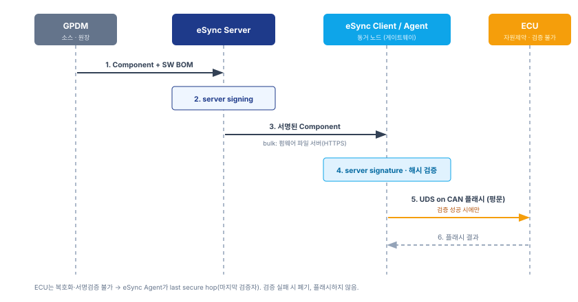

# eSync 기반 OTA 시스템 사양서

| 항목 | 내용 |
|------|------|
| **문서 성격** | eSync 기반 OTA 시스템 사양 (진화형 단일 문서) |
| **상태** | Draft |
| **접근 방식** | 가장 단순한 형태부터 정의하고, 단계마다 이 문서를 갱신한다. |
| **용어 기준** | 본문은 **eSync 용어**를 사용한다. 우리 시스템 용어 대응은 [용어 대응표](용어-대응표.md). |

우리 서버·장비 아키텍처에 Excelfore **eSync**를 도입한 OTA 시스템의 사양을 정의한다.
읽는 순서는 **아키텍처 → 워크플로 → 세부 설계**다.

---

## 1. 아키텍처

시스템을 세 계층으로 나눈다 — **클라우드 · 통신 · 장비**.


*[그림 1] 전체 구조 (조감도)*

> 그림의 물리 노드(TGU·SGW·EPOS 등)와 eSync 역할의 대응은 [용어 대응표](용어-대응표.md)를 따른다.

### 1.1 세 계층 개요

- **클라우드** — eSync Server(백엔드)와, 이를 쓰는 운영·비즈니스 프론트엔드, 그리고 소스·신원·서명 서비스.
- **통신 (Air Interface)** — eSync Server와 eSync Client가 주고받는 채널.
- **장비** — eSync Client·eSync Agent와 플래시 대상 ECU.

### 1.2 계층별 구성

#### 1.2.1 클라우드

- **eSync Server** — 캠페인·타겟팅, Component·Package DB, server signing, 감사를 담당하는 백엔드다.
- **운영 프론트엔드 (Operator UI)** — 캠페인·패키지를 운영하는 단일 콘솔이다. RBAC로 딜러·AS에 부분 개방한다.
- **소스·신원·서명 어댑터**
  - **GPDM** — Component와 SW BOM의 소스이자 출처 원장(§3.2).
  - **Vehicle Identity Provider** — 식별자·차량 신원을 제공한다.
  - **PKI** — server signing key를 HSM 안에 보관하고 서명을 수행한다.

#### 1.2.2 통신 (Air Interface)

- **eSync Messaging Protocol** — 제어·메타데이터 채널이다.
- **전송** — 이 메시지를 실어 나르는 전송(예: AWS IoT Core, MQTT)은 교체 가능하며, 연동 상세는 별도 팀 소관이다.
- **펌웨어 파일 서버 (HTTPS)** — 펌웨어 bulk는 통신 채널로 보내지 않는다. 통신 채널은 다운로드 주소만 전달하고, 기기가 직접 내려받는다(아웃오브밴드).

#### 1.2.3 장비

- **eSync Client + eSync Agent** — 게이트웨이 노드 하나에 함께 있다.
- **ECU** — eSync Agent가 UDS on CAN으로 플래시하는 대상이다.

### 1.3 신뢰 경계

- **server signing**은 클라우드에서 이뤄지고, **eSync Agent가 이를 검증**한다.
- **eSync 전송 신뢰경계는 eSync Agent(게이트웨이)까지**다. 그 아래 ECU 구간은 eSync 밖이며, 후속 단계에서 별도로 다룬다.

---

## 2. 업데이트 워크플로

### 2.1 Step 1 시나리오 — 가장 단순한 형태

eSync Client와 eSync Agent가 한 노드에 함께 있고, eSync Agent가 **암호·서명검증을 스스로 못 하는 자원제약 ECU**를 UDS on CAN으로 플래시한다.

#### 2.1.1 액터

- **eSync Server** — Component에 server signing을 수행한다.
- **eSync Client + eSync Agent** — 업데이트를 받아 서명을 검증하고 ECU를 플래시한다.
- **ECU (자원제약)** — 복호화·서명검증을 못 하는 플래시 대상이다.

#### 2.1.2 신뢰 경계 — last secure hop

ECU가 검증을 못 하므로 **eSync Agent가 마지막 검증자**다. eSync 원문도 자원제약 ECU에서는 페이로드가 마지막 "안전한 홉(hop) 노드"까지만 보호된다고 본다(`eSync/End_to_end_Security_in_eSync_KO.md:17`).

#### 2.1.3 이번 단계 범위와 제외

- **포함** — eSync Agent의 server signature 검증.
- **제외 (후속 단계)** — 암호화(Secure Flash), ECU 디바이스 인증, OCSP·폐기, 롤백, 호환성 관문, 전송·다운로드 상세.

### 2.2 신뢰 사슬

```
GPDM → eSync Server (server signing) → eSync Agent (검증) → ECU (UDS on CAN, 평문 플래시)
```

이 단계의 **유일한 보안 요구**는 하나다 — eSync Agent가 플래시 직전 server signature를 검증한다. ECU는 평문으로 플래시된다(암호화는 이번 범위 밖).

### 2.3 시퀀스



*[그림 2] Step 1 신뢰 사슬*

1. GPDM이 릴리스된 Component와 SW BOM을 eSync Server로 전달한다(연동 방식 §3.2.3).
2. eSync Server가 Component에 server signing을 수행해 Signed Component Database에 저장한다.
3. 캠페인으로 eSync Client에 전달한다. 펌웨어 bulk는 펌웨어 파일 서버에서 내려받는다.
4. eSync Agent가 server signature와 해시를 검증한다.
5. 검증에 성공하면, 그때만 ECU를 UDS on CAN으로 플래시한다(평문).
6. ECU가 플래시 결과를 보고한다. 검증 실패 시 폐기하고 플래시하지 않는다.

---

## 3. 세부 설계

### 3.1 서명 모델 — 개발자 서명 제거

#### 3.1.1 근거

eSync는 개발자·벤더 코드 서명을 **권고이며 강제가 아닌** 것으로 두고, eSync Server 밖에 두라고 명시한다(`eSync/End_to_end_Security_in_eSync_KO.md:203`, `:5`). 강제되는 규칙은 하나뿐이다 — **디바이스는 eSync Server가 서명한 콘텐츠만 수용하고, 개발자가 서명한 콘텐츠는 인정하지 않는다**(`:136`).

즉 eSync에서 디바이스(eSync Agent)가 검증하는 대상은 처음부터 **eSync Server 서명 하나**다. 개발자 서명은 서버가 업로더를 확인하려는 내부용일 뿐, 디바이스가 믿는 대상이 아니다.

개발자마다 서명 인증서를 발급·관리하면 다음 부담이 생긴다.

- eSync Server가 개발자별 인증서를 발급하고 개발자를 관리해야 한다.
- 개발자도 개인키 보관·인증서 수명·폐기를 관리해야 한다.
- 분산된 서명 키는 유출되면 가짜 펌웨어를 서명할 수 있는 위험이 된다.

**디바이스가 믿지도 않는 서명에 이 비용과 위험을 치를 이유가 없다.** 따라서 개발자 서명을 제거한다.

#### 3.1.2 eSync Server 단일 서명

- eSync Agent가 검증하는 유일 서명은 **eSync Server 서명**이다.
- server signing key는 **HSM 안에만** 있으며 밖으로 나가지 않는다.
- "누가 만든 펌웨어인가"는 서명이 아니라 **출처 기록**으로 담보한다(§3.2).

### 3.2 출처 모델 — GPDM 연동

#### 3.2.1 근거

개발자 서명을 없애면 "이 펌웨어가 인가된 출처에서 왔는가"를 다른 방법으로 세워야 한다. 이를 OTA 플랫폼 안에 로그인·승인·감사로 새로 만들면 부담이 크다.

그런데 그 일(작성자·승인·버전 관리)은 **PLM이 이미 하고 있다.** HD현대건설기계는 **GPDM**이라는 PLM을 운영하며, 여기에 SW BOM을 올린다. 그러므로 GPDM을 **출처의 원장(system of record)**으로 두고 eSync Server가 이를 신뢰하면, 개발자 신원 관리를 새로 만들 필요가 없다.

#### 3.2.2 어댑터로서의 GPDM

- GPDM은 eSync 아키텍처의 **소스 어댑터**다. **릴리스된 Component와 SW BOM만** eSync Server로 유입된다.
- **GPDM은 Component·SW BOM의 유일 소스로 정책화**한다. 현재 일부 벤더 예외는 과도기로 두고 후속에서 정리한다(§4).

#### 3.2.3 연동 방식 (설계플랫폼팀 협의 · TBD)

GPDM과 eSync Server를 잇는 구체적 방식은 GPDM을 관리하는 설계플랫폼팀과의 협의 사항이다. 후보 두 가지를 병기한다.

- **(i) 인증된 신뢰 채널** — eSync Server가 인증된 GPDM 피드(mTLS·서비스 계정)를 신뢰한다. 가장 단순하다.
- **(ii) GPDM 릴리스 서명** — GPDM이 릴리스마다 **단일 시스템 키**로 서명하고, eSync Server가 유입 시 이를 검증한 뒤 server signing을 수행한다. eSync의 "상위 서명 검증 → 서버 재서명" 구조를 그대로 따르되, 다수 개발자 키가 아니라 **시스템 키 하나**만 관리한다.

#### 3.2.4 출처·SBOM

- 서명 요청·승인 신원, GPDM 릴리스 식별자, SW BOM을 **eSync Server가 서명하는 매니페스트에 담아** 감사로 담보한다.
- GPDM의 **SW BOM이 곧 SBOM**이 된다. CRA 추적성 요구를 충족하는 경로가 여기서 열린다.

### 3.3 최소 PKI

- **server signing key** — HSM에 보관되는 단일 서명 주체.
- **eSync Agent trust anchor** — server signature를 검증하는 eSync Server 서명 인증서 하나. 개발자 인증서는 없다.
- CA 계층 확장은 후속 단계에서 다룬다.

### 3.4 최소 프로비저닝

- 양산 시 eSync Client·Agent에 **trust anchor(eSync Server 서명 인증서)를 주입**한다.
- 주입 절차의 상세는 후속 프로비저닝 단계에서 정의한다.

---

## 4. 열린 과제 · TODO

- TODO: GPDM ↔ eSync Server 연동 방식 확정 — 설계플랫폼팀 협의(§3.2.3).
- TODO: GPDM 유일 소스 정책의 벤더 예외(과도기) 처리 방안.
- TODO: ECU가 UDS SecurityAccess(`0x27`) 세션 게이트를 지원하는지 확인(서명검증과 별개의 플래시 세션 보호).
- TODO: 후속 단계 — 암호화(Secure Flash) · ECU 디바이스 인증(UDS `0x29`) · OCSP·폐기 · 롤백 · 호환성 관문 · 전송·다운로드. 같은 문서의 해당 절을 갱신한다.
